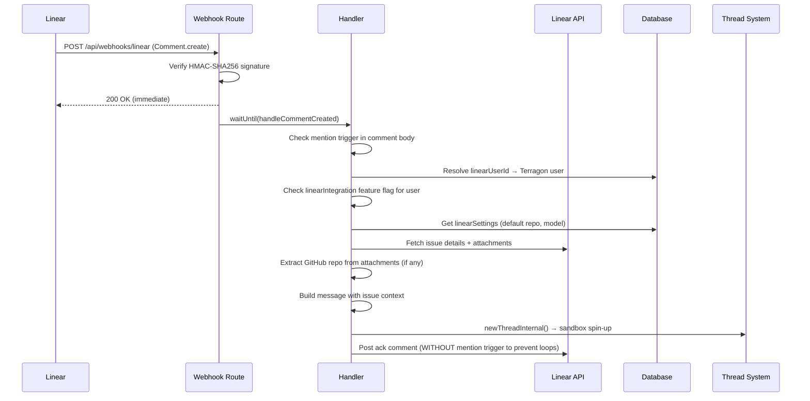
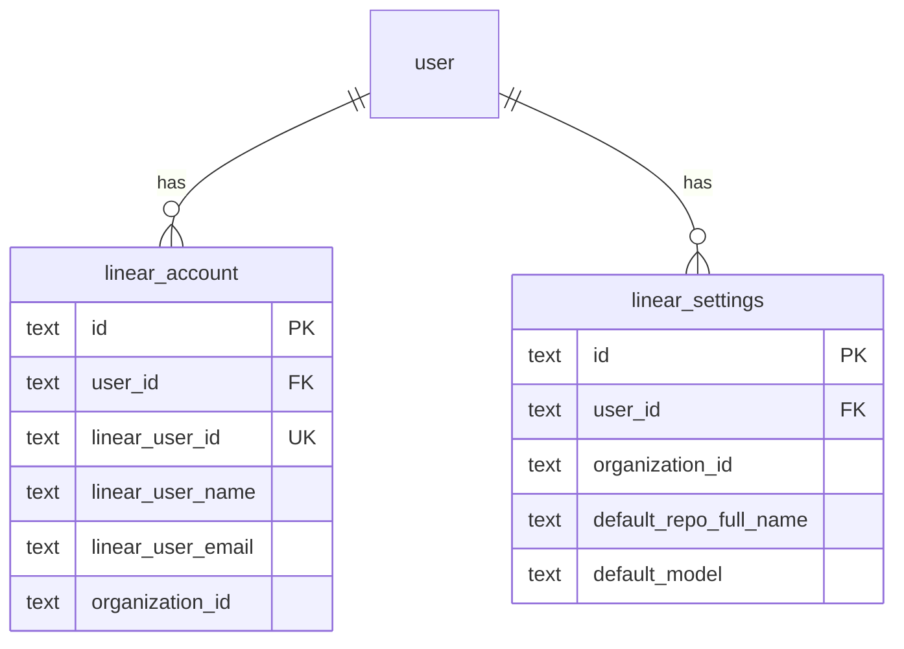

# Add Linear Bot Integration

## Overview

Add a Linear bot integration that allows users to @mention the Terragon bot in Linear issue comments to automatically spin up a sandbox. When mentioned, the bot fetches the issue context including attachments, creates a Terragon thread, starts the agent in a sandbox, and posts an acknowledgment comment back to Linear with a link to the task.

This mirrors the existing Slack @mention integration flow but adapted for Linear's webhook and API model.

## Scope

**In scope (v1):**

- Webhook endpoint receiving Linear Comment.create events with HMAC-SHA256 signature verification
- User account linking (Linear user → Terragon user) via settings UI
- Issue + attachment fetching via @linear/sdk
- Smart GitHub repo detection from Linear issue attachments
- Thread creation with `"linear-mention"` source type
- Acknowledgment comment posted back to Linear
- Feature-flagged behind `linearIntegration` (both webhook handler AND settings UI)
- Documentation (integration guide, env vars, release notes)

**Out of scope (v2):**

- Linear OAuth flow (v1 uses manual account linking + single API key)
- Completion callback to Linear when thread finishes
- Follow-up routing (second mention on same issue → queue to existing thread)
- Automation trigger type `"linear_mention"`
- Bidirectional status sync

## Architecture





## Key Design Decisions

| Decision             | Choice                                                                                   | Rationale                                                                              |
| -------------------- | ---------------------------------------------------------------------------------------- | -------------------------------------------------------------------------------------- |
| Auth model           | Single API key (env var)                                                                 | Linear has no bot concept; simplest for v1                                             |
| User linking         | Manual in settings                                                                       | No OAuth complexity; mirrors early Slack setup                                         |
| Self-loop prevention | Ack comments never contain mention trigger string                                        | Avoids blocking the API key owner from also being a user; simpler than actor ID checks |
| User resolution      | Commenter's linearUserId                                                                 | Same pattern as Slack                                                                  |
| Billing gating       | Check access tier                                                                        | Match GitHub pattern, prevent abuse                                                    |
| Feature flag gating  | Check `linearIntegration` flag for resolved user in webhook handler                      | Gates both UI and webhook processing                                                   |
| Repo detection       | GitHub attachment URL → fallback to settings default                                     | Auto-detects without config when issue has linked PR                                   |
| Idempotency          | Accept rare duplicates                                                                   | Matches existing Slack/GitHub handler behavior                                         |
| DB tables            | 2 (account + settings)                                                                   | No org-level installation table needed with single API key                             |
| Webhook verification | Use `@linear/sdk` `LinearWebhookClient` with fallback to manual `crypto.timingSafeEqual` | SDK preferred but must work in Next.js route handlers                                  |

## DB Index Design

- **`linearAccount`**: 2 unique indexes — `(userId, organizationId)` and `(linearUserId, organizationId)` — matching `slackAccount` pattern
- **`linearSettings`**: 1 unique index — `(userId, organizationId)` only — matching `slackSettings` pattern (user-scoped, not org-global)

## ThreadSourceMetadata Types

All fields are strings (Linear uses UUID strings, not numbers like GitHub):

```
type: "linear-mention"
organizationId: string
issueId: string        // Linear UUID
issueIdentifier: string // Human-readable e.g. "ENG-123"
commentId: string      // Linear UUID
issueUrl: string       // Full URL to Linear issue
```

## Risks

- **Linear API key is personal, not app-level**: Ack comments appear as the key owner, not a bot. Mitigate with clear docs and dedicated service account.
- **No interactive buttons in Linear comments**: Unlike Slack, can't add "Try Again" buttons for setup errors. Must use plain text with links.
- **Webhook payload types unreliable**: SDK generated types don't match webhook payloads (flat IDs vs nested objects). Must handle defensively.
- **`@linear/sdk` webhook client**: May not fit Next.js App Router exactly. Plan includes fallback to manual HMAC-SHA256 verification.

## Mention Detection

- Env var `LINEAR_MENTION_HANDLE` (not "display name") defines the exact trigger string
- Detection is case-insensitive with regex-escaped input
- Ack comments must NEVER include the mention handle (prevents self-triggering loops)

## Quick commands

```bash
# Push schema changes
pnpm -C packages/shared drizzle-kit-push-dev

# Type check
pnpm tsc-check

# Run tests
pnpm -C apps/www test
pnpm -C packages/shared test
```

## Acceptance

- [ ] Linear Comment.create webhooks verified and processed
- [ ] Bot @mention detected in comment body via LINEAR_MENTION_HANDLE (case-insensitive, regex-escaped)
- [ ] Self-triggering loop prevented (ack comments never contain mention handle)
- [ ] Webhook handler checks `linearIntegration` feature flag for resolved user
- [ ] Linear user resolved to Terragon user via linked account
- [ ] User access tier checked before thread creation
- [ ] Issue details + attachments fetched and included in thread message
- [ ] GitHub repo auto-detected from Linear attachments when available
- [ ] Thread created via `newThreadInternal()` with correct sourceType/sourceMetadata (all string types)
- [ ] Acknowledgment comment posted back to Linear with task link
- [ ] Settings UI allows linking Linear account and configuring defaults
- [ ] Disconnect removes both linearAccount and linearSettings records
- [ ] Feature-flagged behind `linearIntegration` (UI + webhook handler)
- [ ] Documentation updated (integration guide, env vars, release notes)
- [ ] All type checks pass (`pnpm tsc-check`)

## References

- Slack webhook route: `apps/www/src/app/api/webhooks/slack/route.ts`
- Slack handler: `apps/www/src/app/api/webhooks/slack/handlers.ts`
- Slack model: `packages/shared/src/model/slack.ts`
- Slack DB tables: `packages/shared/src/db/schema.ts:633-717`
- Thread source types: `packages/shared/src/db/types.ts:79-113`
- Thread creation: `apps/www/src/server-lib/new-thread-internal.ts:13-61`
- Linear SDK webhooks: `@linear/sdk/webhooks` (LinearWebhookClient)
- Linear GraphQL schema: `github.com/linear/linear/packages/sdk/src/schema.graphql`
