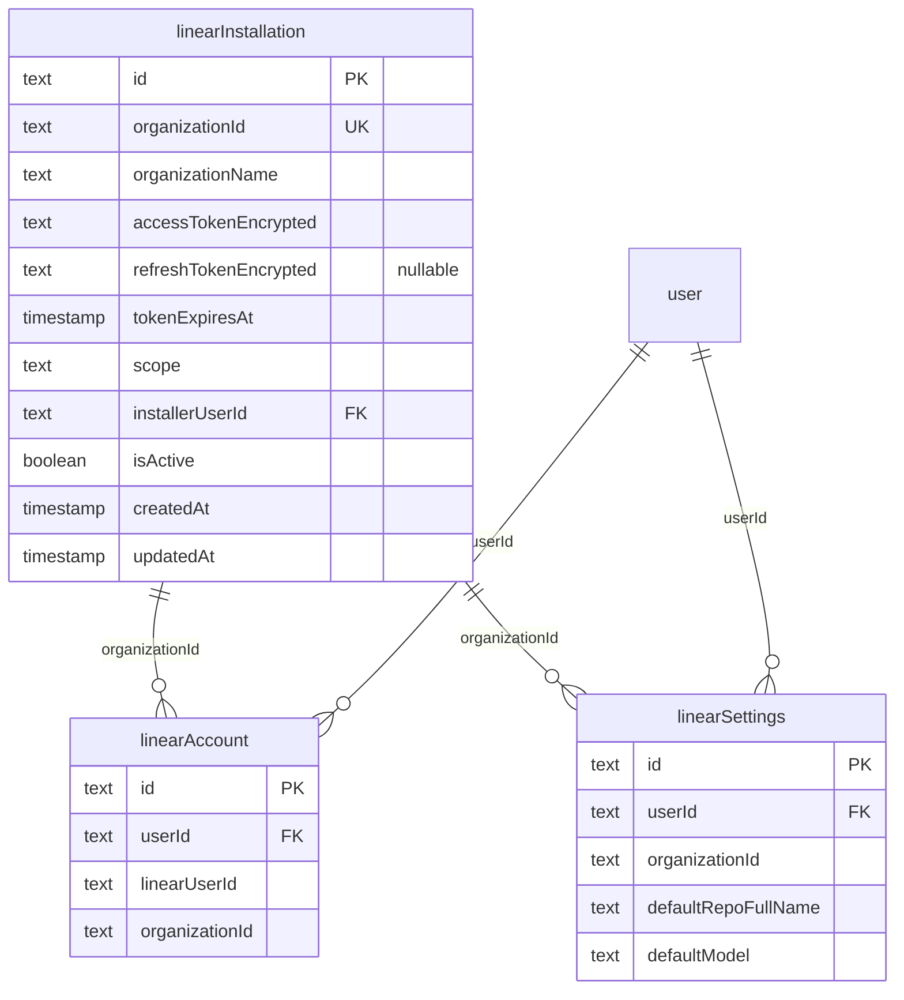
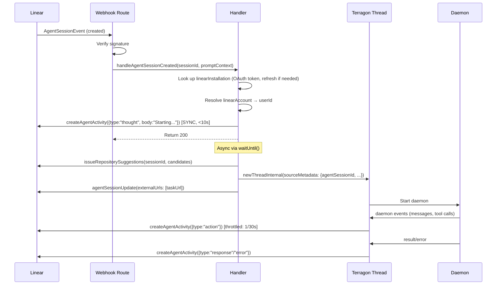

# Upgrade Linear Integration to Linear Agent with OAuth

## Overview

Upgrade Terragon's Linear integration from a simple webhook bot (single API key, regex mention detection, ack comments) to a first-class **Linear Agent** with OAuth 2.0, native mentions, agent sessions, and activity tracking.

### Current State (fn-1, implemented)

- `Comment.create` webhook with HMAC verification
- Single global `LINEAR_API_KEY` for posting ack comments via `createComment`
- `LINEAR_MENTION_HANDLE` env var with regex-based mention detection
- Manual account linking (org ID, user ID, display name, email form)
- `linearAccount` + `linearSettings` DB tables
- Feature-flagged behind `linearIntegration`

### Target State (Linear Agent)

- **OAuth 2.0** with `actor=app` (scopes: `read`, `write`, `app:assignable`, `app:mentionable`)
- **`AgentSessionEvent` webhooks** as the **canonical trigger** for thread creation:
  - `created`: Contains `agentSession.id` + `promptContext` — fires when user mentions/assigns agent
  - `prompted`: Follow-up input to existing session
- **`AppUserNotification` webhooks** (inbox notifications): logged but **not** used for thread creation (no `agentSessionId` available)
- **Agent activities** emitted via `LinearClient.createAgentActivity()`:
  - Content is a typed JSONObject per activity type — see "Critical: Activity API shapes" below
  - NOT a flat `{ type, content }` shape, and NOT `{ type, body }` for all types
- **Agent sessions**: `externalUrls` (link to Terragon task) via `agentSessionUpdate`
- **10-second SLA**: Must emit first activity or set `externalUrls` **synchronously** within webhook handler (before returning 200)
- **Token refresh**: 24-hour access tokens with automatic refresh; DB-level concurrency guard (not in-memory mutex)
- **Repo detection**: Use `issueRepositorySuggestions(agentSessionId, candidateRepositories)` with candidates from `defaultRepoFullName` + user's recent repos. Fallback to `defaultRepoFullName` if no suggestions.

## Scope

### In Scope

- New `linearInstallation` table for workspace-level OAuth tokens (nullable `refreshTokenEncrypted`)
- OAuth callback route + install flow (improving on Slack pattern — error-first handling)
- Webhook handler rewrite for `AgentSessionEvent` (primary) + `AppUserNotification` (logging)
- Agent activity emission during thread lifecycle (time-throttled: max 1/30s per session)
- Settings UI: OAuth install button + separate "disconnect account" vs "uninstall workspace"
- Token refresh with DB-level concurrency guard (optimistic CAS or advisory lock)
- Documentation updates

### Out of Scope

- Linear OAuth for per-user identity (v1 keeps manual `linearAccount` linking)
- Agent `plan` field population from daemon tool calls (future enhancement)
- `issueNewComment` notification type (too noisy at scale)
- Agent `elicitation` activity type (not needed for v1)
- Token revocation on Linear side when disconnecting (just deactivate locally)

## Approach

Follow the **Slack OAuth pattern** with critical fixes:

- `slackInstallation` table → `linearInstallation` table
- `getSlackAppInstallUrl` server action → `getLinearAgentInstallUrl`
- `/api/auth/slack/callback` → `/api/auth/linear/callback`
- `encryptValue()`/`decryptValue()` for token storage

**Key differences from Slack**:

- Linear OAuth uses `actor=app` (agent acts as itself, not as user)
- Linear tokens expire (24h access, refresh tokens) — Slack tokens don't
- No OpenID Connect step (user identity stays via manual `linearAccount` linking)
- **OAuth callback fix**: Handle `error` param BEFORE requiring `code` (Slack has a bug here — `access_denied` omits `code`)
- Wrap state decrypt/JSON.parse in try/catch to redirect gracefully on tampered state

**Critical: Webhook event model**:

- `AgentSessionEvent.created` is the primary trigger for thread creation (always has `agentSession.id`)
- `AppUserNotification` (issueMention, issueCommentMention, issueAssignedToYou) are inbox signals — log them, but don't create threads from them (they lack `agentSessionId`)
- `AgentSessionEvent.prompted` routes follow-up input to existing thread via `agentSessionId`

**Critical: Activity API shapes** (from Linear Agent Interaction docs):

- `LinearClient.createAgentActivity(input)` where input is `{ agentSessionId, content: { type, body?, action?, parameter?, result? } }`
- `thought` type: `{ type: "thought", body: "Thinking..." }`
- `action` type: `{ type: "action", action: "Running tests", result?: "All passed" }`
- `response` type: `{ type: "response", body: "Done! Here's what I did..." }`
- `error` type: `{ type: "error", body: "Failed: reason" }`

**Critical: Repo suggestion API**:

- `issueRepositorySuggestions(agentSessionId, candidateRepositories: [{ fullName, hostname }])`
- Returns `{ repositoryFullName, hostname, confidence }[]`
- Must supply `candidateRepositories` — Linear doesn't auto-detect
- Candidate strategy: `[defaultRepoFullName]` + user's environments from DB (capped at 10)
- Fallback: `defaultRepoFullName` from `linearSettings`

## Architecture





## Quick commands

```bash
# Type check
pnpm tsc-check

# Run model tests
pnpm -C packages/shared test src/model/linear.test.ts

# Run handler tests
pnpm -C apps/www test src/app/api/webhooks/linear/

# Push schema to dev DB
pnpm -C packages/shared drizzle-kit-push-dev
```

## Acceptance

- [ ] `linearInstallation` table stores workspace-level OAuth tokens (encrypted, nullable refresh token)
- [ ] OAuth install flow works: Settings → Linear consent → callback → tokens stored
- [ ] OAuth callback handles `error` before `code`, wraps state decrypt in try/catch
- [ ] Webhook handler processes `AgentSessionEvent.created` as primary trigger (creates thread + emits thought)
- [ ] Webhook handler processes `AgentSessionEvent.prompted` (routes to existing thread)
- [ ] `AppUserNotification` events logged but don't create threads
- [ ] First `thought` activity emitted synchronously within webhook handler (<10s SLA)
- [ ] Agent activities use correct Linear API shapes: `{ type, body/action/result }`
- [ ] Activity emission throttled: max 1 per 30s per session
- [ ] Token refresh uses DB-level concurrency guard (not in-memory mutex)
- [ ] Nullable `refreshTokenEncrypted` — missing refresh token triggers reinstall prompt
- [ ] `issueRepositorySuggestions` uses `candidateRepositories` with fallback to `defaultRepoFullName`
- [ ] Settings UI: separate "disconnect account" vs "uninstall workspace" actions
- [ ] `ThreadSourceMetadata` redesigned: required `agentSessionId`, optional `commentId`, `linearDeliveryId` for dedupe
- [ ] Documentation updated for agent-based flow
- [ ] All existing tests pass + new tests for handler and model layer
- [ ] `pnpm tsc-check` passes

## Dependencies

- **fn-1-add-linear-bot-integration** (all 4 tasks done): Provides base `linearAccount`, `linearSettings` tables, model layer, feature flag, and existing webhook infrastructure

## References

- Linear Agent docs: https://linear.app/developers/agents
- Linear Agent Interaction docs: https://linear.app/developers/agent-interaction
- Linear OAuth docs: https://linear.app/developers/oauth
- Linear Agent demo repo: https://github.com/linear/linear-agent-demo
- Slack OAuth pattern: `apps/www/src/server-actions/slack.ts:37-61`, `apps/www/src/app/api/auth/slack/callback/route.ts`
- Slack installation schema: `packages/shared/src/db/schema.ts:633-659`
- Current Linear webhook: `apps/www/src/app/api/webhooks/linear/route.ts`
- Daemon event handler: `apps/www/src/server-lib/handle-daemon-event.ts`
- Encryption utilities: `packages/utils/src/encryption.ts`
