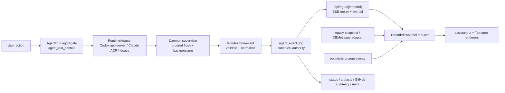

# refactor: Smooth runtime rewrite

## Overview

Rewrite Terragon's agent runtime around a small durable spine: `agent_run_context`, canonical `AgentEvent`s, `agent_event_log`, AG UI streaming, and one active task view model. The delivery loop becomes deleted code, not compatibility architecture. Codex app-server and Claude ACP become first-class runtime adapters behind the Terragon run contract, while AG UI plus assistant-ui remains the long-term task UI stack (see origin: `docs/brainstorms/2026-04-24-smooth-runtime-rewrite-requirements.md`).

This plan now assumes a big-bang rewrite branch: build the replacement runtime and task UI in one coherent slice, aggressively remove delivery-loop/product slop in that branch, and keep only the smallest compatibility adapters needed for old task rendering and data migration. The safety rule is not "remove slowly"; it is "delete aggressively, but replace terminal fencing, follow-up dispatch, hibernation, replay, and access control before the branch ships."

## Problem Frame

The app has too many runtime authorities: `thread_chat.messages`, `agent_run_context`, `agent_event_log`, Redis streams, delivery-loop workflow heads, daemon callbacks, React Query, TanStack DB collections, and compatibility projections. That split makes realtime streaming, terminal state, retry behavior, and follow-ups hard to reason about.

The desired product is simpler: start a coding task, stream progress quickly, show tool/artifact/permission state, stop/retry/follow up, preserve GitHub context, and recover from reconnects or Redis gaps. Autonomous PR delivery gates and babysitting are out of scope for this rewrite.

## Requirements Trace

- R1-R7: Smooth task chat, realtime progress, explicit stop/retry/follow-up/artifact/GitHub basics.
- R8-R14: App-owned runtime/event contract with Codex app-server and Claude ACP as adapters, plus low-latency ordered daemon-to-app delivery.
- R15-R21: Enforceable architecture, lint, type, and test guardrails.
- R22-R26: Durable spine stays `thread`, `thread_chat`, `agent_run_context`, `agent_event_log`; delivery-loop persistence is removed in the rewrite branch after replacement fences and historical-read strategy are explicit.
- R27-R33: One active task view model, AG UI plus assistant-ui projection, collection-safe optimistic updates, render-churn isolation.
- R34-R39: Typed terminal state, explicit recovery actions, malformed event fail-closed behavior, predictable replay/reconnect.
- R40-R44: Latency and replay performance budgets for first paint, streaming, reconnect, and long histories.
- R45-R49: Big-bang replacement branch with named temporary bridges only for historical data/read compatibility.
- R50-R54: Run-scoped ingestion auth, replay protection, provider proxy enforcement, sandbox credential redaction, access-controlled replay/artifacts.
- R55-R57: Preserve explicit GitHub context/actions, remove hidden PR workflow progression.
- R58-R65: Active task action matrix, permission behavior, artifact states, retry and adapter-operation matrices.
- R66-R71: First planning deliverable includes keep/remove map, provider parity, runtime session contract, replay inventory, performance bounds, and reconnect semantics.

## Scope Boundaries

- Do not preserve delivery-loop phases, gates, plan promotion, autonomous PR continuation, CI/review babysitting, or hidden PR workflow state.
- Do preserve basic GitHub context: PR link/number, branch, check summary, mergeability when known, and explicit user-initiated GitHub actions.
- Do preserve automations as task creators or prompt queueing; do not let them depend on delivery-loop phases.
- Do not make Codex app-server the whole product center. Codex app-server and Claude ACP sit behind the Terragon run/event contract.
- Do not do a full visual redesign first. The UI work is state simplification and responsive streaming.

### Deferred to Separate Tasks

- New autonomous PR workflow product: not part of this rewrite. If rebuilt later, it should be a separate feature above the run/event layer.
- Full assistant-ui-native renderer replacement beyond the active task surface: keep assistant-ui as the component/runtime stack, but do not expand into unrelated screens in this rewrite.

## Context & Research

### Relevant Code and Patterns

- `packages/shared/src/db/schema.ts`: existing `thread`, `thread_chat`, `agent_run_context`, `agent_event_log`, and delivery-loop tables.
- `packages/shared/src/model/agent-event-log.ts`: ordered durable event append/replay helpers and AG UI compatibility readers.
- `packages/agent/src/canonical-events.ts`: current canonical event envelope, currently too narrow for full provider parity.
- `packages/agent/src/ag-ui-mapper.ts`: pure mapping boundary to follow for AG UI projection.
- `apps/www/src/server-lib/ag-ui-publisher.ts`: persists AG UI rows transactionally, then publishes Redis after commit.
- `apps/www/src/app/api/ag-ui/[threadId]/route.ts`: session auth, thread/chat ownership check, DB replay, Redis live-tail, durable terminal fallback.
- `apps/www/src/app/api/daemon-event/route.ts`: overloaded ingress; currently validates tokens, persists AG UI, calls legacy `handleDaemonEvent`, and runs delivery-loop terminal side effects.
- `apps/www/src/agent/runtime/implementation-adapter.ts`: dispatch-only adapter contract that must grow into runtime operation contracts.
- `packages/daemon/src/daemon.ts`: daemon hotspot for legacy, ACP, Codex app-server, permissions, batching, and event flush.
- `packages/daemon/src/__fixtures__/codex`, `packages/daemon/src/__fixtures__/acp`, `packages/daemon/src/__fixtures__/claude-code`: fixture base for provider parity.
- `apps/www/src/components/chat/ag-ui-messages-reducer.ts`: pure reducer pattern for client projection.
- `apps/www/src/components/chat/chat-ui.tsx`: current dual-path client state and delivery-loop UI coupling.
- `apps/www/src/collections/thread-chat-collection.ts`: collection-first read path that optimistic updates must feed.
- `apps/www/src/server-lib/ag-ui-regression-guards.test.ts`: current source-inspection guardrail pattern.

### Institutional Learnings

- `docs/ag-ui-cutover-checklist.md`: target is daemon-normalized events -> durable `agent_event_log` -> deterministic projections -> SSE/live replay.
- `docs/ag-ui-migration-complete.md`: current cutover still leaves `/api/daemon-event` calling `handleDaemonEvent(messages)` for run status and delivery-loop behavior.
- `docs/ag-ui-testing-plan.md`: use replay fixtures and integration tests across daemon-event, AG UI route, and UI rendering.
- `docs/ag-ui-stream-observability-note.md`: keep `stream_open`, `first_frame`, and `stream_close` diagnostics with replay, dedupe, timeout, and latency counts.
- `docs/task-liveness-freshness-plan.md`: durable terminal run state must beat stale workflow/head/query state.
- `docs/codex-timeout-investigation.md`: daemon supervision needs real cancellation, health checks, subprocess cleanup, and timeout ownership.
- `docs/github-integration-architecture-redesign.md`: GitHub should be projection/context, not workflow authority.
- `docs/chat-ui-protocol-gaps-plan.md`: fixture-first protocol parity is the right way to cover Codex, ACP, and legacy payloads.

### External References

- [AG UI overview](https://docs.ag-ui.com/): AG UI is an event-based agent-to-user protocol for realtime, multimodal, interactive experiences.
- [AG UI events](https://docs.ag-ui.com/concepts/events): text, reasoning, tool, activity, raw/custom, and snapshot/delta events support streaming and replay.
- [AG UI serialization](https://docs.ag-ui.com/concepts/serialization): event streams can be persisted/restored and compacted.
- [assistant-ui ExternalStoreRuntime](https://www.assistant-ui.com/docs/runtimes/custom/external-store): assistant-ui can consume app-owned state through an external store adapter.
- [claude-agent-acp](https://github.com/agentclientprotocol/claude-agent-acp): Claude ACP bridge is active, released, and fixture-worthy as a primary runtime boundary.

## Key Technical Decisions

- Canonical `AgentEvent`s, not AG UI rows, become durable authority. AG UI remains the presentation protocol and SSE payload shape. Existing AG UI-native rows stay readable for historical tasks through the rewrite branch.
- `agent_run_context` remains the `AgentRun` aggregate unless implementation proves a new table is required. Add runtime session fields there before creating a new table.
- `/api/daemon-event` becomes canonical event ingress. `handleDaemonEvent(messages)` is either deleted in the rewrite branch or reduced to a narrow legacy-history projector with no runtime authority.
- Delivery-loop terminal fencing is replaced with run-context compare-and-set fencing before delivery-loop workflow tables are dropped.
- Follow-up queueing survives, but delivery-loop intent-only dispatch is removed or replaced with generic run-launch intent.
- Client state collapses into one `ThreadViewModel` reducer fed by snapshots, AG UI/SSE events, legacy DBMessage adapters, and optimistic local events.
- Runtime adapters must cover operations, not only dispatch payloads: start, resume, stop, restart/retry, permission response, event normalization, session persistence, and unsupported-operation behavior.
- Architecture guardrails should be a repo-native `packages/architecture-lint` checker added alongside Biome, not an abrupt ESLint migration.

### Provider Product Intent

Codex app-server and Claude ACP are not parity for parity's sake. They earn their place only if they improve the basic task loop:

- **Codex app-server:** preferred path for Codex-native tasks where faster resume, richer tool/progress metadata, reliable interruption, and app-owned sessions matter.
- **Claude ACP:** first-class path for Claude tasks where permission requests, rich content, and standard ACP session semantics are better than legacy stream-json glue.
- **Legacy fallback:** old-history rendering and emergency operation only; acceptable gaps are explicit unsupported-operation results, not hidden no-ops.

The product proof is visible: faster start/resume, clearer permission state, better tool progress, reliable stop/retry, and fewer transcript/projection bugs.

### Assistant UI Adoption Boundary

assistant-ui should own active-task interaction scaffolding and rendering integration, while Terragon owns runtime state and domain renderers. In this rewrite:

- assistant-ui-native now: thread shell, message list integration, composer lifecycle, scroll behavior, and accessible interaction states where compatible.
- Terragon custom renderers remain: terminal, diff, plan/artifact, permission, GitHub summary, meta chips, and any provider-specific rich part.
- Unacceptable regressions: slower first paint, keyboard/screen-reader loss, duplicate bubbles, hidden follow-up state, or visual states that obscure run/permission/terminal status.

## Open Questions

### Resolved During Planning

- Should this be a smaller intervention that only hides delivery-loop UI? No. It would not satisfy R8-R14, R22-R33, R62-R71 because delivery-loop would still own terminal fencing, dispatch intent, follow-up retry, PR progression, and stale UI status.
- Should Codex app-server become the sole runtime authority? No. It should be first-class behind Terragon's adapter contract so Claude ACP and legacy fallback remain covered.
- Should AG UI replace the DB source of truth? No. AG UI is the streaming/presentation protocol; durable Terragon events and projections are app authority.
- Should guardrails use ESLint? Not initially. The repo is Biome-based; add a custom architecture checker with narrow allowlists and tests.

### Deferred to Implementation

- Exact migration columns for runtime session state: settle during schema implementation after checking existing production rows and Drizzle migration constraints.
- Exact long-history latency budget values: plan defines the surfaces; implementation should calibrate budgets with representative fixtures.
- Exact adapter method names: keep the plan at contract level so implementers can fit the local naming.
- Exact delivery-loop drop migration shape: settle inside the rewrite branch once implementation confirms which historical rows need export/archive before table removal.

## Keep / Remove / Replace Map

| Area                     | Current files                                                                                                                                                                                                                                                                          | Decision                                                                                                                                                               |
| ------------------------ | -------------------------------------------------------------------------------------------------------------------------------------------------------------------------------------------------------------------------------------------------------------------------------------- | ---------------------------------------------------------------------------------------------------------------------------------------------------------------------- |
| Enrollment and opt-in    | `apps/www/src/server-lib/new-thread-shared.ts`, `apps/www/src/server-actions/new-thread.ts`, `apps/www/src/server-lib/delivery-loop/enrollment.ts`, `apps/www/src/components/promptbox/dashboard-promptbox.tsx`, `apps/www/src/components/settings/linear/linear-account-settings.tsx` | Remove user-facing opt-in and auto-enrollment; route web/GitHub/Linear task creation through normal tasks.                                                             |
| Delivery status UI       | `apps/www/src/server-actions/get-delivery-loop-status.ts`, `apps/www/src/queries/delivery-loop-status-queries.ts`, `apps/www/src/lib/delivery-loop-status.ts`, `apps/www/src/components/patterns/delivery-loop-top-progress-stepper.tsx`, `apps/www/src/components/chat/chat-ui.tsx`   | Remove stepper and gate UI; replace freshness logic with run-context/thread-chat liveness.                                                                             |
| Dispatch intent          | `packages/shared/src/delivery-loop/store/dispatch-intent-store.ts`, `apps/www/src/server-lib/delivery-loop/dispatch-intent.ts`, `apps/www/src/server-lib/process-follow-up-queue.ts`, `apps/www/src/agent/msg/startAgentMessage.ts`                                                    | Replace with generic run-launch intent only if normal queued-message dispatch cannot own retry.                                                                        |
| Terminal fencing         | `apps/www/src/app/api/daemon-event/route.ts`, `apps/www/src/server-lib/handle-daemon-event.ts`, `packages/shared/src/model/agent-run-context.ts`                                                                                                                                       | Keep fail-closed terminal behavior; replace workflow fence with run-context CAS.                                                                                       |
| Retry jobs               | `apps/www/src/server-lib/delivery-loop/retry-jobs.ts`, `apps/www/src/server-lib/delivery-loop/retry-policy.ts`, `apps/www/src/app/api/internal/cron/scheduled-tasks/route.ts`, `apps/www/src/app/api/internal/cron/dispatch-ack-timeout/route.ts`                                      | Keep follow-up recovery; remove v3 effect/outbox/ack drains after dispatch no longer depends on delivery effects.                                                      |
| Follow-up dispatch       | `apps/www/src/server-actions/follow-up.ts`, `apps/www/src/server-lib/follow-up.ts`, `apps/www/src/server-lib/process-follow-up-queue.ts`, `apps/www/src/server-lib/checkpoint-thread.ts`                                                                                               | Keep queued follow-ups; remove intent-only delivery-loop dispatch.                                                                                                     |
| PR/check progression     | `apps/www/src/app/api/webhooks/github/handlers.ts`, `apps/www/src/server-lib/delivery-loop/publication.ts`, `packages/shared/src/delivery-loop/store/workflow-github-refs.ts`, `apps/www/src/server-lib/github-projection-refresh.ts`                                                  | Keep projection and feedback routing; remove workflow resurrection, canonical loop status, and hidden PR phase progression.                                            |
| Liveness and hibernation | `apps/www/src/agent/thread-resource.ts`, `apps/www/src/agent/sandbox.ts`, `packages/sandbox/src/sandbox.ts`, `apps/broadcast/src/sandbox.ts`                                                                                                                                           | Must survive removal; deactivation, keepalive, hibernation, and stale-status protection become run-context based.                                                      |
| Workflow tables          | `packages/shared/src/db/schema.ts`, `packages/shared/src/delivery-loop/**`, `apps/www/src/server-lib/delivery-loop/v3/**`                                                                                                                                                              | Drop inside the rewrite branch after replacement code compiles and historical read strategy is explicit; do not ship the branch with live workflow-table dependencies. |

## Big-Bang Rewrite Strategy

The rewrite branch should be organized around deletion-first milestones rather than gradual product coexistence:

1. **Freeze and remove new delivery-loop entry points:** delete opt-in controls, enrollment calls, workflow resurrection, delivery-loop progress UI, and hidden PR/check advancement early in the branch.
2. **Stand up the replacement spine in parallel inside the branch:** canonical runtime events, run-context terminal fencing, runtime sessions, and adapter operations become the only write path for new runs.
3. **Collapse the active task UI:** replace dual projection/cache choreography with `ThreadViewModel` before polishing individual UI states.
4. **Delete old runtime authority:** remove delivery-loop dispatch intent, v3 effects/outbox/ack drains, delivery-loop status query/actions, and workflow-head status overrides once replacement tests pass.
5. **Drop delivery-loop schema before merge:** keep only explicit historical export/archive or legacy read adapters that do not participate in new runtime control.
6. **Use one final compatibility boundary:** old tasks may render through a legacy snapshot adapter, but old workflow code should not remain as a dormant subsystem.

Big bang does not mean reckless. The branch should have hard gates: no hidden workflow writes, no delivery-loop imports from runtime/UI paths, durable terminal replay with Redis disabled, provider parity fixtures passing, and architecture-lint enabled before merge.

## High-Level Technical Design

> _This illustrates the intended approach and is directional guidance for review, not implementation specification. The implementing agent should treat it as context, not code to reproduce._

## Runtime Session Contract

The implementation should add or derive a typed runtime session object from `agent_run_context` and only keep `thread_chat.sessionId` / `thread_chat.codexPreviousResponseId` as migration shims.

| Field                  | Meaning                                                                                             | Migration source                                         |
| ---------------------- | --------------------------------------------------------------------------------------------------- | -------------------------------------------------------- |
| `runId`                | Terragon run identity and event/log fence                                                           | Existing `agent_run_context.runId`                       |
| `runtimeProvider`      | `codex-app-server`, `claude-acp`, `legacy-claude`, `legacy-gemini`, `legacy-amp`, `legacy-opencode` | Existing `transportMode` plus `agent`                    |
| `externalSessionId`    | Provider thread/session id                                                                          | `thread_chat.sessionId`, ACP session id, Codex thread id |
| `previousResponseId`   | Codex resume/checkpoint pointer                                                                     | `thread_chat.codexPreviousResponseId`                    |
| `checkpointPointer`    | Durable continuation artifact when compaction/checkpoint exists                                     | Existing checkpoint/session artifacts                    |
| `hibernationValid`     | Whether sandbox/runtime can resume without restart                                                  | Sandbox provider and run terminal/liveness state         |
| `compactionGeneration` | Invalidates stale resume state after compact-and-retry                                              | New or derived from compact event                        |
| `lastAcceptedSeq`      | Replay/ingress ordering fence                                                                       | `agent_event_log.seq` plus daemon envelope seq           |
| `terminalEventId`      | Idempotent terminal event fence                                                                     | Daemon event envelope                                    |

### Runtime Session Invariants

The rewrite must not replace delivery-loop split-brain with run-context split-brain. Before runtime writes move over, define a transition table for `agent_run_context` session fields:

| Transition               | Allowed writer          | Required fence                                       |
| ------------------------ | ----------------------- | ---------------------------------------------------- |
| start run                | app run launcher        | `threadChatId`, `runId`, daemon token key, provider  |
| accept provider session  | daemon adapter          | `runId`, provider, idempotency key                   |
| resume run               | app run launcher        | current `runId`, valid checkpoint/session pointer    |
| compact and retry        | app recovery action     | new compaction generation, old pointer invalidated   |
| hibernate/resume sandbox | sandbox lifecycle owner | current active run and sandbox generation            |
| terminal state           | daemon ingress          | `runId`, `threadChatId`, sequence, terminal event id |

Every transition needs tests for stale writer rejection, duplicate idempotency, and concurrent terminal/follow-up/resume behavior.

## Provider Parity Matrix

| Category                  | Codex app-server                      | Claude ACP                      | Legacy fallback                   | Plan requirement                                             |
| ------------------------- | ------------------------------------- | ------------------------------- | --------------------------------- | ------------------------------------------------------------ |
| Text streaming            | Native deltas                         | ACP session updates             | Claude-shaped stream              | Canonical text lifecycle with stable message ids             |
| Reasoning/thinking        | Reasoning summary/text events         | ACP thought/content             | Legacy thinking parts             | Canonical reasoning events mapped to AG UI reasoning         |
| Tool args/progress/result | Native command/file/MCP progress      | ACP tool call/update/result     | Legacy tool use/result            | Tool lifecycle supports progressive args/progress and result |
| Permission                | App-server approval/interrupt support | ACP permission request          | Existing permission tool fallback | One permission state and response operation                  |
| Terminal                  | Turn completion/error/stop            | ACP completion/error/exit       | Process close/custom error        | Durable typed terminal event before live broadcast           |
| Diff/plan/artifacts       | Native turn diff/plan/file events     | ACP rich content                | Legacy custom parts               | Artifact descriptors by reference, not hot transcript blobs  |
| Image/audio/resource      | Native where available                | ACP rich content fixtures exist | Legacy part fallback              | Rich-part canonical variants or quarantined raw payload      |
| Meta/rate/model           | Native token/reroute/MCP events       | ACP or daemon meta              | Legacy meta                       | Ephemeral or durable meta per type, with bounded payloads    |

Provider payloads are untrusted input. Terragon-generated run/session/control ids are authoritative; provider-supplied artifact paths, URLs, tool names, command metadata, and permission requests must be canonicalized, allowlisted, or quarantined before becoming canonical events.

## Active Task State Matrix

| State                    | Allowed actions                       | Follow-up behavior                                 | Recovery rule                                      |
| ------------------------ | ------------------------------------- | -------------------------------------------------- | -------------------------------------------------- |
| `booting`                | stop, view setup progress             | queue locally and durably                          | restart sandbox/runtime if boot fails              |
| `running`                | stop, view artifacts/tool progress    | queue while run is active                          | reconnect/replay on transport gap                  |
| `waiting_for_permission` | approve, deny, leave pending          | keep queued; composer can stay disabled or guarded | permission response returns to running or terminal |
| `stopped`                | retry, follow up, inspect artifacts   | send immediately as new run                        | restart runtime or resume from checkpoint          |
| `failed`                 | typed retry, follow up, inspect error | send immediately or retry with prompt              | compact-and-retry, restart runtime, ask user       |
| `complete`               | follow up, inspect artifacts/PR       | send immediately as new run                        | none unless user requests retry                    |
| `sandbox_unavailable`    | retry sandbox, view error             | queue/preserve draft                               | recreate/resume sandbox before run dispatch        |

## Retry / Recovery Matrix

| Failure class               | User action                                        | Confirmation                    | Context handling                                                      | Resulting state                      |
| --------------------------- | -------------------------------------------------- | ------------------------------- | --------------------------------------------------------------------- | ------------------------------------ |
| `context_window_exhausted`  | Compact and retry                                  | No                              | compact bounded summary and invalidate old resume pointer             | `booting` then `running`             |
| `runtime_crash`             | Restart runtime and retry                          | No                              | preserve prompt and checkpoint pointer if valid                       | `booting`                            |
| `sandbox_unavailable`       | Reconnect sandbox                                  | No                              | revalidate sandbox liveness before dispatch                           | `booting` or `failed`                |
| `permission_denied`         | Revise prompt or retry                             | No                              | do not auto-resubmit denied operation                                 | `failed` or `waiting_for_permission` |
| `rate_limited`              | Retry later                                        | Maybe, if user cost/time impact | preserve queued prompt as retry metadata, schedule delay if supported | `failed` with retry metadata         |
| `malformed_envelope`        | Ask for intervention                               | Yes                             | reject before persistence and mark run failed                         | `failed`                             |
| `unknown_provider_event`    | Ask for intervention if projection cannot continue | Maybe                           | persist redacted quarantine payload with no default projection        | `failed` or current durable state    |
| `malformed_projection_part` | Re-render from durable snapshot                    | No                              | quarantine projection-only payload and continue safe rendering        | current durable state                |
| `replay_gap`                | Reconnect/replay                                   | No                              | replay from durable cursor, suppress duplicates                       | current durable state                |

## Reconnect and Replay Semantics

- Clients connect with `threadChatId` and optional `runId`; server validates thread membership before replay.
- Replay preflight authorizes the tuple `userId + threadId + threadChatId + runId`, including shared-task visibility and archived/private boundaries.
- Server captures Redis cursor before DB replay so mid-replay writes are not lost.
- Replay is durable and ordered by run/thread-chat sequence; Redis is only live-tail.
- Duplicate suppression uses event identity first: `runId + eventId`, then idempotency key, then sequence, then delta identity.
- If Redis/XREAD fails, UI continues by durable terminal fallback and reconnect replay.
- Multi-tab clients may receive overlapping live events; reducers must be idempotent.
- Long histories should use snapshots, checkpoints, pagination, or compaction rather than O(full transcript) first paint.
- Redis channels include environment and thread/run scope; SSE responses are `no-store`/`no-transform`, diagnostics exclude content and secrets, and cross-thread Redis events are ignored after DB auth preflight.

## Performance Bounds

Initial budgets are merge gates. Implementation may tighten or recalibrate them with representative fixtures, but may not remove them without replacing them with stronger measured gates.

| Surface               | Initial budget                                                                          |
| --------------------- | --------------------------------------------------------------------------------------- |
| Initial task shell    | Visible shell from snapshot in under 500 ms in jsdom/integration harness                |
| Submit-to-echo        | Optimistic user message visible in the next render tick; no collection refetch required |
| Run-start visibility  | `RUN_STARTED` visible without broad refetch                                             |
| First assistant token | First text/reasoning delta does not reduce the full transcript                          |
| Tool progress         | One tool delta updates only that tool/message projection                                |
| Terminal visibility   | Durable terminal event/status wins with Redis disabled                                  |
| Reconnect catch-up    | 5k-event replay converges without duplicates in under 2 s in CI harness                 |
| Long run replay       | Snapshot/checkpoint path activates before 10k events or 5 MB of replay payload          |
| Render churn          | Streaming one delta does not re-render inactive transcript items                        |

## Product Acceptance Gates

The branch cannot use schema deletion as the first proof that the rewrite works. Before Unit 8 lands, run an executable golden task walkthrough that proves the product feels smoother:

- Web-created task: shell, optimistic echo, first assistant token, tool progress, permission prompt, artifact, terminal, follow-up.
- GitHub/Linear-created task: correct repository/branch/PR context, no hidden workflow progression, follow-up targets the visible task.
- Recovery: stop, retry, reconnect after tab sleep, Redis-disabled replay, sandbox unavailable.
- PR confidence: PR link/number, branch, check summary, mergeability when known, review/failure states, and explicit user actions remain visible without delivery-loop phases.

The walkthrough should capture before/after timings for submit-to-echo, first token, first tool progress, terminal visibility, and reconnect convergence.

## Historical Replay Inventory

Before dropping workflow tables, build a replay inventory from sampled production-like histories:

| History class                      | Acceptance rule                                                                                                |
| ---------------------------------- | -------------------------------------------------------------------------------------------------------------- |
| pre-AG UI `DBMessage` thread       | renders through legacy snapshot adapter with explicit degraded states if lossless reconstruction is impossible |
| AG UI-native event-log thread      | replays through canonical/AG UI path with no duplicate bubbles                                                 |
| delivery-loop PR-linked task       | shows PR summary without workflow tables                                                                       |
| accepted-plan/artifact-heavy task  | renders plan/artifact history or an explicit archived artifact state                                           |
| long/sub-agent-heavy run           | uses snapshot/checkpoint path and passes replay budget                                                         |
| malformed/unknown provider payload | follows the quarantine lifecycle and never renders raw payload by default                                      |

Lossy histories must be marked degraded in the adapter and covered by fixtures; they must not keep old workflow code alive.

## Implementation Units

- [ ] **Unit 1: Define canonical runtime events and session ownership**

**Goal:** Expand the canonical runtime contract so provider output, terminal state, session resume data, and AG UI projection have one typed source.

**Requirements:** R8-R14, R19-R24, R34-R39, R50-R54, R67-R68

**Dependencies:** None

**Files:**

- Modify: `packages/agent/src/canonical-events.ts`
- Modify: `packages/agent/src/canonical-events.test.ts`
- Modify: `packages/agent/src/ag-ui-mapper.ts`
- Modify: `packages/agent/src/ag-ui-mapper.test.ts`
- Modify: `packages/shared/src/db/schema.ts`
- Modify: `packages/shared/src/db/types.ts`
- Modify: `packages/shared/src/model/agent-event-log.ts`
- Modify: `packages/shared/src/model/agent-event-log.test.ts`
- Create: `packages/shared/drizzle/<next>_runtime_session_contract.sql`

**Approach:**

- Add canonical variants for reasoning, tool progress, permission request/response, artifact reference, diff, plan, image, audio, resource link, meta, and quarantined unknown provider event.
- Keep raw payloads only in bounded/redacted quarantine fields with no default user-visible projection.
- Define quarantine as admin/debug-only: explicit RBAC, retention TTL, size limits, redaction-before-write, read audit logging, and exclusion from normal replay/export.
- Move durable terminal representation into canonical events and keep aggregate status as a cache.
- Add runtime session fields to `agent_run_context` unless migration research proves a separate table is cleaner.
- Keep readers tolerant of legacy AG UI rows and legacy canonical rows.

**Execution note:** Start with fixture/roundtrip tests that fail for missing provider categories before widening writers.

**Patterns to follow:**

- `packages/agent/src/ag-ui-mapper.ts`
- `packages/shared/src/model/agent-event-log.ts`
- `packages/shared/src/utils.ts` for `assertNever`

**Test scenarios:**

- Happy path: Codex text, reasoning, tool progress, diff, and terminal fixture normalizes to canonical events and maps to AG UI.
- Happy path: Claude ACP permission, terminal, resource link, and plan fixture normalizes to canonical events and maps to AG UI.
- Edge case: unknown provider event is redacted, size-limited, stored as quarantined raw payload, audit-gated, and not rendered or emitted through SSE by default.
- Error path: malformed envelope with mismatched `runId` or non-monotonic `seq` is rejected before persistence.
- Error path: fixture with embedded secrets is redacted before event-log persistence, quarantine, diagnostics, and replay recording.
- Integration: legacy AG UI rows and canonical rows both replay through `getAgUiEventsForRun`.

**Verification:**

- Canonical event union is exhaustive in mapper tests.
- Event-log replay returns the same user-visible event categories for Codex app-server, Claude ACP, and legacy fallback fixtures.

- [ ] **Unit 2: Replace delivery-loop terminal fencing with run-context fencing**

**Goal:** Make `/api/daemon-event` the canonical ingress and terminal authority and delete delivery-loop workflow terminal authority from the rewrite branch.

**Requirements:** R14, R23-R26, R34-R39, R45-R48, R50-R54, R66, R71

**Dependencies:** Unit 1

**Files:**

- Modify: `apps/www/src/app/api/daemon-event/route.ts`
- Modify: `apps/www/src/app/api/daemon-event/route.test.ts`
- Modify: `apps/www/src/server-lib/handle-daemon-event.ts`
- Modify: `apps/www/src/server-lib/daemon-event-db-preflight.ts`
- Modify: `apps/www/src/server-lib/daemon-event-db-preflight.test.ts`
- Modify: `packages/shared/src/model/agent-run-context.ts`
- Modify: `packages/shared/src/model/agent-run-context.test.ts`
- Modify: `apps/www/src/server-lib/ag-ui-publisher.ts`
- Modify: `apps/www/src/server-lib/ag-ui-publisher.test.ts`

**Approach:**

- Split ingress into validate, normalize, append canonical events, update run aggregate, project compatibility, publish live.
- Replace workflow/run-seq terminal fence with run-context compare-and-set using `runId`, `threadChatId`, transport/protocol, token key, sequence, and terminal event id.
- Enforce daemon ingress auth before normalization or persistence: scoped credential, expiry/rotation/revocation semantics, constant-time verification, `runId`/`threadChatId` binding, provider binding, and fail-closed cross-thread rejection.
- Persist durable terminal event before live broadcast.
- Delete `handleDaemonEvent` runtime authority. If legacy `DBMessage` projection is still needed for old histories, isolate it behind a read-only legacy projection module with no status/follow-up/workflow side effects.
- Preserve hibernation and active-thread deactivation semantics during terminal handling.

**Execution note:** Add characterization tests around current duplicate terminal, stale terminal, and route retry behavior before refactoring the route.

**Patterns to follow:**

- `apps/www/src/app/api/ag-ui/[threadId]/route.ts`
- `apps/www/src/server-lib/ag-ui-publisher.ts`
- `docs/task-liveness-freshness-plan.md`

**Test scenarios:**

- Happy path: terminal event appends durable terminal row, updates `agent_run_context`, updates `thread_chat`, broadcasts AG UI, and deactivates sandbox liveness.
- Edge case: duplicate terminal event returns idempotent success and does not duplicate transcript/tool/artifact state.
- Error path: stale terminal event for an old run cannot override newer active run state.
- Error path: invalid token, wrong run token, expired/rotated token, provider mismatch, and cross-thread daemon POST reject before persistence.
- Error path: Redis publish fails after DB commit; reconnect replay still reconstructs terminal state.
- Integration: daemon event POST -> `agent_event_log` rows -> `/api/ag-ui` replay -> UI reducer renders terminal state.

**Verification:**

- Delivery-loop workflow head is no longer required to commit terminal state.
- Existing normal tasks, stopped tasks, and failed tasks still converge through durable replay.

- [ ] **Unit 3: Build real runtime adapter contracts**

**Goal:** Turn runtime adapters from dispatch payload factories into explicit operation contracts across Codex app-server, Claude ACP, and legacy fallback.

**Requirements:** R8-R14, R34-R38, R48, R62-R65, R67-R68

**Dependencies:** Units 1-2

**Files:**

- Modify: `apps/www/src/agent/runtime/implementation-adapter.ts`
- Modify: `apps/www/src/agent/runtime/codex-implementation-adapter.ts`
- Modify: `apps/www/src/agent/runtime/claude-code-implementation-adapter.ts`
- Modify: `apps/www/src/agent/msg/startAgentMessage.ts`
- Modify: `apps/www/src/agent/msg/startAgentMessage.test.ts`
- Modify: `packages/daemon/src/shared.ts`
- Modify: `packages/daemon/src/daemon.ts`
- Modify: `packages/daemon/src/runtime.ts`
- Modify: `packages/daemon/src/codex-app-server.ts`
- Modify: `packages/daemon/src/acp-adapter.ts`
- Modify: `packages/daemon/src/acp-codex-adapter.ts`
- Modify: `packages/daemon/src/codex-app-server.test.ts`
- Modify: `packages/daemon/src/acp-adapter.test.ts`
- Modify: `packages/daemon/src/runtime.test.ts`
- Modify: `packages/daemon/src/__fixtures__/**`

**Approach:**

- Define operation parity for start, resume, stop, restart/retry, permission response, event normalization, and typed unsupported-operation behavior.
- Treat compact-and-retry and human intervention as explicit failure/recovery outputs unless implementation finds an existing live basic-task path that must preserve them as adapter operations.
- Make unsupported operations typed adapter results instead of implicit no-ops.
- Normalize provider events in provider-specific adapter modules before the daemon flush loop; malicious provider fixtures must not forge control events, permission ids, artifact references, terminal state, or Terragon-owned session ids.
- Unify session persistence semantics through runtime session fields.
- Keep legacy stream-json only as an old-history adapter or emergency operational rollback path; it must not own new-run architecture.

**Execution note:** Use fixture-first adapter parity tests before moving logic out of `packages/daemon/src/daemon.ts`.

**Patterns to follow:**

- `packages/daemon/src/codex-app-server.test.ts`
- `packages/daemon/src/acp-adapter.test.ts`
- `packages/daemon/src/unknown-event-telemetry.ts`

**Test scenarios:**

- Happy path: adapter matrix picks correct transport/protocol/session fields for Codex, Claude ACP, and legacy agents.
- Happy path: ACP permission request emits canonical permission event and response returns to the correct pending request.
- Edge case: Codex resume fallback starts a new thread when previous response/session is invalid.
- Error path: adapter reports unsupported compact/restart operation and UI receives a clear recovery option.
- Integration: stop action interrupts Codex app-server, ACP, and legacy fallback with durable `stopped` terminal state.

**Verification:**

- Provider-specific lifecycle behavior is no longer hardcoded only in daemon branches.
- Adapter parity matrix is executable and fails when a new event kind lacks provider behavior.

- [ ] **Unit 4: Collapse active task UI into one ThreadViewModel**

**Goal:** Replace dual DBMessage/AG UI/React Query/collection state choreography with a single event-derived view model for the active task page.

**Requirements:** R1-R7, R27-R33, R39-R44, R58-R61, R69-R71

**Dependencies:** Units 1-2 can be in progress; this unit can start with adapters over existing events.

**Files:**

- Create: `apps/www/src/components/chat/thread-view-model/reducer.ts`
- Create: `apps/www/src/components/chat/thread-view-model/types.ts`
- Create: `apps/www/src/components/chat/thread-view-model/legacy-db-message-adapter.ts`
- Create: `apps/www/src/components/chat/thread-view-model/ag-ui-adapter.ts`
- Create: `apps/www/src/components/chat/thread-view-model/optimistic-events.ts`
- Create: `apps/www/src/components/chat/thread-view-model/reducer.test.ts`
- Modify: `apps/www/src/components/chat/chat-ui.tsx`
- Modify: `apps/www/src/components/chat/ag-ui-messages-reducer.ts`
- Modify: `apps/www/src/components/chat/use-ag-ui-messages.ts`
- Modify: `apps/www/src/components/chat/toUIMessages.ts`
- Modify: `apps/www/src/components/chat/db-messages-to-ag-ui.ts`
- Modify: `apps/www/src/components/chat/assistant-runtime.ts`
- Modify: `apps/www/src/components/chat/assistant-ui/terragon-thread.tsx`
- Modify: `apps/www/src/components/chat/hooks.tsx`
- Modify: `apps/www/src/collections/thread-chat-collection.ts`
- Modify: `apps/www/test/integration/ag-ui-replayer.test.ts`
- Modify: `apps/www/test/integration/chat-ui-streaming-budget.test.tsx`

**Approach:**

- Define `ThreadViewEvent` inputs for snapshot hydration, AG UI live/replay events, canonical runtime events where available, optimistic submit/queue/permission events, and server refetch reconciliation.
- Define a projection contract before landing the reducer: canonical event order, source precedence, read-only historical adapters, inputs forbidden for new runs, and deletion criteria for each non-canonical adapter.
- Project messages, run lifecycle, composer state, queued follow-ups, artifacts, meta chips, GitHub summary, and side-panel inputs from one reducer.
- Feed the collection-first read path and React Query snapshots through the same snapshot adapter.
- Make optimistic submit write the view model first, then reconcile from durable events.
- Keep assistant-ui as renderer/runtime integration, but do not let assistant-ui internal state become a second transcript authority.

**Execution note:** Characterize current `toUIMessages` and `ag-ui-messages-reducer` parity before replacing call sites.

**Patterns to follow:**

- `apps/www/src/components/chat/ag-ui-messages-reducer.ts`
- `apps/www/src/components/chat/assistant-ui/terragon-thread.tsx`
- `apps/www/test/integration/streaming-harness/reducer-harness.ts`

**Test scenarios:**

- Happy path: DB snapshot plus AG UI replay produces one transcript with no duplicate assistant bubbles.
- Happy path: optimistic user submit appears immediately when collection data is already present.
- Edge case: reconnect receives overlapping replay/live deltas and reducer suppresses duplicates without dropping streamed content.
- Edge case: rich parts for diff, terminal, plan, image, audio, and resource link render from one projection path.
- Edge case: the same message appears through snapshot, AG UI replay, live SSE, and optimistic state but produces one visible result.
- Error path: malformed projection part is quarantined at projection/render time and does not crash rendering.
- Integration: long streaming run updates only the active message/tool state within render budget.

**Verification:**

- `chat-ui.tsx` no longer owns transcript projection logic.
- Prompt optimistic updates are visible through the same state surface the page reads.

- [ ] **Unit 5: Remove delivery-loop product surface and detach live call sites**

**Goal:** Delete delivery-loop enrollment and user-facing workflow behavior while preserving task creation, follow-ups, liveness, and GitHub context.

**Requirements:** R2-R5, R25-R26, R45-R49, R55-R57, R66

**Dependencies:** Units 2 and 4

**Files:**

- Modify: `apps/www/src/server-lib/new-thread-shared.ts`
- Modify: `apps/www/src/server-actions/new-thread.ts`
- Modify: `apps/www/src/server-lib/delivery-loop/enrollment.ts`
- Modify: `apps/www/src/components/promptbox/dashboard-promptbox.tsx`
- Modify: `apps/www/src/components/promptbox/prompt-box-tool-belt.tsx`
- Modify: `apps/www/src/components/settings/linear/linear-account-settings.tsx`
- Modify: `apps/www/src/app/api/webhooks/linear/handlers.ts`
- Modify: `apps/www/src/app/api/webhooks/github/handle-app-mention.ts`
- Modify: `apps/www/src/app/api/webhooks/github/handlers.ts`
- Modify: `apps/www/src/app/api/webhooks/github/route-feedback.ts`
- Modify: `apps/www/src/server-lib/process-follow-up-queue.ts`
- Modify: `apps/www/src/server-lib/checkpoint-thread.ts`
- Modify: `apps/www/src/server-lib/github-projection-refresh.ts`
- Modify: `apps/www/src/server-lib/github-surface-bindings.ts`
- Modify: `apps/www/src/components/patterns/delivery-loop-top-progress-stepper.tsx`
- Modify: `apps/www/src/server-actions/get-delivery-loop-status.ts`
- Modify: `apps/www/src/server-actions/delivery-loop-interventions.ts`
- Modify: `apps/www/src/lib/delivery-loop-status.ts`
- Modify: `apps/www/src/queries/delivery-loop-status-queries.ts`
- Modify: `apps/www/src/components/chat/chat-messages.tsx`
- Modify: `apps/www/src/components/chat/assistant-ui/terragon-thread.tsx`
- Modify: `apps/www/src/server-lib/process-follow-up-queue.test.ts`
- Modify: `apps/www/src/server-actions/new-thread.test.ts`
- Modify: `apps/www/src/app/api/webhooks/github/handle-app-mention.test.ts`
- Modify: `apps/www/src/app/api/webhooks/linear/handlers.test.ts`
- Modify: `apps/www/src/app/api/internal/cron/scheduled-tasks/route.ts`
- Modify: `apps/www/src/app/api/internal/cron/dispatch-ack-timeout/route.ts`
- Modify: `apps/cli/src/**/*.ts`
- Modify: `apps/www/src/server-lib/automations/**`
- Modify: `apps/www/src/app/api/sdlc/mark-tasks/route.ts`
- Modify: `apps/www/src/components/chat/secondary-panel-plan.tsx`

**Approach:**

- Remove opt-in controls and delete new delivery workflow creation from web, GitHub, Linear, CLI, and automation task creation.
- Quiesce delivery-loop schedulers and webhook-driven workflow mutation before deleting readers: cron drains, outbox/effect drains, zombie-head reconciliation, daemon-event workflow side effects, and dispatch-ack timeout routes must stop writing workflow rows.
- Keep GitHub projection refresh and feedback task creation, but remove workflow resurrection and PR/check phase advancement.
- Split follow-up retry from delivery-loop dispatch intent; if needed, introduce generic run-launch recovery with no workflow phases.
- Replace delivery-loop freshness/status overrides with run-context liveness in the new view model.
- Delete delivery-loop progress components and intervention actions from the active task surface in this branch.
- Retire `/api/sdlc/mark-tasks` with daemon changes if no provider calls it, or replace it with run-scoped artifact descriptors keyed by `threadChatId`/`runId`.

**Execution note:** Delete new enrollment at the start of the rewrite branch before removing backend readers so no new workflow rows appear while the replacement is being built.

**Patterns to follow:**

- `docs/github-integration-architecture-redesign.md`
- `apps/www/src/server-lib/github-projection-refresh.ts`
- `apps/www/src/server-lib/process-follow-up-queue.test.ts`

**Test scenarios:**

- Happy path: creating a web task no longer creates delivery workflow rows and still starts a normal run.
- Happy path: GitHub mention creates or follows up on a normal task without workflow resurrection.
- Happy path: Linear agent session creates normal task/follow-up with no delivery-loop opt-in.
- Happy path: CLI create/pull and automation-created tasks create zero delivery-loop workflow rows and do create `agent_run_context` plus canonical start event.
- Edge case: queued follow-up after terminal checkpoint still dispatches.
- Edge case: cron routes, GitHub webhooks, daemon-event side effects, and follow-up dispatch have no workflow writes after quiescence.
- Error path: failed GitHub check summary displays without advancing hidden workflow phases.
- Error path: mark-tasks endpoint is either removed with no live daemon callers or writes run-scoped artifacts without delivery-loop stores.
- Integration: stale delivery-loop head cannot affect active task UI status.

**Verification:**

- No user-facing delivery-loop opt-in, stepper, gate, intervention action, or workflow query appears in the task UI.
- Normal task creation, follow-up, GitHub summary, and sandbox liveness still work without creating workflow rows.

- [ ] **Unit 6: Harden streaming, replay, artifacts, and performance**

**Goal:** Make realtime updates fast and durable under long runs, sub-agent-heavy output, large artifacts, reconnects, and Redis gaps.

**Requirements:** R7, R14, R31-R33, R39-R44, R50-R54, R61, R64, R69-R71

**Dependencies:** Units 1, 2, and 4

**Files:**

- Modify: `apps/www/src/app/api/ag-ui/[threadId]/route.ts`
- Modify: `apps/www/src/app/api/ag-ui/[threadId]/route.test.ts`
- Modify: `packages/shared/src/model/agent-event-log.ts`
- Modify: `packages/shared/src/model/agent-event-log.test.ts`
- Modify: `apps/www/src/server-lib/ag-ui-publisher.ts`
- Modify: `apps/www/src/server-lib/ag-ui-publisher.test.ts`
- Modify: `packages/shared/src/db/artifact-descriptors.ts`
- Modify: `packages/shared/src/db/artifact-descriptors.test.ts`
- Modify: `apps/www/test/integration/chat-ui-streaming-budget.test.tsx`
- Modify: `apps/www/test/integration/streaming-harness/stress.test.ts`
- Create: `apps/www/test/integration/runtime-replay-golden.test.tsx`
- Create: `apps/www/test/integration/recordings/runtime-long-run.jsonl`

**Approach:**

- Merge-critical replay work is ordered replay, dedupe, terminal fallback, bounded payload rejection/reference behavior, and one long-run stress fixture.
- Add replay checkpoints or projection snapshots when event count/byte thresholds are exceeded; broader checkpoint strategy can follow only if the merge-critical budget fails.
- Keep large artifacts, terminal output, diffs, images, audio, and logs by reference outside hot transcript payloads.
- Artifact descriptors must be run/thread scoped; fetch endpoints re-check access, storage keys are not client-derived, signed URLs are short-lived, logs/diffs are redacted, and cross-user/cross-thread fetch denial is tested.
- Continue capturing stream diagnostics and add budget assertions where deterministic.
- Ensure terminal state comes from durable run/event state when Redis is unavailable.
- Add golden replay inventory for Codex, ACP, legacy, long-run, sub-agent-heavy, artifact-heavy, and malformed histories.
- Add quarantine lifecycle coverage: persisted status, user-visible recovery state, operator/debug review path, provider/event counters, and deterministic reprocess test after adding a missing canonical mapping.

**Execution note:** Use existing integration harness recordings before introducing synthetic stress fixtures.

**Patterns to follow:**

- `apps/www/test/integration/ag-ui-replayer.ts`
- `apps/www/test/integration/chat-ui-streaming-budget.test.tsx`
- `docs/ag-ui-stream-observability-note.md`

**Test scenarios:**

- Happy path: reconnect from cursor after tab sleep catches up without duplicate visible messages.
- Happy path: long run loads shell and recent snapshot before full historical replay.
- Edge case: Redis XREAD fails repeatedly, but durable terminal fallback closes the stream correctly.
- Edge case: large terminal/diff/artifact event stores reference and renders loading/success/failure states.
- Error path: unauthorized run replay or artifact fetch is denied for wrong run id, wrong threadChatId, shared-link boundary, and archived/private task boundary.
- Error path: replay log missing `RUN_STARTED` returns protocol-valid `RUN_ERROR`.
- Error path: quarantined payload is not emitted through SSE/export and can be reprocessed after adapter support lands.
- Integration: daemon recording replays through route, reducer, and rendered UI within streaming budget.

**Verification:**

- Reconnect and long-history behavior have deterministic fixtures.
- Streaming render budget catches O(full transcript) per-event regressions.

- [x] **Unit 7: Add architecture and code-quality guardrails**

**Goal:** Make the rewrite hard to regress by adding CI-enforced architecture rules, type exhaustiveness, and lint checks with explicit allowlists.

**Requirements:** R15-R21, R44

**Dependencies:** Can begin after Unit 1 defines boundaries; should land early in the rewrite branch before the destructive deletion units.

**Files:**

- Create: `packages/architecture-lint/package.json`
- Create: `packages/architecture-lint/src/index.ts`
- Create: `packages/architecture-lint/src/rules/no-delivery-loop-imports.ts`
- Create: `packages/architecture-lint/src/rules/no-unsafe-runtime-boundary-casts.ts`
- Create: `packages/architecture-lint/src/rules/require-exhaustive-switch.ts`
- Create: `packages/architecture-lint/src/rules/*.test.ts`
- Modify: `package.json`
- Modify: `pnpm-workspace.yaml`
- Modify: `turbo.json`
- Modify: `.github/workflows/ci.yml`
- Modify: `biome.json`
- Modify: `packages/tsconfig/base.json`

**Approach:**

- Keep Biome for generic lint and hook rules.
- Add a TypeScript AST architecture checker for rewrite-specific constraints, not a broad lint framework.
- Fail on delivery-loop imports from live runtime/UI/webhook/cron/CLI QA paths.
- Fail on new unsafe runtime boundary casts in touched runtime/event/view-model directories unless explicitly allowlisted at an ingress boundary.
- Enforce exhaustive switches for canonical event kinds, AG UI mapping, runtime adapter operations, task states, failure classes, and part renderers.
- Defer broad rules for barrels, generic cross-layer imports, floating promises, and component size unless a deletion milestone needs them.

**Execution note:** Start fail-closed for new rewrite directories and fail-open/report-only for legacy debt, then shrink allowlists per phase.

**Patterns to follow:**

- `apps/www/src/server-lib/ag-ui-regression-guards.test.ts`
- `apps/www/src/components/chat/message-part.test.tsx`
- `packages/daemon/src/acp-adapter.test.ts`

**Test scenarios:**

- Happy path: allowed boundary imports pass.
- Error path: runtime/UI/webhook/cron/CLI QA path importing delivery-loop code fails the architecture check.
- Error path: runtime adapter switch missing a provider operation fails.
- Error path: new `as any` in runtime/event/view-model code fails unless allowlisted at an ingress boundary.
- Integration: CI architecture check fails independently of format/type/test jobs.

**Verification:**

- CI has a dedicated architecture check or lint job that fails on boundary and type-safety regressions.
- All allowlists name owner, reason, and deletion criterion.

- [ ] **Unit 8: Drop delivery-loop code and schema in the rewrite branch**

**Goal:** Remove delivery-loop packages, routes, tests, tables, settings, and docs before the rewrite branch ships, leaving only explicit historical read/export compatibility.

**Requirements:** R2, R25, R45-R49, R55-R57, R66

**Dependencies:** Units 2, 5, 6, and 7

**Files:**

- Modify: `packages/shared/src/db/schema.ts`
- Modify: `packages/shared/src/db/types.ts`
- Modify: `packages/shared/src/index.ts`
- Modify: `apps/www/src/components/chat/meta-chips/use-thread-meta-events.ts`
- Modify: `apps/www/src/agent/sandbox.ts`
- Modify: `apps/www/src/app/api/sdlc/mark-tasks/route.ts`
- Modify: `apps/www/src/components/chat/secondary-panel-plan.tsx`
- Delete: `apps/www/src/server-lib/delivery-loop/**`
- Delete: `packages/shared/src/delivery-loop/**`
- Delete: `apps/www/src/components/patterns/delivery-loop-plan-review-card.tsx`
- Delete: `apps/www/src/components/patterns/delivery-loop-top-progress-stepper.tsx`
- Delete: `apps/www/src/server-actions/approve-plan.ts`
- Delete: `apps/www/src/server-actions/get-delivery-loop-status.ts`
- Delete: `apps/www/src/server-actions/delivery-loop-interventions.ts`
- Delete: `scripts/delivery-loop-local-framework.ts`
- Delete: `apps/cli/src/commands/qa.tsx`
- Delete: `apps/cli/src/qa/**`
- Create: `packages/shared/drizzle/<next>_delivery_loop_pre_drop_backfill.sql`
- Create: `packages/shared/drizzle/<next>_drop_delivery_loop_runtime.sql`
- Modify: `docs/ag-ui-migration-complete.md`
- Create: `docs/runtime-architecture.md`

**Approach:**

- Prove no runtime, UI, webhook, cron, follow-up, or diagnostic path imports delivery-loop code.
- Preserve GitHub projection tables/data that still serve visible PR summary.
- Run a pre-drop data migration: inventory workflow row counts, classify every workflow table/column as keep/export/delete, backfill replacement run/GitHub linkage, remove/null dependent `workflowId` foreign keys such as `agent_run_context.workflow_id` and `github_workspace_run.workflowId`, migrate/delete opt-in settings columns such as `delivery_loop_opt_in`, and archive/export workflow data to a named retention target.
- Relocate `ThreadMetaEvent` out of `packages/shared/src/delivery-loop/**` into a runtime/meta path before deleting the delivery-loop package.
- Retire or replace plan artifact paths: `/api/sdlc/mark-tasks`, accepted-plan artifact rendering, and `DeliveryLoopPlanReviewCard` must either become run-scoped artifacts or be proven dead with daemon/provider tests.
- Replace CLI QA workflow-head checks with run-context/thread-chat/container liveness checks.
- Drop workflow tables in the rewrite branch once replacement code stops querying them.
- Delete delivery-loop docs or move lessons into `docs/runtime-architecture.md`.

**Execution note:** Treat schema deletion as the final merge gate for the rewrite branch, not a future cleanup. If production rollout needs a two-step DB deploy, keep that operational split while still landing code with zero workflow-table runtime dependencies.

**Patterns to follow:**

- `docs/github-integration-architecture-redesign.md`
- `docs/task-liveness-freshness-plan.md`

**Test scenarios:**

- Happy path: app boots and tests pass with no imports from `delivery-loop`.
- Happy path: old thread with legacy messages still renders through compatibility snapshot.
- Edge case: old task linked to PR still shows PR summary without workflow tables.
- Edge case: database snapshot with workflow tables removed still passes old-task, PR-linked-task, and accepted-plan/artifact fixtures.
- Error path: dependent FKs or columns such as workflow-linked run/GitHub/Linear settings are migrated before table drop.
- Error path: any import of deleted delivery-loop modules fails architecture check.
- Integration: CLI QA validates run-context and container liveness without workflow head.

**Verification:**

- Delivery-loop runtime code, workflow tables, routes, actions, tests, and docs are deleted; only data exports or non-delivery-loop historical read adapters remain.
- A rollback/restore rehearsal exists for pre-deploy, during deploy, post-new-run creation, and post-schema-drop phases.
- Normal task chat, follow-ups, replay, artifacts, stop/retry, and GitHub summary remain intact.

## System-Wide Impact

- **Interaction graph:** Task creation, daemon event ingestion, AG UI replay, follow-up queueing, GitHub/Linear webhooks, sandbox liveness, and active task rendering all move behind run/event boundaries.
- **Error propagation:** Provider failures normalize into typed failure classes; UI maps them to explicit recovery actions instead of raw blind continue.
- **State lifecycle risks:** Partial terminal writes, duplicate events, collection/query split-brain, stale workflow heads, Redis gaps, and multi-tab duplicates are the main hazards.
- **API surface parity:** Web, GitHub mention, Linear, CLI pull/create, and automations must all create/follow up on normal task runs without delivery-loop phases.
- **Integration coverage:** The critical golden path is daemon-event POST -> event log -> AG UI SSE replay/live-tail -> ThreadViewModel -> rendered task UI.
- **Unchanged invariants:** Thread membership/auth, run-scoped daemon auth, sandbox credential redaction, provider proxy enforcement, artifact/replay authorization, explicit GitHub user actions, and old task rendering must continue to work.

## Dependencies / Prerequisites

- Existing migrations for `agent_run_context` and `agent_event_log` must be present in all environments before event authority shifts.
- Representative replay recordings are needed for Codex app-server, Claude ACP, legacy Claude, long runs, sub-agent-heavy runs, large artifacts, and malformed events.
- Architecture-lint allowlists must be agreed before enabling fail-closed checks across legacy directories.
- Delivery-loop table deletion is a rewrite-branch merge gate: runtime code, webhook, cron, UI, CLI QA, and test routes must stop reading workflow rows before the branch ships, and FK/data backfills must be complete.

## Risk Analysis & Mitigation

| Risk                                                              | Likelihood | Impact | Mitigation                                                                                                               |
| ----------------------------------------------------------------- | ---------- | ------ | ------------------------------------------------------------------------------------------------------------------------ |
| Terminal state regression during delivery-loop demolition         | High       | High   | Replace workflow fence with run-context CAS before deleting workflow code.                                               |
| Duplicate or missing transcript updates on reconnect              | Medium     | High   | Identity-first dedupe, durable replay, and golden replay tests.                                                          |
| Client optimistic updates invisible due to collection-first reads | High       | Medium | Feed optimistic events into ThreadViewModel and collection-compatible state.                                             |
| Provider parity gaps hidden by legacy Claude-shaped messages      | High       | High   | Fixture-first adapter matrix and exhaustive canonical event mapping.                                                     |
| Architecture checker breaks on existing debt                      | High       | Medium | Start fail-closed for rewrite/runtime directories, with temporary allowlists only when a deletion task owns the cleanup. |
| Long replay slows first paint                                     | Medium     | High   | Projection snapshots/checkpoints and streaming budget tests.                                                             |
| Deleting delivery-loop drops useful GitHub data                   | Medium     | Medium | Preserve GitHub projections and explicit user actions separately from workflow progression.                              |
| Sandbox hibernation leaks active sandboxes                        | Medium     | High   | Keep active-run tracking and terminal deactivation tests during all phases.                                              |

## Big-Bang Delivery Model

The branch should land as one coherent runtime replacement. Use internal milestones to keep work reviewable, but do not ship the product in a half-old/half-new state.

### Milestone 1: Demolition Gates

- Delete delivery-loop enrollment and opt-in paths.
- Quiesce delivery-loop schedulers and webhook/cron workflow writers before removing readers.
- Delete active task delivery-loop UI and hidden PR/check progression.
- Add architecture-lint rules that prevent new delivery-loop imports in runtime/UI paths.

### Milestone 2: Replacement Spine

- Land canonical runtime events, runtime session ownership, run-context terminal fencing, and durable terminal replay.
- Make `/api/daemon-event` canonical ingress and `/api/ag-ui/[threadId]` the replay/live transport.
- Keep old histories readable through one legacy snapshot adapter only.

### Milestone 3: Runtime and UI Rewrite

- Extract Codex app-server, Claude ACP, and legacy fallback into operation-capable adapters.
- Collapse active task UI into `ThreadViewModel`.
- Preserve smooth streaming, artifacts, permission state, stop/retry, queued follow-ups, and GitHub summary.

### Milestone 4: Final Cutover

- Remove delivery-loop dispatch intent, v3 effect/outbox/ack drains, status queries/actions, workflow-head freshness, CLI QA workflow checks, and workflow schema.
- Require product walkthrough, replay fixtures, streaming budget tests, provider parity tests, architecture-lint, typecheck, lint, relevant integration tests, pre-drop migration proof, and rollback/restore rehearsal before merge.
- Do not merge while any live runtime path imports `apps/www/src/server-lib/delivery-loop/**` or `packages/shared/src/delivery-loop/**`.

## Documentation / Operational Notes

- Create `docs/runtime-architecture.md` for the target run/event/adapter/replay model.
- Update `docs/ag-ui-migration-complete.md` so it reflects the final authority model, not the halfway cutover.
- Add a short deletion ledger listing each temporary bridge, owner, and required removal before merge.
- Keep stream diagnostics visible for first-frame latency, replay count, dedupe count, XREAD timeout/backoff/error counts, and terminal fallback source.
- Use feature flags only for operational rollout and rollback, not as a reason to keep old delivery-loop architecture alive in the codebase.

## Success Metrics

- Normal task start/follow-up/stop/retry/artifact flows work with delivery-loop code removed from live runtime paths.
- Codex app-server and Claude ACP produce the same visible categories in replay fixtures.
- Refreshed task page reconstructs terminal state from durable storage with Redis unavailable.
- Streaming budget tests catch O(full transcript) per-event updates.
- CI fails for delivery-loop imports in live paths, unsafe runtime boundary casts, and missing event/adapter exhaustiveness.
- Delivery-loop imports are zero in live runtime/UI/webhook/cron/CLI QA paths before merge.

## Sources & References

- **Origin document:** [docs/brainstorms/2026-04-24-smooth-runtime-rewrite-requirements.md](../brainstorms/2026-04-24-smooth-runtime-rewrite-requirements.md)
- Related docs: `docs/ag-ui-cutover-checklist.md`
- Related docs: `docs/ag-ui-migration-complete.md`
- Related docs: `docs/ag-ui-testing-plan.md`
- Related docs: `docs/task-liveness-freshness-plan.md`
- Related docs: `docs/codex-timeout-investigation.md`
- Related docs: `docs/github-integration-architecture-redesign.md`
- Related docs: `docs/chat-ui-protocol-gaps-plan.md`
- Related docs: `delivery-loop-long-term-fix-plan.md`
- External docs: [AG UI overview](https://docs.ag-ui.com/)
- External docs: [AG UI events](https://docs.ag-ui.com/concepts/events)
- External docs: [assistant-ui ExternalStoreRuntime](https://www.assistant-ui.com/docs/runtimes/custom/external-store)
- External repo: [agentclientprotocol/claude-agent-acp](https://github.com/agentclientprotocol/claude-agent-acp)
