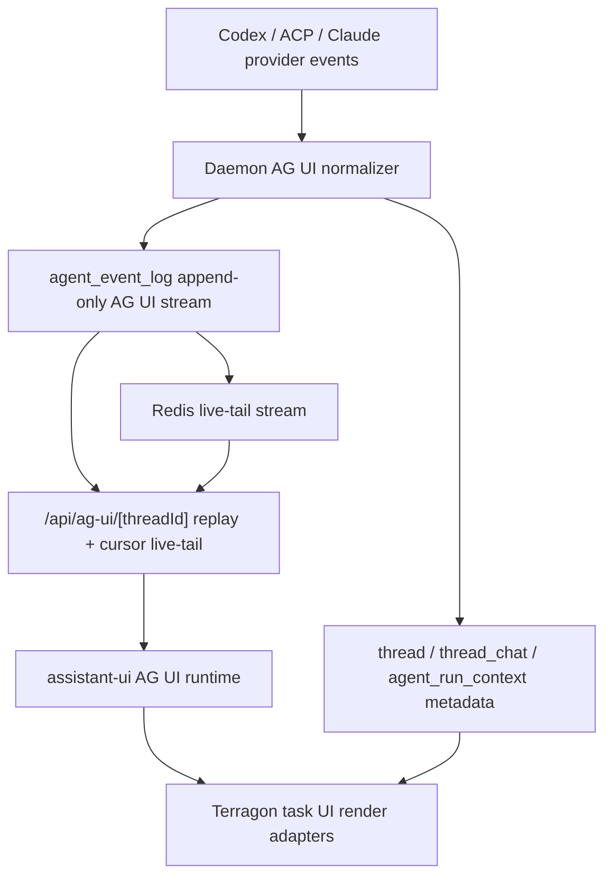

# refactor: Move runtime transcript to native AG UI

## Overview

Terragon should stop treating AG UI as a projection layered on top of legacy
`DBMessage` storage and broadcast patches. The new runtime contract is:
daemon/provider output becomes AG UI events, those events are persisted as the
append-only runtime log, replay/live-tail emits those same events with durable
identity, and the task UI renders from the AG UI runtime state.

This is intentionally a big-bang runtime cleanup. Historical `thread_chat.messages`
compatibility is not a product requirement for this rewrite. Existing metadata
tables such as `thread`, `thread_chat`, `agent_run_context`, GitHub state, and
sandbox state remain; the legacy transcript and delta-patch path stops being the
source of truth.

## Problem Frame

The current system is split-brain:

- `agent_event_log` stores AG UI-ish payloads, but durable row identity is often
  not present in the emitted `BaseEvent`.
- `thread_chat.messages` still stores `DBMessage[]` and hydrates major UI paths.
- `BroadcastThreadPatch` and collection patch helpers still carry transcript
  append/delta behavior.
- `@assistant-ui/react-ag-ui` opens the AG UI stream, but Terragon renders a
  custom reducer projection instead of native assistant-ui runtime messages.
- Important AG UI event families are ignored: `STATE_*`, `MESSAGES_SNAPSHOT`,
  `ACTIVITY_*`, `TOOL_CALL_CHUNK`, native reasoning, run lineage, and run errors.

AG UI docs define events as the fundamental protocol unit between agents and
frontends, with serialization used for restore, reconnect, branching, and
compaction. Terragon should follow that model directly instead of converting
into AG UI after legacy persistence has already lost information.

## Requirements Trace

- R1. Persist the complete task transcript as native AG UI events in
  `agent_event_log`; do not append new runtime transcript data to
  `thread_chat.messages`.
- R2. Preserve durable event identity on the wire: `eventId`, `seq`, `runId`,
  `threadId`, `threadChatId`, and idempotency metadata must be available to
  replay and live-tail clients.
- R3. Replace daemon delta-buffer transcript patches with AG UI-native streaming
  events, including token-by-token text, reasoning, tool args, tool progress,
  state, activity, and terminal lifecycle.
- R4. Make `/api/ag-ui/[threadId]` the canonical replay/live transport with
  cursor support, typed validation, and deterministic reconnect behavior.
- R5. Render the active task page from the assistant-ui AG UI runtime or a thin
  adapter over AG UI messages/state, not from `DBMessage[]` hydration.
- R6. Delete or quarantine legacy DB-message/delta-patch code paths after the
  AG UI path has equivalent coverage.
- R7. Fail closed when the daemon emits malformed AG UI events; drops must be
  explicit, tested, and observable.
- R8. Keep performance smooth: token streaming should remain low-latency and
  reconnect should not replay more history than needed.
- R9. Prove assistant-ui/native AG UI rendering with a vertical slice before
  disabling DB-message transcript writes.

## Success Criteria

- New runtime transcript writes go to `agent_event_log` as native AG UI events;
  `thread_chat.messages` is not appended for active daemon transcript data.
- Reconnect resumes from durable sequence identity without duplicated text or
  missing deltas.
- `TOOL_CALL_CHUNK`, `STATE_*`, `ACTIVITY_*`, native reasoning, terminal, and
  error events are visible or explicitly quarantined; they are not silent no-ops.
- `@assistant-ui/react-ag-ui` or a thin AG UI-native Terragon adapter is the
  rendered transcript source; `DBMessage[]` hydration is not in the active task
  render path.
- Raw provider payload persistence is allowlisted, redacted, size-limited, and
  tested before any `RAW`, `rawEvent`, or quarantine payload reaches DB/SSE.

## Scope Boundaries

- No effort to preserve old `thread_chat.messages` transcript history. Old
  tasks may show empty or degraded transcript after the rewrite.
- No schema/data backfill for historical DB messages.
- Do not drop the `thread_chat.messages` column in the same slice that first
  disables runtime writes. Leave it nullable/unused for one deploy-sized
  boundary so rollback and old-version overlap are possible.
- No new product features beyond moving the runtime architecture to AG UI.
- No replacement of durable metadata outside transcript/runtime event flow
  unless that metadata is currently coupled to transcript patches.

### Deferred to Separate Tasks

- Offline compaction policy for very long AG UI histories: separate performance
  follow-up after native mode is stable.
- Full AG UI generative UI spec adoption beyond activity/state/message events:
  future iteration after the native stream contract is clean.

### Historical Transcript Degradation Matrix

| Surface                      | Native-mode behavior for old `thread_chat.messages` data                                                       |
| ---------------------------- | -------------------------------------------------------------------------------------------------------------- |
| Active task page             | Best-effort AG UI replay only; show an explicit empty historical transcript state if no event log exists       |
| Shared task links            | Same as active task page, filtered through existing ownership/share visibility                                 |
| Admin/debug transcript views | Convert to AG UI replay readers or show a clear legacy transcript unavailable notice                           |
| CLI/API transcript consumers | Convert to AG UI replay where still live; otherwise treat old transcript access as out of scope                |
| Follow-up/retry context      | Must be converted before `DBMessage` type/schema deletion; not allowed to silently lose current prompt context |
| PR automation summaries      | Convert to AG UI replay or explicitly remove dependency before deleting DB-message helpers                     |

## Context & Research

### Relevant Code and Patterns

- `packages/agent/src/ag-ui-mapper.ts` maps Terragon canonical events,
  daemon deltas, DB agent parts, and meta events into AG UI events.
- `apps/www/src/server-lib/ag-ui-publisher.ts` persists AG UI rows and publishes
  to Redis streams, but currently serializes only the `BaseEvent` payload.
- `packages/shared/src/model/agent-event-log.ts` owns append, replay, and legacy
  canonical compatibility helpers.
- `apps/www/src/app/api/ag-ui/[threadId]/route.ts` replays one run and live-tails
  Redis, but lacks cursor support and full payload validation.
- `apps/www/src/components/chat/thread-view-model/*` derives task UI from a mix
  of AG UI events, legacy `DBMessage[]`, optimistic DB messages, and custom
  adapters.
- `apps/www/src/components/chat/toUIMessages.ts`,
  `apps/www/src/components/chat/db-messages-to-ag-ui.ts`, and
  `apps/www/src/components/chat/thread-view-model/legacy-db-message-adapter.ts`
  are legacy transcript hydration surfaces to remove or demote.
- `apps/www/src/collections/patch-helpers.ts`,
  `apps/www/src/queries/thread-patch-cache.ts`, and related collection files
  still apply broadcast patch transcript updates.
- `apps/www/src/server-lib/handle-daemon-event.ts` still appends `DBMessage[]`
  into `thread_chat.messages`.
- `packages/shared/src/db/schema.ts` has both `thread_chat.messages` and the
  newer `agent_event_log` append-only table.

### Institutional Learnings

- `docs/ag-ui-migration-complete.md` documents the previous AG UI cutover but
  also calls out remaining legacy hydration and patch cache surfaces. Treat it
  as historical context, not current truth.
- Prior sub-agent research found concrete data drops: durable identity missing
  from event payloads, `TOOL_CALL_CHUNK` ignored by the reducer, AG UI state and
  activity events ignored, native reasoning IDs ignored, canonical assistant
  messages dropped when deltas exist, and terminal/meta events broadcast
  ephemerally instead of durably.

### External References

- AG UI introduction: `https://docs.ag-ui.com/introduction`
- AG UI events: `https://docs.ag-ui.com/concepts/events`
- AG UI messages: `https://docs.ag-ui.com/concepts/messages`
- AG UI serialization: `https://docs.ag-ui.com/concepts/serialization`
- AG UI state management: `https://docs.ag-ui.com/concepts/state`
- AG UI tools: `https://docs.ag-ui.com/concepts/tools`
- AG UI JS events reference: `https://docs.ag-ui.com/sdk/js/core/events`

## Key Technical Decisions

- **AG UI event log is the transcript source of truth:** `agent_event_log`
  becomes the durable transcript log; `thread_chat.messages` stops receiving
  new runtime transcript writes.
- **Use native AG UI event families before `CUSTOM`:** text, tools, lifecycle,
  reasoning, state, messages, and activity should use AG UI-native events.
  Terragon-only widget payloads use typed `CUSTOM` only when no native event
  shape exists.
- **Event-family taxonomy:** transcript content uses message/tool/reasoning
  events; streamable execution progress tied to a tool call uses
  `TOOL_CALL_CHUNK`; frontend-only progress widgets use `ACTIVITY_*`; durable
  cross-component machine state uses `STATE_*`; inspectable product artifacts
  use typed `CUSTOM` only when no native event exists.
- **Persist terminal and meta events durably:** `RUN_FINISHED`, `RUN_ERROR`,
  token usage, model reroutes, MCP status, boot progress, and permission
  signals must be replayable, not fire-and-forget.
- **Keep AG UI payloads spec-valid:** mappers emit valid AG UI `BaseEvent`
  payloads plus stable source/idempotency hints where the schema allows it.
  Publisher/replay attaches durable `eventId`, `seq`, `runId`, `threadId`,
  `threadChatId`, and SSE `id:` through a Terragon transport envelope rather
  than stuffing arbitrary fields into every AG UI event.
- **Assistant-ui becomes the runtime owner:** Terragon components may adapt and
  render assistant-ui messages/activities, but should not maintain a parallel
  transcript reducer as the primary state store.
- **No silent drops:** unsupported provider-native events become AG UI `RAW` or
  explicit `CUSTOM` quarantine events with redaction, not `[]`.
- **Delete runtime transcript paths after parity, not before:** each legacy
  removal unit includes characterization coverage proving the AG UI path owns
  the same active-task behavior. Explicitly accepted admin/debug leftovers are
  quarantined and tracked separately.
- **Fail closed on write ordering:** persist validated AG UI rows before Redis
  publish or run-status advancement. If append fails, do not publish live-only
  events or mark a run terminal without a durable terminal/error event.

## Open Questions

### Resolved During Planning

- **Should old transcript data be migrated?** No. The rewrite can ignore old
  data and remove legacy transcript dependencies.
- **Should AG UI be projection or source of truth?** Source of truth. The whole
  plan is structured around native AG UI event persistence and replay.
- **Should Terragon custom rich parts stay as DB message parts?** No. Rich parts
  should become AG UI `ACTIVITY_*`, `STATE_*`, `MESSAGES_SNAPSHOT`, or typed
  `CUSTOM` extensions.

### Deferred to Implementation

- **Exact assistant-ui adapter API shape:** depends on what
  `@assistant-ui/react-ag-ui@0.0.26` exposes in this installed version. This is
  an early gate, not a late discovery item: Unit 0 must prove the API shape
  before transcript write shutdown.
- **Exact schema migration shape for `thread_chat.messages`:** implementation
  should leave the column nullable/unused initially; a later PR can drop it
  after old-version overlap and non-runtime consumers are converted.
- **Exact compaction policy:** native event correctness comes first; compaction
  thresholds can follow after replay behavior is stable.

## High-Level Technical Design

> _This illustrates the intended approach and is directional guidance for
> review, not implementation specification. The implementing agent should treat
> it as context, not code to reproduce._

The intended state after the rewrite:

| Surface                               | Current role                     | Native AG UI role                      |
| ------------------------------------- | -------------------------------- | -------------------------------------- |
| `agent_event_log`                     | Mixed AG UI/canonical replay log | Canonical append-only AG UI transcript |
| `thread_chat.messages`                | Runtime transcript store         | Removed or metadata-only legacy column |
| `BroadcastThreadPatch.appendMessages` | Transcript sync                  | Deleted                                |
| daemon delta buffer                   | Separate delta transport         | Emits AG UI streaming events           |
| `ThreadViewModel` transcript reducer  | Primary renderer state           | Thin adapter over assistant-ui runtime |
| `CUSTOM terragon.part.*`              | Rich DB part projection          | Only non-native AG UI extensions       |

## Phased Delivery

### Phase 1: Prove the Native Path Before Deletion

- Land the AG UI event contract, transport-envelope identity, replay cursor
  tests, malformed-event validation, and assistant-ui rendering spike.
- The exit gate is one local/CI replay fixture that renders text streaming, a
  tool call, tool progress, one activity/state update, reconnect, terminal
  success, and `RUN_ERROR` without `DBMessage[]` hydration.

### Phase 2: Switch New Runtime Writes

- Stop new daemon transcript writes to `thread_chat.messages` only after Phase 1
  passes.
- Keep metadata status writes and old transcript columns intact for rollback and
  deploy overlap.

### Phase 3: Remove Legacy Runtime Transcript Surfaces

- Delete active runtime DB-message and broadcast-patch paths.
- Convert or quarantine non-runtime `DBMessage` consumers before removing shared
  types or schema.

## Native Event Mapping Matrix

| Terragon surface           | AG UI home                                                                    | Rendering owner                               | Fallback rule                                                  |
| -------------------------- | ----------------------------------------------------------------------------- | --------------------------------------------- | -------------------------------------------------------------- |
| Assistant/user text        | `TEXT_MESSAGE_*` / AG UI messages                                             | assistant-ui runtime                          | Quarantine malformed message lifecycle                         |
| Reasoning                  | `REASONING_MESSAGE_*`, `REASONING_ENCRYPTED_VALUE`                            | assistant-ui runtime or visibility adapter    | Hide encrypted/private content; never fold into assistant text |
| Tool args/result           | `TOOL_CALL_START`, `TOOL_CALL_ARGS`, `TOOL_CALL_END`, `TOOL_CALL_RESULT`      | assistant-ui runtime + Terragon tool renderer | Quarantine orphaned result unless parent can be resolved       |
| Tool stdout/progress       | `TOOL_CALL_CHUNK` when tied to a tool call                                    | Terragon tool renderer adapter                | Use `ACTIVITY_*` only when no tool call owns the progress      |
| Terminal session output    | `ACTIVITY_*` unless it is direct tool-call progress                           | Terragon activity renderer                    | Size-limit chunks and preserve scroll/focus                    |
| Diff / file change         | `ACTIVITY_*` for progress, typed `CUSTOM` for inspectable artifact            | Terragon artifact/activity renderer           | Keep artifact payload redacted and bounded                     |
| Plan/checklist             | `STATE_*` when shared machine state, `ACTIVITY_*` when frontend-only progress | Terragon state/activity adapter               | Snapshot before deltas on reconnect                            |
| Permission prompt          | `STATE_*` for prompt state plus typed `CUSTOM` for Terragon action metadata   | Permission prompt renderer                    | Role-filter shared/read-only views                             |
| Artifact link              | Typed `CUSTOM`                                                                | Artifact descriptor adapter                   | No raw file contents in event payload                          |
| MCP status / boot progress | `ACTIVITY_*` for visible progress, `STATE_*` for durable machine state        | Meta/activity adapters                        | Redact internal config and credentials                         |

## Implementation Units

Execution order follows the phase gates, not the numeric labels alone:
complete Units 0, 1, 3, 4, and 5 enough to prove native rendering/replay before
executing Unit 2's DB-message write shutdown; then complete Units 6 and 7.

- [ ] **Unit 0: Prove assistant-ui native rendering viability**

**Goal:** Validate the load-bearing assumption that assistant-ui can own the
rendered runtime transcript, or define a thin AG UI-native Terragon adapter
fallback before any DB-message write shutdown.

**Requirements:** R5, R8, R9

**Dependencies:** None

**Files:**

- Modify: `apps/www/src/components/chat/assistant-runtime.ts`
- Modify: `apps/www/src/components/chat/assistant-ui/terragon-thread.tsx`
- Modify: `apps/www/src/components/chat/use-ag-ui-messages.ts`
- Test: `apps/www/src/components/chat/assistant-runtime.test.tsx`
- Test: `apps/www/src/components/chat/use-ag-ui-messages.test.tsx`
- Test: `apps/www/test/integration/ag-ui-replayer.test.ts`

**Approach:**

- Build a vertical fixture that uses real AG UI events, not `DBMessage[]`, to
  render one user message, one assistant text stream, one tool call/result, one
  tool progress update, one activity/state update, reconnect, completion, and
  run error.
- If assistant-ui cannot expose the required message/state/activity data in this
  installed version, define the fallback as a Terragon-owned AG UI-native
  adapter over `BaseEvent`/transport envelopes. The fallback must still avoid
  `DBMessage[]` hydration.
- Define the active-task UI state machine: initial replay, live streaming,
  reconnecting/restoring, stale cursor recovery, malformed-event quarantine,
  stopped/interrupted, run error, and completed.

**Patterns to follow:**

- Existing `useTerragonRuntime` seam in
  `apps/www/src/components/chat/assistant-runtime.ts`.
- Existing AG UI replay harness in `apps/www/test/integration/ag-ui-replayer.ts`.

**Test scenarios:**

- Happy path: assistant-ui or the fallback adapter renders live text streaming
  from native AG UI events.
- Happy path: tool calls and tool progress render without `DBMessage[]`.
- Happy path: state/activity updates render and restore after reconnect.
- Edge case: reconnecting preserves scroll position and avoids duplicate token
  flashes.
- Error path: malformed events show quarantine state instead of blank UI.
- Accessibility: reconnect/error changes preserve focus, streaming status uses
  appropriate live-region behavior, and tool/activity disclosure remains
  keyboard accessible.

**Verification:**

- Native AG UI rendering is proven before Units 2 and 6 can remove legacy
  transcript write/read paths.

- [ ] **Unit 1: Define the native AG UI event contract**

**Goal:** Establish one typed contract for Terragon AG UI events, transport
identity, privacy boundaries, and extensions so writers, replay, tests, and UI
all agree.

**Requirements:** R1, R2, R3, R7

**Dependencies:** None

**Files:**

- Modify: `packages/agent/src/ag-ui-mapper.ts`
- Modify: `packages/agent/src/ag-ui-mapper.test.ts`
- Modify: `packages/shared/src/model/agent-event-log.ts`
- Modify: `apps/www/src/server-lib/ag-ui-publisher.ts`
- Test: `packages/agent/src/ag-ui-mapper.test.ts`
- Test: `apps/www/src/server-lib/ag-ui-publisher.test.ts`

**Approach:**

- Introduce a single Terragon transport envelope rule for persisted and emitted
  events. AG UI `BaseEvent` payloads stay spec-valid; publisher/replay attaches
  row identity and SSE `id:` outside the base payload.
- Ensure mapper output preserves `timestamp` and safe source/idempotency hints
  where applicable. `seq` is assigned only by the event-log/publisher layer.
- Map unknown provider events to AG UI `RAW` or a typed quarantine `CUSTOM`
  event instead of returning no events.
- Add a redaction and truncation contract before persisting `rawEvent`, `RAW`,
  or quarantine payloads. Secrets, env values, OAuth/session material,
  credentials, large file contents, and oversized provider payloads must be
  stripped before DB and SSE.
- Stop encoding tool errors via role hacks when AG UI has a direct `error`
  shape in messages or a better custom extension is needed.

**Execution note:** Add characterization tests for the current dropped fields
before changing mapper behavior.

**Patterns to follow:**

- `canonicalEventsToAgUiRows` stable event-id construction in
  `apps/www/src/server-lib/ag-ui-publisher.ts`.
- Existing AG UI event imports from `@ag-ui/core`.

**Test scenarios:**

- Happy path: a canonical assistant message maps to start/content/end events and
  each persisted/emitted event includes stable identity.
- Happy path: a tool call maps to start/args/end/result with parent message
  association preserved as a message relationship, not a tool-id alias.
- Edge case: unknown provider event maps to a redacted `RAW` or quarantine event
  and is replayable.
- Edge case: oversized or sensitive `rawEvent` payloads are redacted/truncated
  before persistence and live-tail publishing.
- Error path: malformed mapper input fails validation with an explicit error
  rather than silently producing `[]`.
- Integration: actual `canonicalEventsToAgUiRows()` output replayed twice through
  the UI deduper does not duplicate text.

**Verification:**

- No AG UI event emitted by the publisher lacks replay/dedupe identity.
- Mapper tests cover all AG UI event families Terragon emits.

- [ ] **Unit 2: Replace DB-message daemon writes with AG UI event writes**

**Goal:** Stop appending runtime transcript to `thread_chat.messages`; daemon
ingest writes native AG UI rows to `agent_event_log`.

**Requirements:** R1, R3, R6, R7, R9

**Dependencies:** Units 0, 1, 3, and 5 native-rendering/replay gates

**Files:**

- Modify: `apps/www/src/server-lib/handle-daemon-event.ts`
- Modify: `apps/www/src/app/api/daemon-event/route.ts`
- Modify: `packages/daemon/src/daemon.ts`
- Modify: `packages/daemon/src/shared.ts`
- Modify: `packages/daemon/src/codex.ts`
- Test: `apps/www/src/server-lib/handle-daemon-event.test.ts`
- Test: `apps/www/src/app/api/daemon-event/route.test.ts`
- Test: `packages/daemon/src/codex.test.ts`
- Test: `packages/daemon/src/streaming-benchmark.test.ts`

**Approach:**

- Change daemon-event ingest so `messages` are not converted to `DBMessage[]`
  for persistence. Provider output should normalize into AG UI events before
  persistence.
- Convert the delta buffer into AG UI-native streaming events:
  `TEXT_MESSAGE_CONTENT`, `REASONING_MESSAGE_CONTENT`, `TOOL_CALL_ARGS`, and
  `TOOL_CALL_CHUNK`.
- Emit `RUN_STARTED`, `RUN_FINISHED`, `RUN_ERROR`, `STEP_*`, meta, permission,
  and artifact lifecycle events durably.
- Preserve token streaming cadence; the transport shape changes, not the
  latency budget.
- Leave `thread_chat.status` and run context updates only where they are
  lifecycle metadata, not transcript storage. Durable AG UI `seq` replaces
  transcript ordering needs.
- This unit must not land until Unit 0 proves native rendering and Unit 3 proves
  replay/cursor recovery with actual publisher output.

**Execution note:** Characterize one Codex token stream, one tool-call stream,
one tool-progress stream, and one failed run before removing DB-message writes.

**Patterns to follow:**

- Delta start/end bracketing in `daemonDeltasToAgUiRows`.
- Run status mirroring in `packages/shared/src/model/threads.ts`.

**Test scenarios:**

- Happy path: a Codex text delta sequence persists AG UI start/content/end rows
  and leaves `thread_chat.messages` unchanged.
- Happy path: command execution output emits `TOOL_CALL_CHUNK` or activity
  progress and remains visible during streaming.
- Happy path: run completion persists a replayable `RUN_FINISHED`.
- Error path: daemon failure persists `RUN_ERROR` with message and code.
- Edge case: duplicate daemon retries dedupe by event identity without losing
  later deltas.
- Integration: `/api/daemon-event` ingest followed by `/api/ag-ui` replay
  reconstructs the same transcript without DB messages.

**Verification:**

- New task runs produce transcript rows only in `agent_event_log`.
- `thread_chat.messages` is no longer modified by daemon runtime ingest.

- [ ] **Unit 3: Make AG UI replay and live-tail spec-complete**

**Goal:** Make `/api/ag-ui/[threadId]` a reliable native AG UI transport with
cursor reconnect, validation, and durable terminal/meta replay.

**Requirements:** R2, R4, R7, R8

**Dependencies:** Unit 1; this unit is a prerequisite for Unit 2 write shutdown

**Files:**

- Modify: `apps/www/src/app/api/ag-ui/[threadId]/route.ts`
- Modify: `packages/shared/src/model/agent-event-log.ts`
- Modify: `apps/www/src/server-lib/ag-ui-publisher.ts`
- Test: `apps/www/src/app/api/ag-ui/[threadId]/route.test.ts`
- Test: `apps/www/src/server-lib/ag-ui-publisher.test.ts`
- Test: `apps/www/test/integration/ag-ui-replayer.test.ts`

**Approach:**

- Implement replay cursor support using `fromSeq` and/or SSE `Last-Event-ID`.
- Encode SSE `id:` frames with durable sequence identity so reconnect can resume
  without structural dedupe.
- Validate events with the strongest available AG UI schema or explicit
  per-event guards. Known event type alone is not enough.
- Remove ephemeral-only terminal/meta broadcasting. Persist terminal and meta
  events before publishing live-tail entries.
- Replay by `threadChatId` and cursor rather than one-run-only history, while
  keeping run filters available for focused clients.
- Scope every replay query, live-tail subscription, `fromSeq`, `Last-Event-ID`,
  and optional `runId` filter through authenticated thread ownership.
- Validate or explicitly ignore client-supplied AG UI POST body fields
  (`state`, `messages`, `tools`, `context`, `threadId`, `runId`,
  `parentRunId`) so clients cannot spoof ownership or inject replay state.

**Patterns to follow:**

- Existing ownership join in `apps/www/src/app/api/ag-ui/[threadId]/route.ts`.
- Existing `agent_event_log_thread_chat_seq_unique` index in
  `packages/shared/src/db/schema.ts`.

**Test scenarios:**

- Happy path: fresh connect replays from `RUN_STARTED` through current live
  events.
- Happy path: reconnect with `fromSeq` receives only events after that sequence.
- Happy path: SSE frames include durable `id:` values and valid AG UI `data:`.
- Edge case: live events written during DB replay are not dropped or duplicated.
- Error path: malformed known-type events are quarantined or rejected with a
  `RUN_ERROR`/diagnostic event, not silently skipped.
- Error path: cross-user `threadChatId`, cross-thread `runId`, and foreign
  cursor values return no events and do not leak existence.
- Integration: a terminal run with no Redis live-tail entry still replays the
  persisted terminal event.

**Verification:**

- Reconnect can recover from a dropped browser connection without duplicate
  text or missing deltas.
- The route never emits structurally invalid AG UI events.

- [ ] **Unit 4: Move rich parts to AG UI state, activity, messages, and custom extensions**

**Goal:** Replace `DBAgentMessagePart`-driven rich UI projection with the event
families defined in the Native Event Mapping Matrix.

**Requirements:** R3, R5, R6, R7

**Dependencies:** Units 0, 1, and 3; this unit should use fixture/replay events
before Unit 2 switches daemon writes

**Files:**

- Modify: `packages/agent/src/ag-ui-mapper.ts`
- Modify: `apps/www/src/components/chat/assistant-runtime.ts`
- Modify: `apps/www/src/components/chat/assistant-ui/terragon-thread.tsx`
- Modify: `apps/www/src/components/chat/thread-view-model/reducer.ts`
- Modify: `apps/www/src/components/chat/message-part.tsx`
- Modify: `apps/www/src/components/chat/meta-chips/use-thread-meta-events.ts`
- Test: `packages/agent/src/ag-ui-mapper.test.ts`
- Test: `apps/www/src/components/chat/ag-ui-messages-reducer.test.ts`
- Test: `apps/www/src/components/chat/thread-view-model/reducer.test.ts`
- Test: `apps/www/src/components/chat/meta-chips/use-thread-meta-events.integration.test.tsx`

**Approach:**

- Represent long-running visible work as `ACTIVITY_SNAPSHOT` and
  `ACTIVITY_DELTA` when it is frontend-only progress. Tool-owned progress stays
  `TOOL_CALL_CHUNK`.
- Represent shared runtime state with `STATE_SNAPSHOT` and `STATE_DELTA` for
  things like boot progress, current plan/checklist, permissions, and running
  tool state when the agent and UI both need the data.
- Treat `MESSAGES_SNAPSHOT` as a restore/compatibility hook only if needed now;
  generating compacted message snapshots remains deferred.
- Keep typed `CUSTOM` events for Terragon-specific widgets that have no native
  AG UI representation, such as artifact references.
- Support native reasoning IDs and `REASONING_ENCRYPTED_VALUE` rather than the
  Terragon-only `:thinking:` marker convention.
- Apply visibility rules before SSE: sensitive internal state is server-only,
  redacted, or role-filtered for shared tasks/admin views.

**Patterns to follow:**

- Existing rich part rendering components under `apps/www/src/components/chat/`.
- AG UI state/activity docs for snapshot and delta semantics.

**Test scenarios:**

- Happy path: terminal/tool progress renders from `ACTIVITY_DELTA` updates.
- Happy path: plan/checklist state updates from `STATE_DELTA` without DB
  message patches.
- Happy path: native reasoning events with ordinary `messageId` render or are
  intentionally hidden according to visibility settings.
- Edge case: malformed activity/custom payloads produce quarantine diagnostics
  with enough context to debug.
- Integration: replaying an activity snapshot after reconnect restores progress
  UI without historical DB parts.
- Accessibility: activity updates do not steal focus, permission prompts manage
  focus intentionally, and streaming/progress announcements are not noisy.

**Verification:**

- `TOOL_CALL_CHUNK`, `STATE_*`, `ACTIVITY_*`, `MESSAGES_SNAPSHOT`, and native
  reasoning events are no longer reducer no-ops unless explicitly documented as
  unsupported.

- [ ] **Unit 5: Make assistant-ui runtime the rendered transcript owner**

**Goal:** Remove the parallel Terragon transcript reducer as the primary source
of rendered messages and use assistant-ui AG UI runtime state directly or
through a thin typed adapter.

**Requirements:** R5, R6, R8

**Dependencies:** Units 0, 1, 3, and 4

**Files:**

- Modify: `apps/www/src/components/chat/assistant-runtime.ts`
- Modify: `apps/www/src/components/chat/assistant-ui/terragon-thread.tsx`
- Modify: `apps/www/src/components/chat/chat-ui.tsx`
- Modify: `apps/www/src/components/chat/use-ag-ui-messages.ts`
- Modify: `apps/www/src/components/chat/thread-view-model/types.ts`
- Modify: `apps/www/src/components/chat/thread-view-model/reducer.ts`
- Test: `apps/www/src/components/chat/assistant-runtime.test.tsx`
- Test: `apps/www/src/components/chat/use-ag-ui-messages.test.tsx`
- Test: `apps/www/src/components/chat/assistant-ui/memo-rerenders.test.tsx`

**Approach:**

- Wire assistant-ui history/runtime loading to the AG UI replay stream rather
  than feeding precomputed `UIMessage[]` from `DBMessage[]`.
- Keep a small Terragon view model for non-transcript metadata: thread status,
  permissions, GitHub summary, artifacts, side panel state, and optimistic input.
- Convert optimistic user submissions into AG UI user/message events rather than
  optimistic `DBUserMessage` entries.
- Preserve memoization and row-level rendering isolation so token streaming only
  rerenders the active row.

**Execution note:** Use performance/memo tests as guardrails before deleting the
legacy reducer path.

**Patterns to follow:**

- Existing memoization tests in
  `apps/www/src/components/chat/assistant-ui/memo-rerenders.test.tsx`.
- Existing `useTerragonRuntime` seam in
  `apps/www/src/components/chat/assistant-runtime.ts`.

**Test scenarios:**

- Happy path: active task text streams token-by-token through assistant-ui
  runtime state.
- Happy path: user-submitted prompt appears optimistically via AG UI message
  events and reconciles with server replay.
- Edge case: reconnect after partial stream does not duplicate assistant text.
- Error path: `RUN_ERROR` surfaces the error message in the task UI.
- Performance: historical rows do not rerender on each active token delta.

**Verification:**

- The task page does not call `toUIMessages` or hydrate transcript from
  `thread_chat.messages` for active runtime rendering.
- Optimistic user submissions have stable client/server message IDs, duplicate
  suppression after replay, pending visual state, and rollback on failed submit.

- [ ] **Unit 6: Delete legacy DB-message and patch transcript surfaces**

**Goal:** Remove active runtime transcript storage, adapters, and broadcast
patch paths after native AG UI rendering is proven; convert or explicitly
quarantine non-runtime `DBMessage` consumers separately.

**Requirements:** R1, R6, R7

**Dependencies:** Units 2 through 5

**Files:**

- Delete: `apps/www/src/components/chat/toUIMessages.ts`
- Delete: `apps/www/src/components/chat/toUIMessages.test.ts`
- Delete: `apps/www/src/components/chat/db-messages-to-ag-ui.ts`
- Delete: `apps/www/src/components/chat/db-messages-to-ag-ui.test.ts`
- Delete or rewrite: `apps/www/src/components/chat/thread-view-model/legacy-db-message-adapter.ts`
- Delete or rewrite: `apps/www/src/collections/patch-helpers.ts`
- Modify: `apps/www/src/collections/thread-chat-collection.ts`
- Modify: `apps/www/src/collections/thread-info-collection.ts`
- Modify: `apps/www/src/collections/thread-shell-collection.ts`
- Modify: `apps/www/src/queries/thread-patch-cache.ts`
- Modify: `apps/www/src/server-lib/handle-daemon-event.ts`
- Modify: `packages/shared/src/db/db-message.ts`
- Modify: `packages/shared/src/db/schema.ts`
- Test: `apps/www/src/collections/thread-chat-collection.test.ts`
- Test: `apps/www/src/queries/thread-patch-cache.test.ts`
- Test: `apps/www/src/components/chat/thread-view-model/reducer.test.ts`

**Approach:**

- Remove transcript fields from broadcast patch types and handlers. Keep
  metadata patching only where sidebar/list freshness still needs it.
- Delete DB-message transcript adapters after active task rendering no longer
  imports them.
- Split runtime removal from shared type/schema deletion. `DBMessage` also feeds
  follow-up/retry context, prompt formatting, compaction, checkpoint/plan
  extraction, queued/draft/system messages, admin/debug views, secondary panels,
  GitHub/Slack/Linear flows, stories, and tests.
- Remove `thread_chat.messages` from new runtime writes, but leave the column
  nullable/unused for the first native-mode slice. A later migration can drop
  it after non-runtime consumers are converted.
- Preserve user prompt draft/queued-message concepts only if they are metadata,
  not transcript history.

**Execution note:** Run a dependency-impact pass before each deletion. If a file
is still imported by a non-transcript surface, convert that surface to AG UI
replay first.

**Patterns to follow:**

- Existing metadata-only patching in `thread-patch-cache.ts`.
- Existing `agent_event_log` replay helpers.

**Test scenarios:**

- Happy path: thread list/sidebar metadata still updates when status, archive,
  PR checks, sandbox status, or unread state changes.
- Happy path: active chat loads without `thread_chat.messages`.
- Edge case: a thread with null/empty old messages does not crash admin/task UI.
- Error path: attempting to publish transcript append patches fails typecheck or
  explicit tests.
- Integration: no active task rendering test imports `DBMessage` fixtures.
- Integration: follow-up/retry and prompt-context construction use AG UI replay
  or an explicitly converted metadata source before `DBMessage` helpers are
  deleted.

**Verification:**

- `rg "toUIMessages|db-messages-to-ag-ui|appendMessages|DBMessage"` shows no
  runtime transcript dependencies outside explicitly accepted migration/debug
  leftovers.

- [ ] **Unit 7: Add native AG UI reliability and performance coverage**

**Goal:** Prove the rewrite is smooth, replayable, and resistant to silent data
loss.

**Requirements:** R2, R3, R4, R7, R8

**Dependencies:** Units 1 through 6

**Files:**

- Modify: `apps/www/test/integration/ag-ui-replayer.ts`
- Modify: `apps/www/test/integration/ag-ui-replayer.test.ts`
- Modify: `apps/www/src/app/api/ag-ui/[threadId]/route.test.ts`
- Modify: `packages/daemon/src/streaming-benchmark.test.ts`
- Modify: `packages/daemon/src/latency-breakdown.test.ts`
- Modify: `apps/www/src/components/chat/assistant-ui/memo-rerenders.test.tsx`
- Modify: `docs/ag-ui-migration-complete.md`

**Approach:**

- Expand integration fixtures so they cover actual publisher output, not
  hand-authored reducer events.
- Add the publisher-output replay, reconnect, and malformed-event tests as
  gates before Units 2 through 5 remove or bypass legacy paths; this unit owns
  the full suite, but the earliest high-risk cases must land first.
- Add reconnect, duplicate, dropped-Redis-entry, malformed-event, and terminal
  fallback tests.
- Keep token streaming benchmarks focused on end-to-end latency from daemon
  delta to browser event consumption.
- Measure max replay payload size and replay latency for active runs before
  legacy hydration is removed. Full compaction remains deferred, but the rewrite
  needs hard numbers for the new path.
- Add bounded quarantine retention/size expectations so repeated invalid
  provider output cannot grow the append-only log without limits.
- Replace stale migration docs with native-mode architecture, known event
  coverage, and deletion status.

**Patterns to follow:**

- Existing replay harness in `apps/www/test/integration/ag-ui-replayer.ts`.
- Existing latency benchmark tests in `packages/daemon`.

**Test scenarios:**

- Happy path: provider text streams through daemon, event log, SSE, assistant-ui
  runtime, and rendered UI token by token.
- Happy path: tool args and tool progress stream visibly without DB message
  patches.
- Happy path: reconnect from a mid-run cursor resumes without duplicate content.
- Edge case: Redis publish failure is recovered by DB replay.
- Error path: invalid event payload is quarantined and visible in diagnostics.
- Error path: repeated invalid/RAW/quarantine events are size-limited and carry
  observability fields without retaining sensitive payloads.
- Performance: token deltas keep the intended low-latency budget and do not
  rerender historical rows.

**Verification:**

- Integration coverage proves replay/live-tail parity for text, reasoning,
  tools, activity, state, terminal, and error events.

## System-Wide Impact

- **Interaction graph:** daemon provider adapters, daemon-event ingest,
  `agent_event_log`, Redis live-tail, `/api/ag-ui`, assistant-ui runtime,
  task renderer, sidebar metadata collections, and admin/debug surfaces are all
  affected.
- **Error propagation:** malformed provider output should become explicit AG UI
  `RAW`, `CUSTOM` quarantine, or `RUN_ERROR` events. Silent drops are not
  acceptable.
- **State lifecycle risks:** replay cursors, duplicate daemon retries, Redis
  gaps, optimistic user input, and terminal synthesis need deterministic
  identity.
- **API surface parity:** browser task UI, share/admin views, CLI/API consumers,
  and any follow-up/retry flow that reads transcript history must move to AG UI
  replay or be explicitly dropped.
- **Visibility model:** shared/read-only views and admin views must receive only
  events they are allowed to inspect; sensitive state, raw provider payloads,
  permission internals, and credentials are redacted or withheld before SSE.
- **Integration coverage:** unit tests alone are insufficient; the final proof
  is daemon ingest through replay/live-tail into assistant-ui rendering.
- **Unchanged invariants:** thread ownership checks, sandbox lifecycle, GitHub
  metadata, permission mode metadata, and run status metadata remain durable.
  This plan changes transcript/runtime event ownership, not those domain models.

## Risks & Dependencies

| Risk                                                                   | Mitigation                                                                                                           |
| ---------------------------------------------------------------------- | -------------------------------------------------------------------------------------------------------------------- |
| Assistant-ui native runtime cannot render a Terragon-specific part yet | Use typed AG UI activity/custom adapters at the edge while keeping event log native                                  |
| Dropping `thread_chat.messages` breaks admin/debug pages               | Convert those pages to AG UI replay readers or accept degraded historical transcript per scope                       |
| Native rendering cannot be proven before write shutdown                | Block DB-message write removal until Unit 0 vertical fixture passes or the AG UI-native fallback adapter is in place |
| Cursor implementation duplicates or skips live events                  | Use durable `seq`/SSE `id:` tests and replay actual publisher output                                                 |
| Native AG UI state/activity usage becomes another bespoke layer        | Prefer documented AG UI event types and keep `CUSTOM` narrowly typed                                                 |
| Performance regresses from full replay on long threads                 | Add cursor replay first; defer compaction threshold to a follow-up after correctness                                 |
| Provider-native details are too rich for AG UI base events             | Preserve only allowlisted, redacted, size-limited details in `rawEvent`, `RAW`, or typed custom quarantine events    |
| Schema rollback is unsafe after immediate column drop                  | Keep `thread_chat.messages` nullable/unused for one deploy boundary; drop later after readers are converted          |

## Documentation / Operational Notes

- Update `docs/ag-ui-migration-complete.md` or replace it with a native-mode
  architecture doc after implementation.
- Add an operational note explaining that old `thread_chat.messages` transcript
  history is intentionally not migrated.
- Monitor event insert rate, SSE reconnect counts, malformed event quarantine
  counts, and token delta latency after rollout.

## Sources & References

- Related code: `packages/agent/src/ag-ui-mapper.ts`
- Related code: `apps/www/src/server-lib/ag-ui-publisher.ts`
- Related code: `packages/shared/src/model/agent-event-log.ts`
- Related code: `apps/www/src/app/api/ag-ui/[threadId]/route.ts`
- Related code: `apps/www/src/components/chat/thread-view-model/reducer.ts`
- Related code: `apps/www/src/components/chat/assistant-runtime.ts`
- Related code: `apps/www/src/server-lib/handle-daemon-event.ts`
- Historical doc: `docs/ag-ui-migration-complete.md`
- External docs: `https://docs.ag-ui.com/introduction`
- External docs: `https://docs.ag-ui.com/concepts/events`
- External docs: `https://docs.ag-ui.com/concepts/messages`
- External docs: `https://docs.ag-ui.com/concepts/serialization`
- External docs: `https://docs.ag-ui.com/concepts/state`
- External docs: `https://docs.ag-ui.com/concepts/tools`
