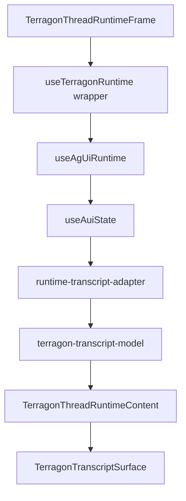
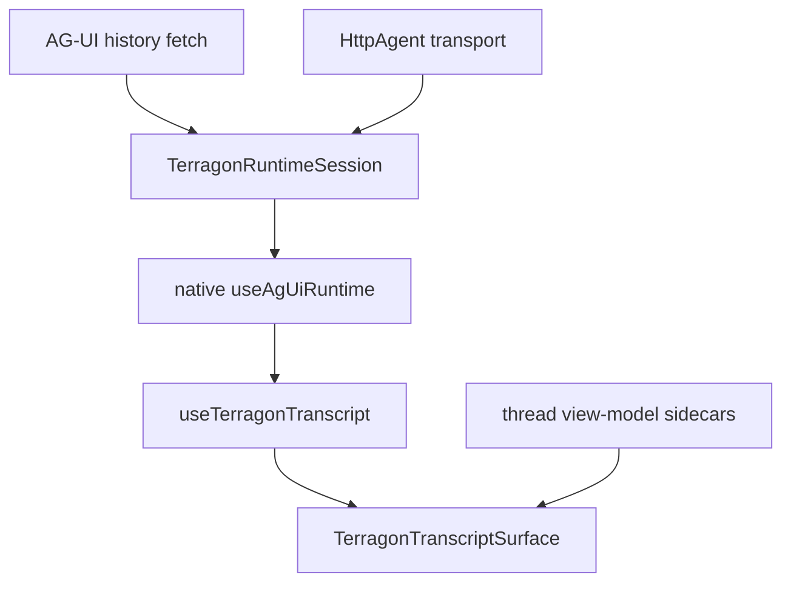

# Refactor AG-UI Runtime Session and Transcript Projection

**Type:** refactor  
**Status:** completed  
**Date:** 2026-05-24  
**Owner:** Terragon chat runtime

## Summary

Simplify the AG-UI/assistant-ui chat layer by making `useAgUiRuntime` the explicit native runtime source of truth and moving runtime/session behavior plus transcript projection into two narrow seams:

1. `TerragonRuntimeSession`: load, resume, cancel, retry, queue, history import, and cursor application around the native runtime.
2. `useTerragonTranscript`: projection from assistant-ui runtime state into Terragon's transcript surface model.

Transport, route, and sidecar view-model owners stay explicit non-runtime boundaries. This plan does not rewrite the AG-UI route, replace TipTap, replace Streamdown, or collapse reducers wholesale. It creates cleaner ownership boundaries first, deletes only compiler-proven leftovers, and leaves broader characterization as the gate before any risky simplification.

## Problem Frame

The current integration already uses `@assistant-ui/react-ag-ui`, but the ownership is still hard to read:



The main issue is not that native assistant-ui is absent. It is that Terragon-specific responsibilities are spread across the frame, runtime wrapper, transport hook, history adapter, content component, projector, model builder, and server route. That makes it easy to duplicate message/thread state or accidentally reintroduce a second runtime owner.

The target shape is:



## Requirements

- Preserve native `useAgUiRuntime` as the single runtime source of truth. Terragon should configure and host it, not wrap it with a competing runtime abstraction.
- Centralize runtime session concerns: initial history, active resume, `fromSeq`, retry keys, load errors, assistant-ui send queue configuration, and cancel behavior.
- Keep `useAgUiTransport` as the owner of `threadChatId`, `runId` URL/header mutation, and `HttpAgent` identity.
- Centralize transcript projection concerns: `useAuiState`, runtime message projection, optimistic message handling, tool lifecycle facts, plan occurrences, and hydration state.
- Keep Terragon-specific UI sidecars outside the runtime abstraction. Meta chips, scheduled/draft banners, footer state, and non-transcript DB view-model data are not assistant-ui runtime state.
- Preserve AG-UI replay/live-tail ordering, terminal fallback, cancel semantics, queued follow-ups, optimistic dedupe, unresolved tool finalization, and rich part rendering.
- Delete only compiler-proven leftovers in this slice. Risky reducer, cache, transport, validation, and write-path cleanup requires characterization first.

## Scope

### In Scope

- Refactor `apps/www/src/components/chat/assistant-ui/terragon-thread.tsx` into a smaller frame that delegates runtime ownership to a session seam.
- Fold or relocate `apps/www/src/components/chat/assistant-runtime.ts` so the native runtime setup is owned by `TerragonRuntimeSession`.
- Extract transcript projection from `apps/www/src/components/chat/assistant-ui/terragon-thread-runtime-content.tsx` into `useTerragonTranscript`.
- Preserve `apps/www/src/hooks/use-ag-ui-transport.ts` as the focused `HttpAgent` URL/header/run cursor seam.
- Use local typed test helpers first; extract shared fixtures only when repeated setup proves it is useful.
- Remove only compiler-proven leftovers discovered during extraction.

### Out Of Scope

- Replacing TipTap with assistant-ui composer primitives.
- Replacing Streamdown with `@assistant-ui/react-markdown`.
- Rewriting `apps/www/src/app/api/ag-ui/[threadId]/route.ts`.
- Moving all writes to `runtime.append`.
- Supporting scheduled or draft task creation through AG-UI POST.
- Removing `runtime-transcript-adapter` caching or tail fast paths without a perf gate.
- Collapsing daemon reducers or deleting DB-message projection behavior covered by `docs/plans/phase-6-reducer-audit.md`.
- Migrating rich custom parts to assistant-ui `ActivityMessage`.

## Context And Research

Relevant code:

- `apps/www/src/components/chat/assistant-ui/terragon-thread.tsx`: current frame, history load, active cursor application, retry/error state, and `AssistantRuntimeProvider`.
- `apps/www/src/components/chat/assistant-runtime.ts`: thin native `useAgUiRuntime` wrapper with history adapter, cancel POST, external message strategy, and queue configuration.
- `apps/www/src/components/chat/assistant-ui/terragon-thread-runtime-content.tsx`: large component combining runtime state subscription, transcript projection, working footer facts, and surface wiring.
- `apps/www/src/components/chat/assistant-ui/runtime-transcript-adapter.ts`: pure runtime-to-UI projection with cache and tail update fast path.
- `apps/www/src/components/chat/ag-ui-history-adapter.ts`: AG-UI history import into assistant-ui external messages.
- `apps/www/src/hooks/use-ag-ui-transport.ts`: `HttpAgent` creation plus `threadChatId`, `runId`, trace headers, and `fromSeq` URL mutation.
- `apps/www/src/lib/ag-ui-history-fetch.ts`: client history fetch/validation and `lastSeq` parsing.
- `apps/www/src/app/api/ag-ui/[threadId]/route.ts`: AG-UI GET replay/live-tail and POST append/resume adapter.

Relevant docs:

- `docs/plans/2026-04-27-refactor-chat-layer-consolidated-plan.md`: plan of record for assistant-ui consolidation and justified divergences.
- `docs/plans/2026-04-28-phase-5-readiness.md`: confirms runtime transcript ownership while noting no-op history `append` and remaining projection complexity.
- `docs/plans/2026-04-30-runtime-owns-writes-adr.md`: single-writer direction; this plan preserves the current write path unless a later ADR wave cuts it over.
- `docs/plans/phase-6-reducer-audit.md`: deletion checklist for reducer behavior that must survive before any reducer collapse.

Native assistant-ui shape:

- `@assistant-ui/react-ag-ui` exposes the intended integration as `HttpAgent` plus `useAgUiRuntime({ agent })`.
- Terragon should keep using that native runtime directly, and put product-specific session rules around it.

## Technical Decisions

### 1. Build A Runtime Session, Not A Generic Transport Layer

`useAgUiRuntime` remains the native runtime and source of truth. `TerragonRuntimeSession` should own lifecycle and provider setup around it because the complexity is session lifecycle, not transport abstraction.

It should include:

- `useAgUiRuntime` with the current option shape: `agent`, `showThinking`, `onError`, `onCancel`, `adapters.history`, `historyLoadKey`, `externalMessagesStrategy: "merge-after-local-mutations"`, and optional `queue`
- `AssistantRuntimeProvider`
- history loading and history adapter construction
- active-thread cursor application through `applyReplayCursorToAgent`
- retry/load-key behavior
- load error rendering props
- cancel POST behavior
- assistant-ui send queue configuration and external message strategy

It should not include:

- transcript rendering
- DB message projection
- meta chip state
- scheduled/draft task rendering
- server-side replay/live-tail implementation
- `threadChatId`, `runId` URL/header mutation, or `HttpAgent` identity, which remain in `useAgUiTransport`

### 2. Extract A Transcript Hook, Not A Second Runtime

`useTerragonTranscript` should convert assistant-ui runtime state into the Terragon surface model. It can compose the existing projector and model builder, but callers should not manually stitch those pieces together.

Return shape:

```ts
type TerragonTranscript = {
  messages: UIMessage[];
  latestAgentMessageIndex: number;
  hasRenderableAgentParts: boolean;
  hasPendingToolCall: boolean;
  planOccurrencesRaw: Map<string, number>;
  isRuntimeHydrating: boolean;
};
```

The hook should keep the projector pure and should not pull in route, transport, or server action concerns.

### 3. Keep Sidecars Explicit

Some state is intentionally outside assistant-ui:

- thread status and working footer data
- scheduled/draft task banner state
- meta event chips
- branch/PR/environment data
- viewport and scroll behavior
- rich Terragon DB part rendering

These should remain in the view-model and layout layer. The goal is less code at the runtime seam, not forcing every chat feature through assistant-ui.

### 4. Defer Risky Deletions

The following are tempting but should not be deleted in this slice:

- reducer paths that preserve reasoning, progress chunks, custom rich parts, terminal data, snapshot classification, or daemon-specific lifecycle states
- runtime transcript cache and tail fast path
- history validation duplication between `ag-ui-history-adapter.ts` and `ag-ui-history-fetch.ts`
- `followUp()` server-action write path
- AG-UI route replay/live-tail ordering logic

Each needs characterization coverage first.

## Implementation Units

### Unit 1: Establish `TerragonRuntimeSession`

Files:

- Create `apps/www/src/components/chat/assistant-ui/terragon-runtime-session.tsx`
- Modify `apps/www/src/components/chat/assistant-ui/terragon-thread.tsx`
- Modify or delete `apps/www/src/components/chat/assistant-runtime.ts`
- Port tests from `apps/www/src/components/chat/assistant-runtime.test.tsx` if present
- Update `apps/www/src/components/chat/assistant-ui/terragon-thread.test.tsx`

Implementation:

- Move native runtime setup into `TerragonRuntimeSession`.
- Keep `useAgUiRuntime` visible in that component so the integration is obvious.
- Move `createAgUiHistoryAdapter`, `postTerragonCancel`, queue configuration, external message strategy, and send options into the session module.
- Keep `resolveTerragonRuntimeLoadConfig`, history load, and retry orchestration either inside the session module or as local helpers consumed only by it.
- Keep `applyReplayCursorToAgent` near the session because it is part of active resume, not transcript projection.
- Keep `useAgUiTransport` responsible for `threadChatId`, `runId`, trace headers, and `HttpAgent` identity.
- Keep `ChatUI` capturing `runId` via `useCurrentRunId()` unless a later unit explicitly moves that capture.
- Move cancel ownership to the AG-UI cancel route and stop passing a local `onCancel` callback once that route path is verified.
- Shrink `TerragonThreadRuntimeFrame` to routing, layout frame, session props, and thread view-model wiring.

Acceptance:

- Active thread load applies `fromSeq` before resume.
- Idle thread load imports history without resuming.
- Empty active thread still starts with no duplicate placeholder.
- History load failure shows the existing retry affordance.
- Retry increments the load key and re-runs history load.
- Cancel still posts to the AG-UI cancel route and does not require a local callback prop.
- Assistant-ui send queue configuration is still forwarded to native `useAgUiRuntime`.

### Unit 2: Extract `useTerragonTranscript`

Files:

- Create `apps/www/src/components/chat/assistant-ui/use-terragon-transcript.ts`
- Modify `apps/www/src/components/chat/assistant-ui/terragon-thread-runtime-content.tsx`
- Keep `apps/www/src/components/chat/assistant-ui/runtime-transcript-adapter.ts` pure
- Keep `apps/www/src/components/chat/assistant-ui/terragon-transcript-model.ts` pure
- Update `apps/www/src/components/chat/assistant-ui/runtime-transcript-adapter.test.ts`
- Update `apps/www/src/components/chat/assistant-ui/terragon-transcript-model.test.ts`

Implementation:

- Move `useAuiState` subscription and projector/model-builder orchestration into the hook.
- Keep input props minimal: chat agent state, optimistic user messages, and the runtime loading/hydration facts needed for transcript rendering.
- Do not accept or render `threadViewModel.messages`; DB view-model messages remain sidecar-only and must not re-enter transcript rendering.
- Return a stable transcript model used by `TerragonThreadRuntimeContent`.
- Leave working footer, scroll, view-model sidecars, and surface composition in `TerragonThreadRuntimeContent`.

Acceptance:

- Runtime transcript remains the only transcript source.
- Optimistic user message does not duplicate when history/runtime catches up.
- Pending tool-call facts still drive the working footer.
- Plan occurrence counts remain stable.
- Blank loading runtime state renders the existing hydration affordance, not DB transcript fallback.
- DB view-model messages remain sidecar-only and never re-enter transcript rendering.
- A large transcript tail update preserves stable identities for unaffected messages.

### Unit 3: Delete Compiler-Proven Leftovers

Files:

- Modify `apps/www/src/components/chat/assistant-ui/terragon-thread.tsx`
- Modify `apps/www/src/components/chat/assistant-ui/terragon-thread-runtime-content.tsx`
- Modify callers only when required by Units 1 and 2.

Candidates:

- Remove the unused `TerragonThread` wrapper if no imports remain.
- Remove unused `onCancel` plumbing after cancel is owned by the runtime session.
- Remove duplicate prop threading created by the extraction.

Acceptance:

- No behavior changes.
- Typecheck catches all callers.
- Existing hydration, empty, error, scheduled, draft, working, and transcript states still render.
- Do not touch `runtime-transcript-adapter.ts` solely for cleanup in this unit.

### Unit 4: Keep Test Helpers Local Until Duplication Proves Itself

Files:

- Update assistant-ui runtime/transcript tests touched by Units 1 and 2.
- Create `apps/www/src/components/chat/assistant-ui/test-utils/runtime-messages.ts` only if three or more touched tests duplicate the same typed runtime-message shape.

Implementation:

- Prefer local typed helpers inside the touched tests.
- Extract shared builders only when they remove repeated setup without hiding the case-specific payloads.

Acceptance:

- Tests are shorter where helper extraction is justified, without hiding important payload differences.
- Fixture types align with pinned `@assistant-ui/react` and `@ag-ui/core` versions.
- No test uses untyped `any`.

### Unit 5: Define The Follow-Up Deletion Gate

Files:

- Update `apps/www/src/components/chat/assistant-ui/runtime-transcript-adapter.test.ts`
- Update `apps/www/src/components/chat/ag-ui-history-adapter.test.ts`
- Update `apps/www/src/components/chat/assistant-ui/terragon-thread.test.tsx`
- Update `apps/www/src/app/api/ag-ui/[threadId]/route.test.ts`
- Update `apps/www/src/app/api/ag-ui/[threadId]/cancel/route.test.ts` if cancel ownership changes.

This unit should not block the session/transcript extraction PR unless moved behavior needs coverage. It defines the tests required before later reducer/cache/route/write-path deletion.

Scenarios:

- Active load: history returns `lastSeq`, agent URL receives `fromSeq`, resume starts after cursor application.
- Reconnect: `Last-Event-ID`/`fromSeq` replay does not duplicate events.
- Replay/live-tail overlap: duplicate server events do not produce duplicate transcript messages.
- Terminal fallback: terminal event invalidates working state even when no live stream remains.
- Idle unresolved tool call: imported history finalizes stale tool calls as errored.
- Cancel: UI cancellation posts once and replay is side-effect free.
- Queue: rapid follow-up submissions while active stay FIFO and deduped.
- Optimistic message: local optimistic user message disappears exactly when canonical runtime/history version arrives.
- Tool lifecycle: started, progress, completed, failed, and interrupted states still map to the correct UI parts.
- Perf guard: 500-message transcript tail update does not rebuild all unchanged message models.

Acceptance:

- Moved behavior in Units 1 and 2 is covered in the extraction PR.
- The broader scenarios above pass before further reducer/cache/route/write cleanup.
- Any failure becomes a separate fix before deleting the corresponding old path.

## Verification Plan

Run the narrow suite first, then the project gates:

```bash
pnpm -C apps/www test -- "assistant-runtime|terragon-runtime-session"
pnpm -C apps/www test -- runtime-transcript-adapter
pnpm -C apps/www test -- terragon-transcript-model
pnpm -C apps/www test -- ag-ui-history-adapter
pnpm -C apps/www test -- terragon-thread
pnpm -C apps/www test -- "api/ag-ui"
pnpm -C apps/www lint
pnpm tsc-check
```

If route or integration tests are touched, also run the matching `apps/www/test/integration` target. If UI layout changes are visible, open the affected chat route locally and verify active, idle, empty, error, queued, and cancel states.

## Risks And Mitigations

| Risk                                         | Impact                                         | Mitigation                                                                                               |
| -------------------------------------------- | ---------------------------------------------- | -------------------------------------------------------------------------------------------------------- |
| Accidentally creating a second runtime owner | Message duplication and race conditions        | Keep native `useAgUiRuntime` inside `TerragonRuntimeSession`; do not introduce another transcript store. |
| Cursor application moves after resume        | Replay gap or duplicate stream events          | Cover active load and reconnect before refactor completion.                                              |
| Transcript hook hides sidecar state          | Lost scheduled/draft/meta/footer behavior      | Keep sidecars in content/view-model layer and document owners.                                           |
| Over-deleting reducer behavior               | Lost reasoning, tool progress, or custom parts | Use `docs/plans/phase-6-reducer-audit.md` as the deletion gate, not this refactor.                       |
| Removing perf cache too early                | Large threads regress badly                    | Preserve cache/tail fast path until perf characterization is green.                                      |
| Changing write ownership accidentally        | Follow-up queue or server action regressions   | Keep current write path unless a dedicated runtime-write ADR wave is implemented.                        |

## Ownership Table

| Concern                              | Owner After This Plan                                                      | Non-Owner                 |
| ------------------------------------ | -------------------------------------------------------------------------- | ------------------------- |
| Native AG-UI runtime source of truth | `useAgUiRuntime`; hosted by `TerragonRuntimeSession`                       | transcript hook, route    |
| HTTP agent URL/header/run metadata   | `useAgUiTransport`                                                         | transcript hook           |
| Follow-up persistence/write path     | existing `followUp()`/current composer path                                | `TerragonRuntimeSession`  |
| History import into assistant-ui     | `createAgUiHistoryAdapter` called by session                               | surface component         |
| Active resume cursor                 | `TerragonRuntimeSession`                                                   | transcript projector      |
| Runtime-to-UI projection             | `useTerragonTranscript` plus pure projector/model modules                  | runtime session           |
| Working footer facts                 | `TerragonThreadRuntimeContent` using transcript facts and view-model state | runtime session           |
| Rich custom part rendering           | existing part registry and transcript surface                              | assistant-ui runtime core |
| AG-UI replay/live-tail/POST          | `apps/www/src/app/api/ag-ui/[threadId]/route.ts`                           | client session            |

## Follow-Up Work

- Consolidate duplicated history validation between `ag-ui-history-adapter.ts` and `ag-ui-history-fetch.ts` after fixtures exist.
- Collapse reducer paths only after every Category B behavior in `docs/plans/phase-6-reducer-audit.md` has an equivalent runtime or projection owner.
- Revisit runtime write ownership under `docs/plans/2026-04-30-runtime-owns-writes-adr.md`.
- Characterize and possibly remove the transcript tail fast path if real measurements show it is unnecessary.
- Evaluate whether `thread-view-model` can be split into transcript-independent sidecar hooks after the runtime/transcript seams settle.

## Open Questions

- Should `TerragonRuntimeSession` live as a component only, or expose a small hook plus provider component for easier testing?
