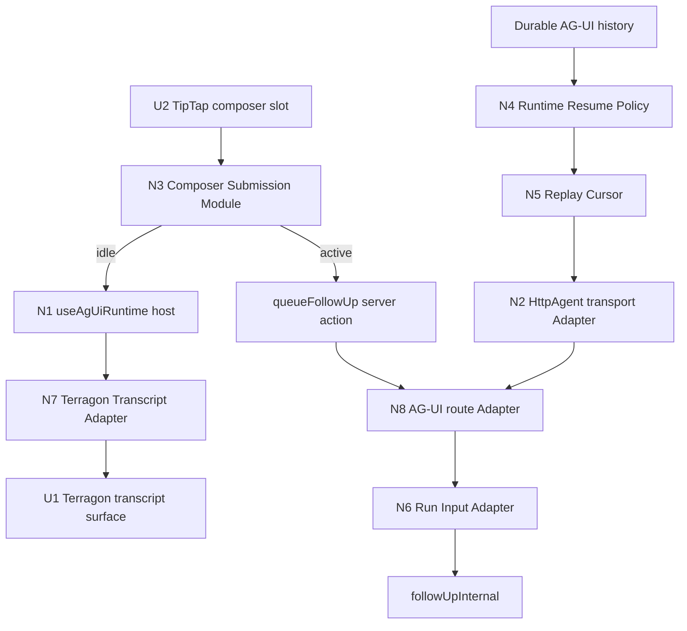

# Assistant-UI and AG-UI Chat Architecture — Shaping

## Source

> I want to simplify and improve the architecture as much as possible while focusing on assistant-ui and AG UI
>
> we need this to be just assistant ui and ag ui as much as possible

> Think about how we can improve the architecture as we are editing this.

## Problem

Terragon's chat layer is moving in the right direction: the runtime now uses `useAgUiRuntime` directly, and transcript rendering reads assistant-ui runtime state with `useAuiState`. The remaining friction is that some behavior still lives in Terragon-specific protocols and shallow Modules:

- The composer still decides between queued follow-up, runtime append, and legacy direct submit.
- Active resume semantics are spread across history loading, replay cursors, assistant-ui `unstable_resume`, and the AG-UI POST route.
- Terragon metadata is encoded through incidental `runConfig.custom` / `forwardedProps` shapes.
- The sidecar view-model still has enough AG-UI transcript machinery that it can become a second interpreter beside `useAgUiRuntime` if we let it grow.
- The AG-UI route owns replay, live-tail, terminal fallback, POST intent, auth, and diagnostics in one large implementation.
- The `@assistant-ui/react-ag-ui` patch still contains behavior that should either become upstream capability or be isolated behind an explicit Terragon Adapter.

## Outcome

The chat architecture should read as:

```text
assistant-ui primitives and runtime
  -> @assistant-ui/react-ag-ui useAgUiRuntime
  -> @ag-ui/client HttpAgent
  -> Terragon AG-UI endpoint
```

Terragon code should exist only where it is an Adapter for product-specific behavior: durable history, task follow-up metadata, replay cursor semantics, rich Terragon transcript parts, and sandbox/task lifecycle sidecars.

## Requirements (R)

| ID  | Requirement                                                                                                                                                                                     | Status    |
| --- | ----------------------------------------------------------------------------------------------------------------------------------------------------------------------------------------------- | --------- |
| R0  | The assistant-ui runtime is the single browser runtime source of truth for thread messages and running state.                                                                                   | Core goal |
| R1  | The client uses AG-UI protocol and `HttpAgent` as the live transport rather than a Terragon-specific runtime protocol.                                                                          | Core goal |
| R2  | Terragon-specific behavior lives behind explicit typed Adapter seams, not implicit `forwardedProps`, URL mutation conventions, package-patch-only behavior, or avoidable AG-UI `CUSTOM` events. | Must-have |
| R3  | Composer submission leans on assistant-ui runtime/composer semantics and does not make generic editor code understand queue topology, follow-up persistence, or AG-UI POST details.             | Must-have |
| R4  | Active task resume never dispatches the last durable user message as a fresh follow-up.                                                                                                         | Must-have |
| R5  | Rich Terragon transcript features remain supported: tools, plans, terminal, diffs, images, audio, resource links, meta chips, lifecycle footer, queued messages, and optimistic user messages.  | Must-have |
| R6  | The architecture reduces custom runtime code and makes the remaining `@assistant-ui/react-ag-ui` patch smaller, upstreamable, or replaceable.                                                   | Must-have |
| R7  | Tests exercise Module Interfaces and AG-UI/assistant-ui contracts instead of private helper functions and incidental object shapes.                                                             | Must-have |
| R8  | The migration can land in small, reviewable slices without rewriting TipTap, Streamdown, the whole AG-UI route, or the daemon event model in one pass.                                          | Must-have |

## CURRENT: Native Runtime With Mixed Terragon Protocols

| Part     | Mechanism                                                                                                                                                        | Flag |
| -------- | ---------------------------------------------------------------------------------------------------------------------------------------------------------------- | :--: |
| CURRENT1 | `TerragonRuntimeSession` hosts `useAgUiRuntime`, `AssistantRuntimeProvider`, history load, retry state, cancel, and patched runtime options.                     |      |
| CURRENT2 | `useAgUiTransport` owns `HttpAgent`, `threadChatId`, `runId`, trace header, and typed `fromSeq` replay cursor URL state.                                         |      |
| CURRENT3 | `usePromptBox` builds a `DBUserMessage`, then branches between active queueing, `threadRuntime.append`, and fallback `handleSubmit`.                             |      |
| CURRENT4 | `ChatPromptBox` owns direct `followUp`, queued `queueFollowUp`, optimistic queue projection, error state, and refetch reconciliation.                            |      |
| CURRENT5 | `run-from-ag-ui.ts` decodes assistant-ui `forwardedProps.runConfig.terragon`, converts AG-UI content back to `DBUserMessage`, and calls `followUpInternal`.      |      |
| CURRENT6 | The AG-UI route owns POST append/resume intent, replay cursor parsing, durable replay, Redis live-tail, SSE framing, terminal fallback, and diagnostics.         |      |
| CURRENT7 | `useTerragonTranscript` projects assistant-ui runtime messages into Terragon UI messages while sidecar state remains outside runtime state.                      |      |
| CURRENT8 | A large `@assistant-ui/react-ag-ui` package patch adds load keys, wait-for-load, message merge behavior, target assistant message IDs, and leftover queue hooks. |  ⚠️  |

## A: Pure Native Assistant-UI and AG-UI

| Part | Mechanism                                                                                                     | Flag |
| ---- | ------------------------------------------------------------------------------------------------------------- | :--: |
| A1   | Use only upstream `useAgUiRuntime({ agent })` plus official adapter slots.                                    |  ⚠️  |
| A2   | Replace Terragon composer submission with assistant-ui `ComposerPrimitive` and native `threadRuntime.append`. |  ⚠️  |
| A3   | Remove Terragon replay cursor policy and rely on upstream AG-UI runtime/history behavior.                     |  ⚠️  |
| A4   | Remove package patch entirely.                                                                                |  ⚠️  |
| A5   | Keep only visual Terragon message renderers on top of assistant-ui message state.                             |  ⚠️  |

## B: Native Core With Terragon Adapters

| Part | Mechanism                                                                                                                                                                                                                                 | Flag |
| ---- | ----------------------------------------------------------------------------------------------------------------------------------------------------------------------------------------------------------------------------------------- | :--: |
| B1   | Keep `useAgUiRuntime` and `HttpAgent` as the only runtime/transport core; no Terragon runtime reimplementation.                                                                                                                           |      |
| B2   | Add a Composer Submission Module: TipTap produces a `DBUserMessage`; the Module chooses runtime append, queued follow-up, `/clear`, optimistic projection, error handling, and reconciliation.                                            |      |
| B3   | Add a Runtime Resume Policy Module: active/idle history mode, load key, replay cursor application, and POST resume intent are named in one place.                                                                                         |      |
| B4   | Add a Replay Cursor Module: parse, serialize, clear, and detect cursor-backed resume from URL and `Last-Event-ID`.                                                                                                                        |      |
| B5   | Add a Run Input Adapter: client encoder and server decoder for selected model, permission mode, trace id, intent, and supported content conversion.                                                                                       |      |
| B6   | Keep `useTerragonTranscript` as the Adapter from assistant-ui runtime messages to Terragon transcript surface state.                                                                                                                      |      |
| B7   | Shrink the package patch to the minimum missing native behavior: history load key / retry, wait-for-load, target assistant message IDs, and deterministic message reconciliation, then either upstream or isolate as an explicit adapter. |  ⚠️  |
| B8   | Collapse sidecar reducers to Terragon-only custom events and product sidecars; assistant-ui runtime remains authoritative for transcript lifecycle.                                                                                       |      |
| B9   | Split the AG-UI route only after B3-B5 exist, so extraction moves named Modules instead of anonymous closure logic.                                                                                                                       |      |

## C: Terragon Runtime Shell Around Assistant-UI

| Part | Mechanism                                                                                                                                           | Flag |
| ---- | --------------------------------------------------------------------------------------------------------------------------------------------------- | :--: |
| C1   | Keep `useAgUiRuntime`, but wrap it in a Terragon runtime shell that owns queueing, cursoring, metadata, history import, and message reconciliation. |      |
| C2   | Keep composer and route protocol mostly as-is, with better names and narrower helper functions.                                                     |      |
| C3   | Treat the package patch as a maintained Terragon fork until upstream support catches up.                                                            |      |
| C4   | Continue rendering through `useTerragonTranscript` and sidecar view-model state.                                                                    |      |

## Fit Check

| Req | Requirement                                                                                                                                                                                     | Status    | CURRENT | A   | B   | C   |
| --- | ----------------------------------------------------------------------------------------------------------------------------------------------------------------------------------------------- | --------- | ------- | --- | --- | --- |
| R0  | The assistant-ui runtime is the single browser runtime source of truth for thread messages and running state.                                                                                   | Core goal | ✅      | ✅  | ✅  | ❌  |
| R1  | The client uses AG-UI protocol and `HttpAgent` as the live transport rather than a Terragon-specific runtime protocol.                                                                          | Core goal | ✅      | ✅  | ✅  | ✅  |
| R2  | Terragon-specific behavior lives behind explicit typed Adapter seams, not implicit `forwardedProps`, URL mutation conventions, package-patch-only behavior, or avoidable AG-UI `CUSTOM` events. | Must-have | ❌      | ❌  | ✅  | ❌  |
| R3  | Composer submission leans on assistant-ui runtime/composer semantics and does not make generic editor code understand queue topology, follow-up persistence, or AG-UI POST details.             | Must-have | ❌      | ✅  | ✅  | ❌  |
| R4  | Active task resume never dispatches the last durable user message as a fresh follow-up.                                                                                                         | Must-have | ✅      | ❌  | ✅  | ✅  |
| R5  | Rich Terragon transcript features remain supported: tools, plans, terminal, diffs, images, audio, resource links, meta chips, lifecycle footer, queued messages, and optimistic user messages.  | Must-have | ✅      | ❌  | ✅  | ✅  |
| R6  | The architecture reduces custom runtime code and makes the remaining `@assistant-ui/react-ag-ui` patch smaller, upstreamable, or replaceable.                                                   | Must-have | ❌      | ✅  | ✅  | ❌  |
| R7  | Tests exercise Module Interfaces and AG-UI/assistant-ui contracts instead of private helper functions and incidental object shapes.                                                             | Must-have | ❌      | ❌  | ✅  | ❌  |
| R8  | The migration can land in small, reviewable slices without rewriting TipTap, Streamdown, the whole AG-UI route, or the daemon event model in one pass.                                          | Must-have | ✅      | ❌  | ✅  | ✅  |

**Notes:**

- CURRENT fails R2, R3, R6, and R7 because ownership is better than before but still spread across shallow Terragon protocols and a broad package patch.
- A fails R2 because Terragon still needs durable task metadata and rich transcript adapters; pretending those disappear would make the protocol implicit.
- A fails R4, R5, R7, and R8 because pure native removal does not preserve task resume, rich parts, or incremental migration.
- C fails R0, R2, R3, R6, and R7 because a Terragon shell would keep assistant-ui as an implementation detail instead of the runtime owner.

## Selected Shape

**B: Native Core With Terragon Adapters** is selected.

It satisfies the user's architectural direction without hand-waving away real Terragon product behavior. The rule is:

```text
assistant-ui and AG-UI own runtime, composer semantics, transport protocol, and state access.
Terragon owns only typed Adapters at seams where product behavior genuinely differs.
```

## Detail B: Concrete Parts

| Part   | Mechanism                                                                                                                                                                                  | Flag |
| ------ | ------------------------------------------------------------------------------------------------------------------------------------------------------------------------------------------ | :--: |
| **B1** | **Runtime core stays native**                                                                                                                                                              |      |
| B1.1   | `TerragonRuntimeSession` remains a host for `useAgUiRuntime`, not a runtime implementation.                                                                                                |      |
| B1.2   | Native state access uses `useAuiState` / runtime APIs; no DB transcript fallback re-enters the runtime transcript path.                                                                    |      |
| B1.3   | Package patch behavior is tracked as missing upstream/runtime-adapter behavior, not normalized as app architecture.                                                                        |  ⚠️  |
| **B2** | **Composer Submission Module**                                                                                                                                                             |      |
| B2.1   | `usePromptBox` owns editor state, attachments, model/mode selection, and converts TipTap content to `DBUserMessage`.                                                                       |      |
| B2.2   | `ComposerSubmission.submit()` receives the user message plus context and chooses native runtime append, durable queue, `/clear`, or fallback create-thread submit.                         |      |
| B2.3   | Queue dedupe, optimistic queue projection, errors, refetch, and `forceScrollToBottom` move behind the Composer Submission Interface.                                                       |      |
| B2.4   | Delete or integrate unused `useComposerQueue` so there is one queue owner.                                                                                                                 |      |
| **B3** | **Runtime Resume Policy Module**                                                                                                                                                           |      |
| B3.1   | `RuntimeResumePolicy.forHistoryLoad()` returns `historyLoadKey`, `resumeOnLoad`, and replay cursor intent for active vs idle loads.                                                        |      |
| B3.2   | The AG-UI route asks the policy whether a POST is append or cursor-backed resume instead of reading raw URL state inline.                                                                  |      |
| B3.3   | Tests assert the invariant: active history resume opens the stream and never dispatches a duplicate follow-up.                                                                             |      |
| **B4** | **Replay Cursor Module**                                                                                                                                                                   |      |
| B4.1   | `ReplayCursor.parse()` handles bare seq and projection cursor strings.                                                                                                                     |      |
| B4.2   | `ReplayCursor.serialize()` is used by `useAgUiTransport` and route tests.                                                                                                                  |      |
| B4.3   | `ReplayCursor.isResumeRequest()` is the shared check for POST resume behavior.                                                                                                             |      |
| **B5** | **Run Input Adapter**                                                                                                                                                                      |      |
| B5.1   | `TerragonAgUiRunConfig.encode()` creates the assistant-ui `runConfig.custom.terragon` payload for selected model, permission mode, trace id, and intent.                                   |      |
| B5.2   | `TerragonAgUiRunConfig.decode()` accepts assistant-ui runtime layout and direct caller layout, validates with explicit types, and returns Terragon metadata.                               |      |
| B5.3   | AG-UI content to `DBUserMessage` conversion sits in the Adapter, not in the route or composer.                                                                                             |      |
| B5.4   | `AIModel` is validated with a real guard; no `selectedModel as AIModel` casts survive this seam.                                                                                           |      |
| **B6** | **Transcript Adapter stays explicit**                                                                                                                                                      |      |
| B6.1   | `useTerragonTranscript` remains the only Adapter from assistant-ui runtime messages to Terragon transcript model.                                                                          |      |
| B6.2   | Rich parts and sidecar lifecycle state stay outside assistant-ui runtime state unless assistant-ui/AG-UI exposes a native equivalent.                                                      |      |
| B6.3   | Native AG-UI events are preferred first; `CUSTOM` is allowed only when the surface has no AG-UI or assistant-ui shape.                                                                     |      |
| B6.4   | Long-term direction: render assistant-ui `ThreadMessage` directly through Terragon part renderers, then delete message-level `UIMessage` projection once golden rich-part coverage exists. |  ⚠️  |
| **B7** | **Patch reduction path**                                                                                                                                                                   |      |
| B7.1   | Remove queue hooks from the package patch after B2 owns queueing.                                                                                                                          |      |
| B7.2   | Move merge policy into history projection if possible; keep only behavior that must happen inside runtime core.                                                                            |  ⚠️  |
| B7.3   | Prepare upstreamable changes for load key/retry, wait-for-load, and target message id support if they remain necessary.                                                                    |  ⚠️  |
| **B8** | **Sidecar reducer collapse**                                                                                                                                                               |      |
| B8.1   | Replace broad `useAgUiSidecarRouter` transcript/lifecycle interpretation with a custom-event/product-sidecar hook.                                                                         |      |
| B8.2   | Keep meta chips, artifact descriptors, PR/check data, scheduled banners, and query invalidation as sidecars.                                                                               |      |
| B8.3   | Remove dead/test-only AG-UI subscriber modules after import checks prove no production use.                                                                                                |      |
| **B9** | **Route extraction last**                                                                                                                                                                  |      |
| B9.1   | After B3-B5, extract `AgUiPostIntent`, `AgUiReplayStream`, `AgUiLiveTail`, and `AgUiTerminalFallback` from the route.                                                                      |      |
| B9.2   | Keep the Next route as a thin Adapter from `NextRequest`/`NextResponse` to these Modules.                                                                                                  |      |

## Breadboard

### Non-UI Affordances

| ID  | Place             | Affordance                    | Wires In                                                                             | Wires Out                                                 |
| --- | ----------------- | ----------------------------- | ------------------------------------------------------------------------------------ | --------------------------------------------------------- |
| N1  | Browser runtime   | Native `useAgUiRuntime` host  | `HttpAgent`, history Adapter, cancel Adapter                                         | assistant-ui runtime context                              |
| N2  | Browser transport | `HttpAgent` transport Adapter | thread id, thread chat id, run id, replay cursor                                     | AG-UI endpoint URL and trace headers                      |
| N3  | Composer          | Composer Submission Module    | `DBUserMessage`, thread status, runtime append, queue action, optimistic dispatchers | runtime append or durable queue                           |
| N4  | Runtime resume    | Runtime Resume Policy Module  | thread chat id, active/idle state, history `lastSeq`, retry nonce                    | load key, `unstable_resume`, replay cursor                |
| N5  | Replay protocol   | Replay Cursor Module          | URL `fromSeq`, `Last-Event-ID`, history `lastSeq`                                    | parsed/serialized cursor                                  |
| N6  | Server append     | Run Input Adapter             | AG-UI `RunAgentInput`                                                                | Terragon follow-up command metadata                       |
| N7  | Transcript        | Terragon Transcript Adapter   | assistant-ui runtime messages, optimistic user messages                              | Terragon transcript surface model                         |
| N8  | Route             | AG-UI route Adapter           | Next request/session, replay stream Modules, post intent Modules                     | SSE response or follow-up dispatch                        |
| N9  | Sidecars          | Terragon sidecar hook         | AG-UI custom events, product event payloads, query invalidation triggers             | meta chips, artifacts, PR/check state, lifecycle sidecars |

### UI Affordances

| ID  | Place         | Affordance                  | Wires In                                                     | Wires Out                                         |
| --- | ------------- | --------------------------- | ------------------------------------------------------------ | ------------------------------------------------- |
| U1  | Thread        | Terragon transcript surface | Terragon transcript model, sidecar lifecycle state           | message rendering                                 |
| U2  | Composer      | TipTap composer slot        | editor content, attachments, selected model, permission mode | `DBUserMessage` to Composer Submission            |
| U3  | Composer      | Queued messages row         | durable queued messages, optimistic queue updates            | remove queued message through Composer Submission |
| U4  | Thread footer | Working/lifecycle footer    | transcript facts, thread status, freshness                   | passive wait / loading UI                         |



## Slice Plan

| Slice | Goal                                                                                                       | Main files                                                                                                    | Demo / verification                                                                                                                                                      |
| ----- | ---------------------------------------------------------------------------------------------------------- | ------------------------------------------------------------------------------------------------------------- | ------------------------------------------------------------------------------------------------------------------------------------------------------------------------ |
| S1    | Composer Submission Module owns queue vs runtime append, and unused queue module is deleted or integrated. | `use-promptbox.tsx`, `chat-prompt-box.tsx`, new `composer-submission.ts`, `use-composer-queue.ts`             | Submitting while idle calls runtime append; submitting while active persists queue; queued row updates and remove still work.                                            |
| S2    | Runtime Resume Policy names active/idle load behavior and duplicate-follow-up prevention.                  | `terragon-runtime-session.tsx`, `ag-ui-history-adapter.ts`, AG-UI route tests, new `runtime-resume-policy.ts` | Active history load sets cursor and resumes; POST with cursor does not call follow-up; idle load does not resume.                                                        |
| S3    | Replay Cursor Module removes raw cursor parsing/serialization from route and transport.                    | `use-ag-ui-transport.ts`, `route.ts`, new `ag-ui-replay-cursor.ts`                                            | Existing route replay tests pass; transport tests assert serialized cursor strings through shared helper.                                                                |
| S4    | Run Input Adapter owns Terragon metadata encoding and decoding.                                            | `use-promptbox.tsx`, `run-from-ag-ui.ts`, `agent-trace.ts`, new `terragon-ag-ui-run-config.ts`                | Selected model and permission mode round-trip through assistant-ui runtime append without incidental `forwardedProps` knowledge in composer and without `AIModel` casts. |
| S5    | Sidecar reducer scope collapses to Terragon-only product sidecars.                                         | `use-ag-ui-messages.ts`, `thread-view-model`, `terragon-ag-ui-subscriber.ts`, sidecar tests                   | Active transcript lifecycle remains owned by assistant-ui runtime; sidecar hook only handles custom/product events and query invalidation.                               |
| S6    | Package patch reduction and route extraction.                                                              | package patch, `route.ts`, extracted route Modules                                                            | Patch no longer contains queue behavior; route is a thin Adapter around named Modules.                                                                                   |

## Fit Check: Selected Shape B

| Req | Requirement                                                                                                                                                                                     | Status    | B   |
| --- | ----------------------------------------------------------------------------------------------------------------------------------------------------------------------------------------------- | --------- | --- |
| R0  | The assistant-ui runtime is the single browser runtime source of truth for thread messages and running state.                                                                                   | Core goal | ✅  |
| R1  | The client uses AG-UI protocol and `HttpAgent` as the live transport rather than a Terragon-specific runtime protocol.                                                                          | Core goal | ✅  |
| R2  | Terragon-specific behavior lives behind explicit typed Adapter seams, not implicit `forwardedProps`, URL mutation conventions, package-patch-only behavior, or avoidable AG-UI `CUSTOM` events. | Must-have | ✅  |
| R3  | Composer submission leans on assistant-ui runtime/composer semantics and does not make generic editor code understand queue topology, follow-up persistence, or AG-UI POST details.             | Must-have | ✅  |
| R4  | Active task resume never dispatches the last durable user message as a fresh follow-up.                                                                                                         | Must-have | ✅  |
| R5  | Rich Terragon transcript features remain supported: tools, plans, terminal, diffs, images, audio, resource links, meta chips, lifecycle footer, queued messages, and optimistic user messages.  | Must-have | ✅  |
| R6  | The architecture reduces custom runtime code and makes the remaining `@assistant-ui/react-ag-ui` patch smaller, upstreamable, or replaceable.                                                   | Must-have | ✅  |
| R7  | Tests exercise Module Interfaces and AG-UI/assistant-ui contracts instead of private helper functions and incidental object shapes.                                                             | Must-have | ✅  |
| R8  | The migration can land in small, reviewable slices without rewriting TipTap, Streamdown, the whole AG-UI route, or the daemon event model in one pass.                                          | Must-have | ✅  |

## Open Flags

| Flag | Question                                                                                                                                           | Resolution path                                                                                 |
| ---- | -------------------------------------------------------------------------------------------------------------------------------------------------- | ----------------------------------------------------------------------------------------------- |
| F1   | Can package-patch merge behavior move fully into history projection, or does it require runtime-core access?                                       | Spike before S5.                                                                                |
| F2   | Should assistant-ui Composer primitives replace more of `SimplePromptBox`, or should TipTap remain the input slot behind `ComposerPrimitive.Root`? | Keep TipTap for now; revisit only after S1.                                                     |
| F3   | Can active queueing move fully server-side through AG-UI POST without losing immediate queued-message UI?                                          | Treat as a later alternative after S1 proves the current product behavior behind one Interface. |
| F4   | Can `TerragonTranscriptSurface` consume assistant-ui `ThreadMessage` directly and delete message-level `UIMessage` projection?                     | Add golden rich-part tests before attempting this after S5.                                     |
| F5   | Which Redis stream envelope shapes are still produced in production?                                                                               | Add a stream-envelope decoder and migration check before tightening the AG-UI route.            |
