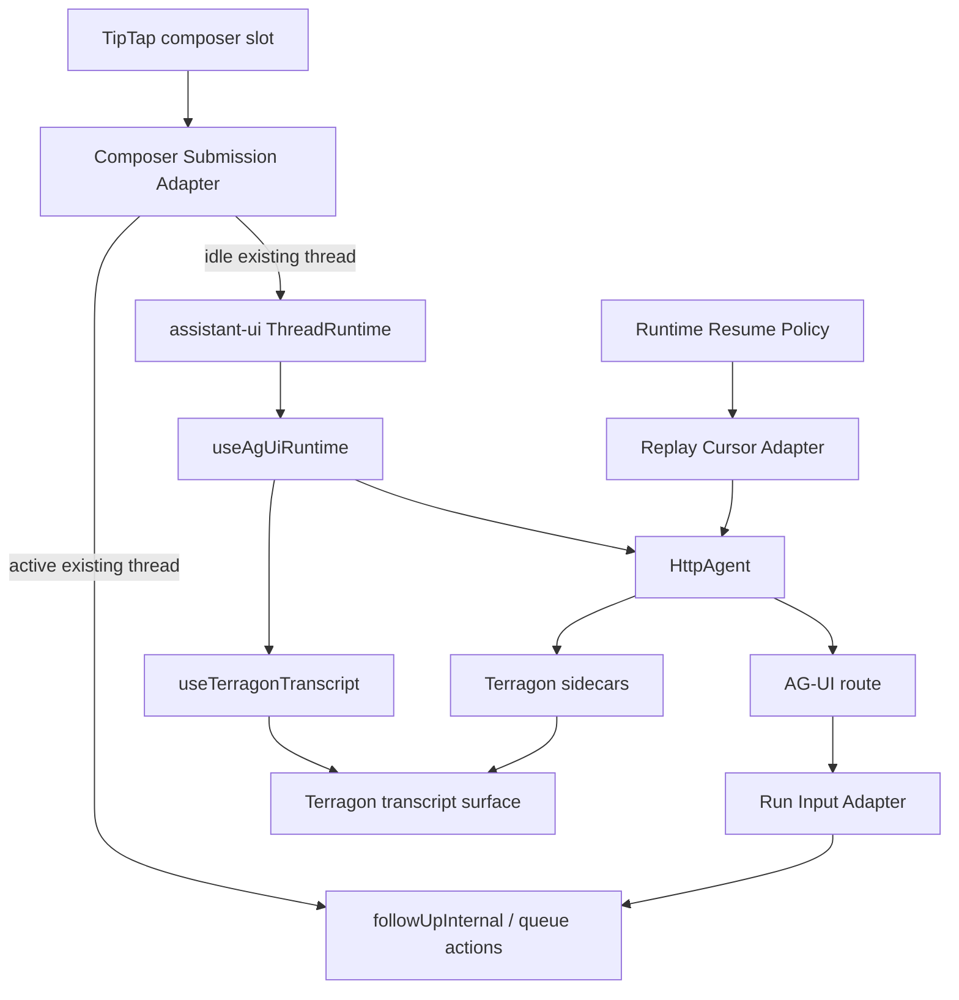
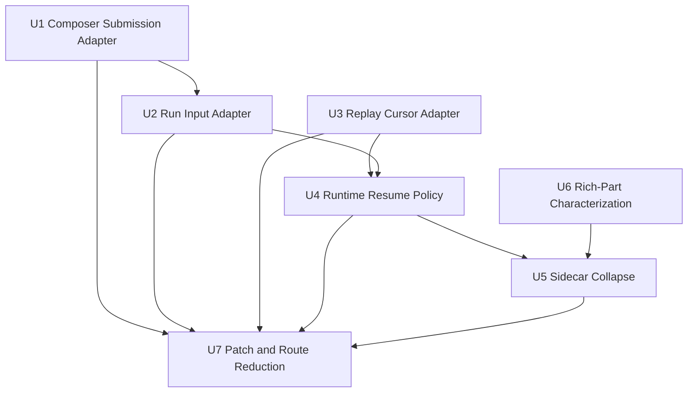
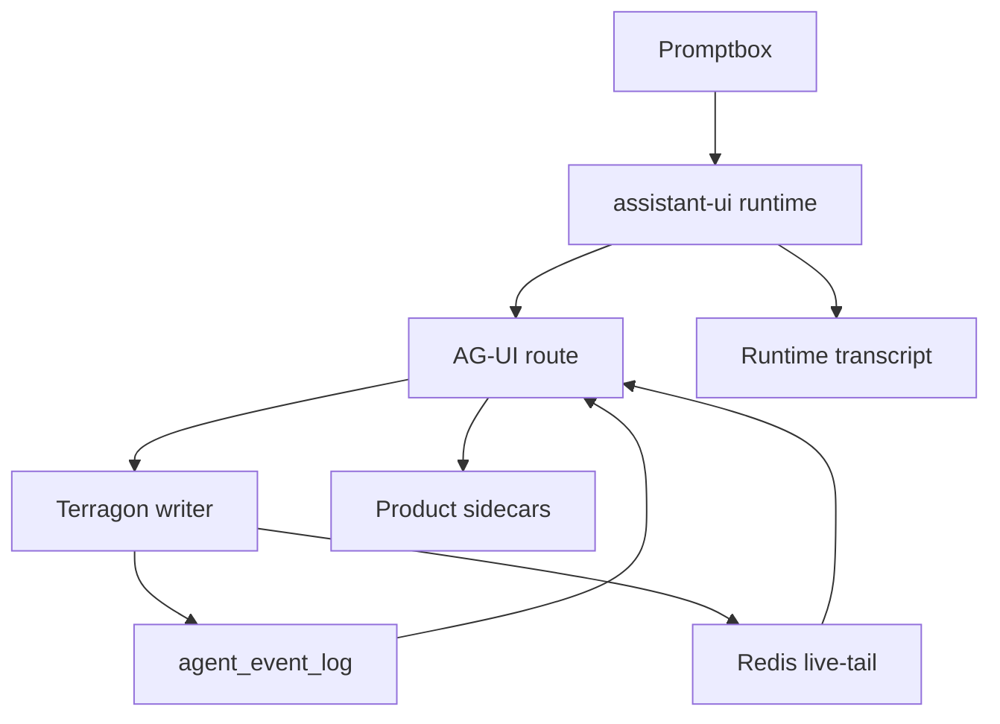

# refactor: Complete Assistant-UI and AG-UI Chat Cutover

## Summary

Complete the chat architecture simplification by making assistant-ui and AG-UI the default runtime path end to end, with Terragon code only at explicit typed adapter seams. The work should land as small refactor slices: composer submission, run metadata, resume/cursor policy, sidecar collapse, rich-part characterization, package patch reduction, and route extraction.

---

## Problem Frame

The chat layer now hosts `useAgUiRuntime` directly, but several Terragon-specific protocols still sit beside it: composer branching, run metadata forwarding, replay cursor parsing, sidecar transcript projection, and a large AG-UI route. Those seams make it too easy to reintroduce duplicated messages, duplicate follow-ups, or a second transcript interpreter.

---

## Requirements

- R1. Assistant-ui runtime state remains the single browser source of truth for thread messages and running state.
- R2. Browser transport uses AG-UI through `HttpAgent`; Terragon does not create another runtime protocol.
- R3. Terragon-specific behavior lives behind explicit typed adapters, not incidental `forwardedProps`, URL-string conventions, or package-patch-only behavior.
- R4. Existing thread submission leans on assistant-ui runtime append/cancel semantics while preserving Terragon durable queueing and single-writer server actions.
- R5. Active resume, reconnect, and cursor-backed POST requests never dispatch the last durable user message as a fresh follow-up.
- R6. Prompt content round-trips safely: supported content is preserved, unsupported content has an explicit fallback or error path, and model/permission metadata is type checked.
- R7. Rich Terragon transcript behavior remains intact: tools, plans, terminal, diffs, images, audio, resource links, meta chips, lifecycle footer, queued messages, and optimistic user messages. Optimistic submitted messages are runtime-owned pending messages; optimistic queued rows are product sidecars.
- R8. Product sidecars stay out of the runtime transcript path unless assistant-ui or AG-UI has a native equivalent.
- R9. Tests exercise adapter contracts and cross-layer flows rather than private helper shapes.
- R10. The migration reduces custom runtime code and shrinks, upstreams, or isolates the remaining `@assistant-ui/react-ag-ui` patch.

---

## Scope Boundaries

- Do not replace TipTap. It remains the input slot while submission wiring moves behind assistant-ui/runtime-aware adapters.
- Do not replace Streamdown or the markdown renderer.
- Do not rewrite the daemon event model.
- Do not move scheduled or draft task creation onto AG-UI POST in this plan.
- Do not delete rich-part, tool-progress, reasoning, or terminal projection behavior until characterization coverage proves the native path preserves it.
- Do not change the pinned assistant-ui or AG-UI package versions as part of these units.
- Do not adopt assistant-ui experimental thread-list or interrupt surfaces broadly; keep any future use behind Terragon adapters.

### Deferred to Follow-Up Work

- Directly render assistant-ui `ThreadMessage` objects through Terragon part renderers after golden rich-part coverage exists.
- Replace Terragon `CUSTOM` rich UI events with AG-UI activity events where that is proven to preserve durable UI semantics.
- Upstream remaining package-patch behavior after the local adapter seams are small enough to describe cleanly.

---

## Context & Research

### Relevant Code and Patterns

- `apps/www/src/components/chat/assistant-ui/terragon-runtime-session.tsx` hosts native `useAgUiRuntime`, history loading, active resume, cancel, retry, and provider setup.
- `apps/www/src/hooks/use-ag-ui-transport.ts` owns `HttpAgent` identity, URL/header mutation, `threadChatId`, `runId`, and replay cursor state.
- `apps/www/src/components/promptbox/use-promptbox.tsx` currently decides between active queueing, runtime append, and fallback submit.
- `apps/www/src/components/chat/chat-prompt-box.tsx` owns direct `followUp`, durable queue persistence, optimistic queue projection, and stop behavior.
- `apps/www/src/server-lib/run-from-ag-ui.ts` adapts AG-UI POST bodies back into `followUpInternal`.
- `apps/www/src/app/api/ag-ui/[threadId]/route.ts` owns auth, replay cursor parsing, durable replay, Redis live-tail, POST intent, terminal fallback, and diagnostics.
- `apps/www/src/components/chat/use-ag-ui-messages.ts` and `apps/www/src/components/chat/thread-view-model/*` still contain sidecar and transcript projection machinery.
- `apps/www/src/components/chat/assistant-ui/use-terragon-transcript.ts`, `runtime-transcript-adapter.ts`, and `terragon-transcript-model.ts` are the current transcript adapter seam.
- `apps/www/src/components/chat/parts/part-registry.ts`, `apps/www/src/components/chat/tool-part.tsx`, and `apps/www/src/components/chat/tools/tool-registry.ts` are the rendering registries that must remain exhaustive.
- `patches/@assistant-ui__react-ag-ui@0.0.26.patch` still carries runtime behavior that should shrink after queueing and reconciliation policy move into Terragon adapters.

### Institutional Learnings

- `docs/plans/2026-05-24-002-assistant-ui-ag-ui-architecture-shaping.md` selects "Native Core With Terragon Adapters" as the plan of record.
- `docs/plans/2026-05-24-001-refactor-ag-ui-runtime-simplification-plan.md` established `TerragonRuntimeSession` and `useTerragonTranscript` as narrow seams.
- `docs/plans/2026-04-27-refactor-chat-layer-consolidated-plan.md` identifies duplicated transcript ownership as the core architectural hazard.
- `docs/plans/2026-04-30-runtime-owns-writes-adr.md` requires AG-UI POST to adapt into `followUp()` and preserve replay-mode write bypass.
- `docs/plans/phase-6-reducer-audit.md` says reducer deletion needs replay fixtures for reasoning, tool progress, rich parts, malformed payloads, terminal fallback, reconnect, and duplicates.
- `docs/ag-ui-migration-complete.md` records known follow-ups around thread status freshness, long replay cost, and orphan rich parts.
- `docs/ag-ui-stream-observability-note.md` documents existing stream diagnostics: open, first frame, close, replay count, dedupe count, and XREAD counters.

### External References

- assistant-ui AG-UI runtime options: https://www.assistant-ui.com/docs/runtimes/ag-ui/runtime-options
- assistant-ui AG-UI quickstart: https://www.assistant-ui.com/docs/runtimes/ag-ui/quickstart
- assistant-ui runtime architecture: https://www.assistant-ui.com/docs/runtimes/concepts/architecture
- AG-UI `HttpAgent`: https://docs.ag-ui.com/sdk/js/client/http-agent

---

## Key Technical Decisions

- Use native runtime as the spine: `useAgUiRuntime` and `HttpAgent` own runtime parsing, message reconstruction, cancellation, and live transport.
- Keep Terragon adapters explicit and typed: composer submission, run config, replay cursor, resume policy, transcript projection, and sidecars get named modules with contract tests.
- Preserve server single-writer behavior: runtime append may initiate POST, but the server still adapts into `followUpInternal` and queue actions rather than bypassing Terragon orchestration.
- Treat unsupported prompt content as a contract decision, not silent loss: any message containing unsupported attachment parts falls back as a whole to the existing direct submit path until AG-UI content support can preserve the full message.
- Define resume from all cursor sources: URL `fromSeq`, `Last-Event-ID`, and typed `intent=resume` must all be classified before follow-up dispatch and suppress append handling.
- Collapse sidecars by whitelist: sidecar hooks may handle product-only metadata, artifacts, status invalidation, PR/check state, and lifecycle side effects, but not text/tool/reasoning transcript mutation.
- Route extraction comes last: split the AG-UI route only after cursor, resume, and run-input policies exist as named modules.

---

## Open Questions

### Resolved During Planning

- Should this be pure upstream assistant-ui with no Terragon adapters? No. Terragon still has durable queueing, task metadata, replay cursor semantics, and rich parts that need adapter seams.
- Should route extraction happen first? No. Extracting the route before naming the policies would just move anonymous closure logic into anonymous helpers.
- Should TipTap be replaced now? No. TipTap remains the editor input slot; this plan changes submission ownership, not the editor.

### Deferred to Implementation

- Whether non-image attachments can be represented through current AG-UI input content or must fall back to legacy `followUp`: this depends on testing current content support and product expectations.
- Whether the package patch merge policy can move fully into history projection: this needs a patch spike after queueing and resume policy are isolated.
- Whether rich parts can move from `CUSTOM` to AG-UI activity events: this needs golden fixtures and parity checks.

---

## High-Level Technical Design

> _This illustrates the intended approach and is directional guidance for review, not implementation specification. The implementing agent should treat it as context, not code to reproduce._

The design keeps one runtime spine and several narrow adapters. The runtime spine is assistant-ui plus AG-UI. Terragon adapters either prepare Terragon inputs for that spine, decode AG-UI inputs back into Terragon server actions, or render product sidecars outside transcript ownership.

### Content Routing Matrix

| Prompt content                                         | Existing-thread behavior                              | Reason                                                  |
| ------------------------------------------------------ | ----------------------------------------------------- | ------------------------------------------------------- |
| Text only                                              | Runtime append through assistant-ui/AG-UI             | Fully representable today.                              |
| Image only or text + image                             | Runtime append through assistant-ui/AG-UI             | Current conversion supports AG-UI image content.        |
| PDF, text-file, or other unsupported attachment only   | Direct fallback submit                                | Avoid silent content loss.                              |
| Text/image mixed with unsupported attachment           | Direct fallback submit for the whole message          | Partial append would persist an incomplete user prompt. |
| Empty after conversion and no fallback-capable content | Visible reject/no-op using existing submit validation | Avoid dispatching empty follow-ups.                     |

### Sidecar Allowlist

| Event family                                | Allowed consumer                                       | Malformed behavior                                                |
| ------------------------------------------- | ------------------------------------------------------ | ----------------------------------------------------------------- |
| `RUN_STARTED`, `RUN_FINISHED`, `RUN_ERROR`  | lifecycle footer, query invalidation, status freshness | Ignore fields that fail type checks; keep subscription alive.     |
| `CUSTOM` `thread.status_changed`            | thread status invalidation and lifecycle sidecar       | Ignore invalid payload and refetch only when identity is present. |
| `CUSTOM` `terragon.meta.*`                  | meta chips                                             | Quarantine or ignore invalid chip payloads.                       |
| `CUSTOM` artifact/product descriptors       | artifact side panel and PR/check product state         | Ignore invalid descriptor; do not mutate transcript messages.     |
| Text, reasoning, and tool transcript events | assistant-ui runtime plus `useTerragonTranscript` only | Sidecar hook must no-op.                                          |

### Patch Hunk Inventory

| Patch behavior                                  | Disposition                                                                                                                  |
| ----------------------------------------------- | ---------------------------------------------------------------------------------------------------------------------------- |
| Queue hook behavior                             | Remove after U1 owns durable queueing outside the dependency patch.                                                          |
| History load key / retry / wait-for-load        | Keep until U4 proves whether the behavior can move to app-owned resume policy or must be upstreamed.                         |
| Merge-after-local-mutations reconciliation      | Keep until U6/U7 can prove native history projection preserves optimistic and replay behavior.                               |
| Target assistant message id support             | Keep until rich-part and tool-call characterization proves native message targeting is sufficient or upstream support lands. |
| Any remaining pinned-version compatibility shim | Mark as blocked by pinned package and document the upstream issue or local reason before leaving it in place.                |

---

## Implementation Units

### U1. Composer Submission Adapter

**Goal:** Move existing-thread submission branching behind one typed adapter so promptbox code owns editor state and the adapter owns the local routing decision for idle append, active queue, `/clear`, fallback create-thread submit, optimistic runtime messages, optimistic queued rows, and refetch reconciliation.

**Requirements:** R3, R4, R6, R7, R9

**Dependencies:** None

**Files:**

- Create: `apps/www/src/components/promptbox/composer-submission.ts`
- Modify: `apps/www/src/components/promptbox/use-promptbox.tsx`
- Modify: `apps/www/src/components/chat/chat-prompt-box.tsx`
- Modify or delete: `apps/www/src/components/promptbox/use-composer-queue.ts`
- Test: `apps/www/src/components/promptbox/use-promptbox.test.tsx`
- Test: `apps/www/src/components/promptbox/use-composer-queue.test.ts`
- Test: `apps/www/src/components/chat/queued-message-dedupe.test.ts`

**Approach:**

- Keep TipTap conversion, attachment upload, selected model selection, and permission mode selection in promptbox code.
- Introduce a composer submission adapter that receives a `DBUserMessage`, selected-model context, thread status context, runtime append capability, queue persistence capability, and create-thread fallback capability.
- Return typed local routing outcomes such as runtime-append-started, queued-locally, fallback-submitted, rejected, or validation-no-op. Do not promise a server-dispatched/queued result from `threadRuntime.append`; the AG-UI path reports durable state through SSE events and refetch reconciliation.
- Make active/idle race handling explicit through the adapter's post-submit reconciliation rule. If the client thought the thread was idle but the server later shows active/queued state, reconcile by refetching and updating optimistic sidecars rather than inventing a second AG-UI result channel.
- Define `/clear` while active in this adapter. The conservative behavior is to queue it behind the current run unless implementation reveals an existing product rule.
- Do not make generic promptbox/editor code know AG-UI POST body details.
- Do not silently drop unsupported content. If the message contains PDF or text-file parts that cannot round-trip through current AG-UI content, the adapter must route the whole message through direct fallback submit or return a visible unsupported-content result.

**Execution note:** Start with characterization tests for the current idle append, active queue, and unsupported attachment behavior before moving branching.

**Patterns to follow:**

- `apps/www/src/components/chat/chat-prompt-box.tsx` for optimistic submit, queue persistence, and refetch reconciliation.
- `apps/www/src/components/chat/queued-message-dedupe.ts` for durable queue dedupe.
- `apps/www/src/components/promptbox/use-promptbox.tsx` for TipTap-to-`DBUserMessage` conversion.

**Test scenarios:**

- Happy path: idle existing-thread submit with rich text calls runtime append and does not call direct `followUp`.
- Happy path: active existing-thread submit persists a queued message, updates optimistic queued rows as a sidecar, and does not call runtime append.
- Happy path: dashboard or generic composer without runtime continues using fallback submit.
- Edge case: active `/clear` follows the adapter-defined behavior and leaves queued-message UI consistent.
- Edge case: status changes idle to active during submit; the adapter starts runtime append locally, then refetch/SSE reconciliation produces one durable result without duplicate follow-up.
- Edge case: status changes active to idle during submit; queue persistence or refetch reconciliation does not leave a stale queued row.
- Error path: queue persistence failure surfaces the existing thread error and refetches.
- Error path: runtime append failure triggers the existing submit error flow and does not clear content prematurely.
- Edge case: unsupported-only and mixed supported/unsupported messages follow the Content Routing Matrix and do not partially append.
- Integration: queued-message removal still persists the updated queue and dedupes by `clientSubmissionId`.

**Verification:**

- Promptbox submission reads as editor-to-message production plus a single adapter call.
- Existing-thread idle and active submission paths are covered without duplicating queue logic across promptbox and chat wrapper.
- Unsupported content behavior is documented in the adapter tests.

---

### U2. Run Input Adapter

**Goal:** Centralize Terragon metadata encoding and decoding for assistant-ui runtime append and AG-UI POST.

**Requirements:** R3, R4, R6, R9

**Dependencies:** U1

**Files:**

- Create: `apps/www/src/lib/terragon-ag-ui-run-config.ts`
- Modify: `apps/www/src/components/promptbox/use-promptbox.tsx`
- Modify: `apps/www/src/server-lib/run-from-ag-ui.ts`
- Modify: `apps/www/src/lib/agent-trace.ts`
- Modify: `apps/www/src/app/api/ag-ui/[threadId]/route.ts`
- Test: `apps/www/src/server-lib/run-from-ag-ui.test.ts`
- Test: `apps/www/src/components/promptbox/use-promptbox.test.tsx`
- Test: `apps/www/src/app/api/ag-ui/[threadId]/route.test.ts`

**Approach:**

- Define one Terragon run config contract for selected model, permission mode, trace id, append intent, resume intent, and client submission identity.
- Encode the contract through assistant-ui `runConfig.custom` on the client, accounting for the installed runtime's `forwardedProps.runConfig` layout.
- Decode the assistant-ui runtime layout on the server. Keep any direct-layout support limited to existing tests or explicit compatibility fixtures, with a deletion path; do not bless a second public caller protocol.
- Replace `selectedModel as AIModel` with a real guard against the canonical model registry.
- Move AG-UI user content to `DBUserMessage` conversion into this adapter or a sibling adapter owned by the same contract.
- Add `clientSubmissionId` to append requests so retries can become idempotent beyond the current short Redis lock.
- Preserve replay-mode write bypass for integration harness requests.

**Patterns to follow:**

- `apps/www/src/server-lib/run-from-ag-ui.ts` for current `RunAgentInput` validation and `followUpInternal` call shape.
- `apps/www/src/lib/agent-trace.ts` for trace metadata extraction.
- `apps/www/src/components/chat/terragon-ag-ui-conversions.ts` for AG-UI message conversion patterns.

**Test scenarios:**

- Happy path: selected model and permission mode round-trip from runtime append into `followUpInternal`.
- Happy path: assistant-ui `runConfig` layout decodes to Terragon metadata; any direct-layout fixture is marked compatibility-only.
- Happy path: image URL and image data content convert to supported DB image parts.
- Edge case: invalid selected model is rejected or falls back according to the adapter contract without a cast.
- Edge case: unsupported AG-UI content follows the Content Routing Matrix; no partial durable prompt is created for mixed content.
- Error path: missing user message returns invalid input and does not dispatch.
- Error path: unauthorized thread returns the existing safe error.
- Integration: duplicate append requests with the same client submission identity do not produce duplicate durable follow-ups.
- Integration: replay-mode request skips writes even when a valid body is present.

**Verification:**

- Composer, route, trace, and server adapter code no longer parse Terragon metadata independently.
- No `AIModel` cast remains in the AG-UI POST path.
- Runtime append has a typed idempotency story.

---

### U3. Replay Cursor Adapter

**Goal:** Share replay cursor parsing, serialization, validation, and resume detection between browser transport and the AG-UI route.

**Requirements:** R2, R3, R5, R9

**Dependencies:** None

**Files:**

- Create: `apps/www/src/lib/ag-ui-replay-cursor.ts`
- Modify: `apps/www/src/hooks/use-ag-ui-transport.ts`
- Modify: `apps/www/src/app/api/ag-ui/[threadId]/route.ts`
- Modify: `apps/www/src/lib/ag-ui-history-fetch.ts`
- Test: `apps/www/src/hooks/use-ag-ui-transport.test.tsx`
- Test: `apps/www/src/app/api/ag-ui/[threadId]/route.test.ts`
- Test: `apps/www/src/lib/ag-ui-history-fetch.test.ts`

**Approach:**

- Move bare cursor, `seq:` cursor, projection cursor, invalid cursor, and `Last-Event-ID` parsing into one module.
- Make serialization shared by `useAgUiTransport`, route tests, and history fetch callers.
- Define resume detection as any valid URL cursor, valid `Last-Event-ID`, or typed Terragon resume intent.
- Define `classifyAgUiPostIntent(request, body)` as the API that runs before `runFollowUpFromAgUiInput` and reads URL cursor, `Last-Event-ID`, and typed intent in one place.
- Keep projection-index semantics intact for replay/live-tail overlap.
- Require durable envelopes for streamable deltas to carry enough identity for dedupe, or synthesize a stable identity in one place.

**Patterns to follow:**

- Existing route tests around `fromSeq`, projection cursors, `Last-Event-ID`, and POST resume behavior.
- `packages/shared/src/model/agent-event-log.ts` for durable per-thread-chat sequence semantics.

**Test scenarios:**

- Happy path: bare cursor serializes and parses as a thread-chat catch-up cursor.
- Happy path: projection cursor serializes and parses with projection index.
- Happy path: `Last-Event-ID` is preferred over URL cursor for reconnect when present.
- Edge case: invalid, negative, unsafe, or malformed cursors parse to no cursor.
- Edge case: cursor value `-1` keeps existing empty-thread behavior if still required by current route semantics.
- Integration: POST with valid body plus URL cursor suppresses follow-up dispatch.
- Integration: POST with valid body plus `Last-Event-ID` but no URL cursor suppresses follow-up dispatch.
- Integration: `classifyAgUiPostIntent` is used before any append adapter call, so cursor-backed requests cannot be misclassified as appends.
- Integration: replay/live-tail overlap for text, reasoning, and tool chunks dedupes only when stable identity is present and does not drop legitimate deltas.

**Verification:**

- Route and transport no longer duplicate cursor string rules.
- Resume-vs-append decisions do not depend on a single URL query convention.

---

### U4. Runtime Resume Policy

**Goal:** Name and test active/idle history load behavior, replay cursor application, load keys, retry semantics, and POST resume intent.

**Requirements:** R1, R3, R5, R9

**Dependencies:** U2, U3

**Files:**

- Create: `apps/www/src/components/chat/assistant-ui/runtime-resume-policy.ts`
- Modify: `apps/www/src/components/chat/assistant-ui/terragon-runtime-session.tsx`
- Modify: `apps/www/src/components/chat/ag-ui-history-adapter.ts`
- Modify: `apps/www/src/app/api/ag-ui/[threadId]/route.ts`
- Test: `apps/www/src/components/chat/assistant-ui/terragon-runtime-session.test.tsx`
- Test: `apps/www/src/components/chat/ag-ui-history-adapter.test.ts`
- Test: `apps/www/src/app/api/ag-ui/[threadId]/route.test.ts`

**Approach:**

- Define active history load, idle history load, retry load, empty active thread, and terminal replay as policy states.
- Return the history load key, resume-on-load behavior, cursor to apply, and resume intent from a single policy function.
- Ensure cursor application is a precondition for resume. Tests should capture the actual `HttpAgent` URL used by resume rather than only checking that a setter was called.
- Define when active history becomes idle history after terminal replay so unresolved tools do not stay pending forever.
- Keep `TerragonRuntimeSession` as a host for native runtime options, not a policy container.

**Patterns to follow:**

- `apps/www/src/components/chat/assistant-ui/terragon-runtime-session.tsx` for current history load, retry, and `setReplayCursor` behavior.
- `apps/www/src/components/chat/ag-ui-history-adapter.ts` for unresolved tool finalization differences between active and idle loads.
- `apps/www/src/app/api/ag-ui/[threadId]/route.test.ts` for POST resume no-dispatch invariants.

**Test scenarios:**

- Happy path: idle history load imports messages without resuming the run.
- Happy path: active history load applies cursor before resume and opens the stream.
- Happy path: retry changes the load key and repeats policy calculation.
- Edge case: empty active thread opens a stream without creating duplicate placeholders.
- Edge case: active resume receiving terminal replay eventually finalizes unresolved tools.
- Error path: history load failure exposes retry state without falling back to DB transcript rows.
- Integration: the URL used by resume includes the intended cursor before POST starts.
- Integration: POST resume path never calls `followUpInternal`.

**Verification:**

- Active/idle/resume behavior is readable from a named module and covered by route plus runtime tests.
- Duplicate follow-up prevention is enforced on both browser and server seams.

---

### U5. Sidecar Collapse

**Goal:** Reduce AG-UI sidecar handling to product-only side effects and prevent it from becoming a second transcript interpreter.

**Requirements:** R1, R7, R8, R9

**Dependencies:** U4, U6

**Files:**

- Create: `apps/www/src/components/chat/use-terragon-ag-ui-sidecars.ts`
- Modify: `apps/www/src/components/chat/use-ag-ui-messages.ts`
- Modify: `apps/www/src/components/chat/chat-ui.tsx`
- Modify: `apps/www/src/components/chat/thread-view-model/reducer.ts`
- Modify: `apps/www/src/components/chat/thread-view-model/types.ts`
- Modify or delete: `apps/www/src/components/chat/terragon-ag-ui-subscriber.ts`
- Test: `apps/www/src/components/chat/use-ag-ui-messages.test.tsx`
- Test: `apps/www/src/components/chat/thread-view-model/reducer.test.ts`
- Test: `apps/www/src/components/chat/meta-chips/use-thread-meta-events.integration.test.tsx`
- Test: `apps/www/src/hooks/use-ag-ui-query-invalidator.test.tsx`
- Test: `apps/www/src/components/chat/terragon-ag-ui-subscriber.test.ts`

**Approach:**

- Replace broad sidecar routing with a product-sidecar hook that subscribes to the shared `HttpAgent` only for allowed event families.
- Implement the Sidecar Allowlist table as the contract for status invalidation, terminal wakeups, meta chips, artifacts, PR/check data, lifecycle sidecars, and query invalidation.
- Set transcript projection false at the sidecar seam and make text, tool, reasoning, and standard assistant transcript events no-ops for sidecar message state.
- Keep `useTerragonTranscript` as the only current runtime-to-Terragon transcript adapter.
- Delete `terragon-ag-ui-subscriber.ts` only if import checks and tests prove it is test-only or obsolete.
- Preserve side panel artifacts and scheduled/draft banners outside assistant-ui runtime state.

**Execution note:** Characterization-first. Prove sidecar behavior before deleting reducer paths.

**Patterns to follow:**

- `apps/www/src/components/chat/meta-chips/use-thread-meta-events.ts` for scoped event subscription.
- `apps/www/src/hooks/use-ag-ui-query-invalidator.ts` for query invalidation side effects.
- `apps/www/src/components/chat/thread-view-model/*` for existing product sidecar state.

**Test scenarios:**

- Happy path: status-changed custom event invalidates/refetches the expected thread data.
- Happy path: meta chip events still update chip state.
- Happy path: artifact descriptors still update side panel state.
- Edge case: text, reasoning, and tool transcript events do not mutate sidecar transcript messages.
- Edge case: malformed custom event is quarantined or ignored without breaking subscription.
- Integration: active transcript rendering remains driven by assistant-ui runtime state while sidecars update product UI.
- Integration: scheduled/draft banners and lifecycle footer remain visible in the same states as before.

**Verification:**

- The sidecar hook name and tests make it clear that it is not a transcript owner.
- Any remaining reducer transcript code is either deleted or gated by rich-part characterization.

---

### U6. Rich-Part Characterization and Native Event Preference

**Goal:** Lock down rich Terragon rendering behavior before deleting projection paths or replacing custom event shapes.

**Requirements:** R7, R8, R9

**Dependencies:** None

**Files:**

- Modify: `apps/www/src/components/chat/assistant-ui/runtime-transcript-adapter.test.ts`
- Modify: `apps/www/src/components/chat/assistant-ui/use-terragon-transcript.test.tsx`
- Modify: `apps/www/src/components/chat/assistant-ui/terragon-transcript-model.test.ts`
- Modify: `apps/www/src/components/chat/ag-ui-messages-reducer.test.ts`
- Modify: `apps/www/test/integration/ag-ui-replayer.test.ts`
- Modify: `apps/www/test/integration/chat-ui-streaming-budget.test.tsx`
- Modify: `apps/www/src/server-lib/ag-ui-publisher.test.ts`
- Modify: `packages/agent/src/ag-ui-mapper.test.ts`

**Approach:**

- Add golden coverage for reasoning, tool progress chunks, terminal parts, diffs, plans, images, audio, resource links, delegation, auto-approval review, malformed payloads, orphan rich parts, reconnect replay, and duplicate overlap.
- Prefer native AG-UI event families for new behavior: text, tool calls/results, state snapshot/delta, and reasoning events.
- Avoid adding new `THINKING_*` behavior; new backend events should use reasoning event families while the UI remains tolerant of legacy thinking events.
- Keep Terragon `CUSTOM` events only for product-specific side channels or rich parts without a native assistant-ui/AG-UI representation.

**Patterns to follow:**

- `packages/agent/src/ag-ui-mapper.ts` for canonical event to AG-UI mapping.
- `apps/www/src/server-lib/ag-ui-publisher.ts` for durable event envelope identity.
- `docs/plans/phase-6-reducer-audit.md` for reducer deletion criteria.

**Test scenarios:**

- Happy path: reasoning streams render without adding new deprecated thinking-only behavior.
- Happy path: tool start, args, progress, result, failure, and interruption states render correctly.
- Happy path: terminal, diff, plan, image, audio, resource-link, delegation, and auto-approval review parts render through the existing registries.
- Edge case: orphan rich part on reconnect attaches or quarantines according to existing behavior.
- Edge case: malformed custom payload does not crash the transcript or sidecar subscription.
- Edge case: duplicate replay/live-tail rich-part events do not duplicate UI parts.
- Integration: long transcript tail updates preserve stable identities for unaffected messages.

**Verification:**

- Reducer/projection deletion is blocked until these cases are green.
- Future direct `ThreadMessage` rendering has a concrete parity suite.

---

### U7. Package Patch and Route Reduction

**Goal:** Shrink the dependency patch and split the large AG-UI route after the adapter seams are stable.

**Requirements:** R3, R5, R9, R10

**Dependencies:** U1, U2, U3, U4, U5

**Files:**

- Modify: `patches/@assistant-ui__react-ag-ui@0.0.26.patch`
- Modify: `apps/www/src/app/api/ag-ui/[threadId]/route.ts`
- Create: `apps/www/src/app/api/ag-ui/[threadId]/authorize-thread-chat.ts`
- Create: `apps/www/src/app/api/ag-ui/[threadId]/ag-ui-post-intent.ts`
- Create: `apps/www/src/app/api/ag-ui/[threadId]/ag-ui-replay-stream.ts`
- Create: `apps/www/src/app/api/ag-ui/[threadId]/ag-ui-live-tail.ts`
- Create: `apps/www/src/app/api/ag-ui/[threadId]/ag-ui-terminal-fallback.ts`
- Test: `apps/www/src/app/api/ag-ui/[threadId]/route.test.ts`
- Test: `apps/www/src/app/api/ag-ui/[threadId]/cancel/route.test.ts`
- Test: `apps/www/src/components/chat/assistant-ui/terragon-runtime-session.test.tsx`

**Approach:**

- Remove queue behavior from the package patch after U1 owns composer queueing.
- Follow the Patch Hunk Inventory before editing the dependency patch; every remaining hunk must be categorized as app-owned, upstreamable, pinned-version blocked, or still runtime-core.
- Keep only categorized runtime-core behavior that cannot live in app adapters.
- Record each remaining patch hunk as upstreamable, app-owned, or blocked by pinned-version limitations.
- Split the route by responsibility after U2-U4 exist and sidecar-visible behavior is covered by U5/U6 tests, so extraction moves named policy modules rather than creating a new route framework.
- Keep the Next route as a thin adapter over auth, POST intent, replay stream, live tail, and terminal fallback helpers.
- Preserve stream diagnostics while extracting.

**Patterns to follow:**

- Existing route tests around replay, live-tail, terminal fallback, and POST resume.
- `docs/ag-ui-stream-observability-note.md` for diagnostics invariants.
- `docs/plans/2026-04-30-runtime-owns-writes-adr.md` for single-writer behavior.

**Test scenarios:**

- Happy path: existing route replay tests pass after extraction.
- Happy path: stream diagnostics still emit open, first-frame, and close records with replay and dedupe counts.
- Happy path: cancel route still aborts server-side work and refetch behavior remains intact.
- Edge case: terminal fallback closes or tails according to current terminal-status behavior.
- Edge case: replay mode still skips writes and streams fixtures.
- Integration: route extraction does not change SSE framing, ids, or cursor behavior.
- Integration: patch queue behavior is gone while runtime append, load retry, and message reconciliation remain stable.

**Verification:**

- The patch is smaller and documented by remaining behavior category.
- `route.ts` reads as request/response wiring over named modules.
- No new custom runtime layer is introduced.

---

## System-Wide Impact

- **Interaction graph:** Promptbox, assistant-ui runtime, `HttpAgent`, AG-UI route, `followUpInternal`, replay/live-tail, transcript adapter, and sidecar hooks all interact in this migration.
- **Error propagation:** Runtime append, queue persistence, POST validation, replay parse failures, and cancel failures must surface through existing visible thread errors or retry affordances.
- **State lifecycle risks:** Duplicate user messages, duplicate follow-ups, stale queued rows, replay/live-tail overlap, terminal fallback, and unresolved tool finalization are the main lifecycle risks.
- **API surface parity:** Existing browser chat, replay harness, server action write path, AG-UI route, and integration tests must keep equivalent behavior.
- **Integration coverage:** Unit tests are not enough. The plan needs route tests, runtime tests, and replay harness coverage for reconnect and rich-part behavior.
- **Unchanged invariants:** assistant-ui and AG-UI package versions stay pinned; TipTap and Streamdown remain; durable writes still flow through Terragon server actions; DB transcript fallback does not re-enter active transcript rendering.

---

## Risks & Dependencies

| Risk                                                                          | Mitigation                                                                             |
| ----------------------------------------------------------------------------- | -------------------------------------------------------------------------------------- |
| Runtime append silently drops PDF/text-file attachments                       | U1 and U2 require explicit supported-content tests and fallback/error behavior.        |
| Cursor-backed POST with only `Last-Event-ID` dispatches a duplicate follow-up | U3 defines shared POST intent classification before any append adapter call.           |
| Client active/idle status races misroute a submit                             | U1 returns typed local routing outcomes and reconciles durable results by SSE/refetch. |
| Idempotency remains tied only to a short Redis lock                           | U2 carries client submission identity into append requests.                            |
| Sidecar collapse deletes rich-part behavior                                   | U6 characterization gates U5 deletion.                                                 |
| Package patch removal regresses load/retry/reconciliation                     | U7 removes queue behavior first and categorizes remaining patch hunks before deletion. |
| Route extraction becomes churn                                                | U7 waits until policy modules exist and preserves route tests/diagnostics.             |
| AG-UI protocol churn breaks assumptions                                       | Keep exact package pins and keep experimental assistant-ui features behind adapters.   |

---

## Documentation / Operational Notes

- Update `docs/plans/2026-05-24-002-assistant-ui-ag-ui-architecture-shaping.md` only if the selected shape changes.
- If U7 materially changes stream diagnostics, update `docs/ag-ui-stream-observability-note.md`.
- Watch AG-UI route diagnostics after route/cursor changes: first-frame latency, replay count, dedupe count, close reason, XREAD backoff, and XREAD errors.
- For each shipped slice, PR descriptions should call out whether the slice changes runtime ownership, write ownership, replay ownership, or sidecar ownership.

---

## Sources & References

- Origin shaping doc: `docs/plans/2026-05-24-002-assistant-ui-ag-ui-architecture-shaping.md`
- Prior simplification plan: `docs/plans/2026-05-24-001-refactor-ag-ui-runtime-simplification-plan.md`
- Chat consolidation plan: `docs/plans/2026-04-27-refactor-chat-layer-consolidated-plan.md`
- Runtime-writes ADR: `docs/plans/2026-04-30-runtime-owns-writes-adr.md`
- Reducer deletion audit: `docs/plans/phase-6-reducer-audit.md`
- AG-UI migration notes: `docs/ag-ui-migration-complete.md`
- Stream observability notes: `docs/ag-ui-stream-observability-note.md`
- assistant-ui AG-UI runtime options: https://www.assistant-ui.com/docs/runtimes/ag-ui/runtime-options
- assistant-ui AG-UI quickstart: https://www.assistant-ui.com/docs/runtimes/ag-ui/quickstart
- assistant-ui runtime architecture: https://www.assistant-ui.com/docs/runtimes/concepts/architecture
- AG-UI `HttpAgent`: https://docs.ag-ui.com/sdk/js/client/http-agent
