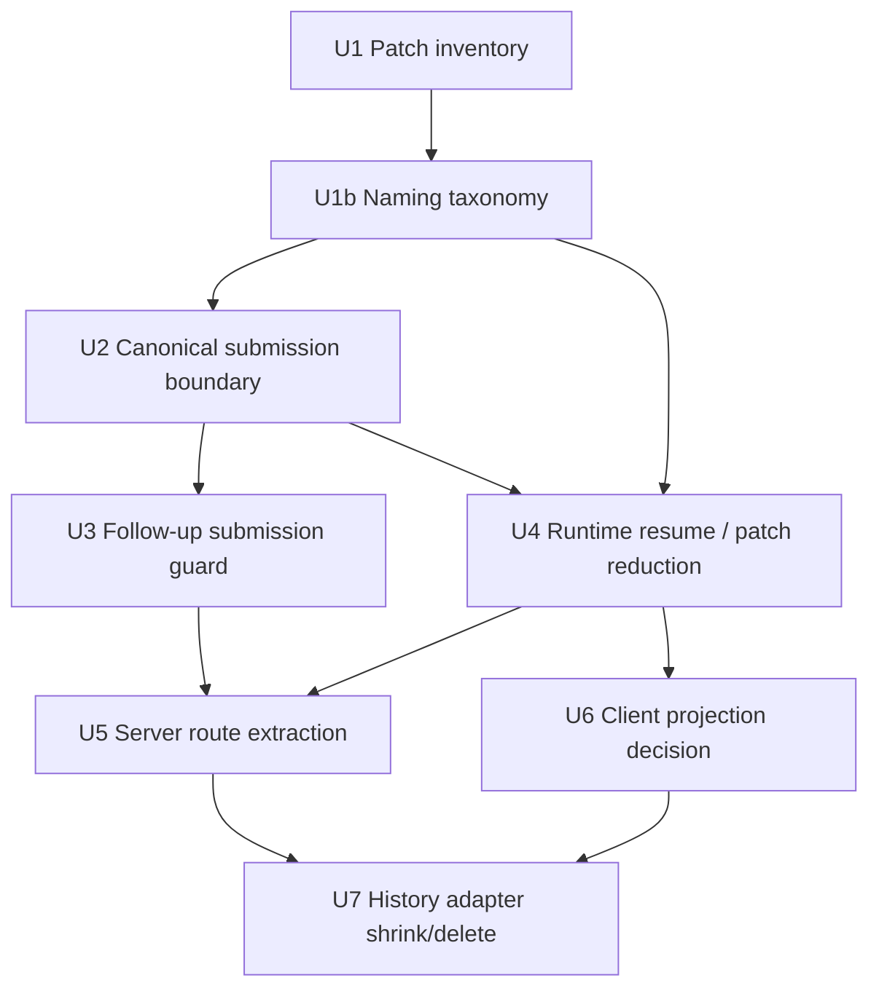

# refactor: Simplify Assistant-UI and AG-UI Ownership

## Summary

Finish the architecture cleanup after the native assistant-ui / AG-UI cutover by deleting competing owners of runtime, transcript, submission, and protocol state.

The target is not "pure upstream at all costs." Terragon still has product behavior that assistant-ui and AG-UI do not own: durable task queueing, sandbox lifecycle sidecars, replay cursors, selected-model metadata, permission mode, and rich task transcript parts. The target is one native runtime spine with explicit Terragon adapters at the edges.

```text
TipTap composer
  -> ComposerSubmission adapter
  -> assistant-ui runtime.append / cancel
  -> @assistant-ui/react-ag-ui useAgUiRuntime
  -> @ag-ui/client HttpAgent
  -> thin AG-UI route
  -> typed Terragon command / projection services
  -> followUpInternal / durable AG-UI event log
```

The cleanup rule for every patch:

```text
If two modules can both interpret the same message, run, cursor, or lifecycle event,
pick one canonical owner and delete the other path.
```

---

## Problem Frame

The current branch made the important move to native `useAgUiRuntime`, but the system still has five sources of architectural pressure:

1. `patches/@assistant-ui__react-ag-ui@0.0.26.patch` carries runtime policy that is hard to review, test, or upstream.
2. `apps/www/src/app/api/ag-ui/[threadId]/route.ts` is still the server-side protocol brain.
3. Client submission is split between assistant-ui append, durable queue actions, and legacy fallback submit.
4. Transcript rendering flows through multiple projections before reaching Terragon's surface.
5. AG-UI sidecars subscribe beside assistant-ui runtime state, so lifecycle/meta/artifact state can race transcript state by convention.

Current shape:

```text
composer-submission.ts
  -> runtime.append OR queueFollowUp OR fallback submit

useAgUiRuntime
  -> patched runtime merge/load/target behavior
  -> assistant-ui ThreadMessage state
  -> useTerragonTranscript
  -> Terragon UIMessage[]

useTerragonAgUiSidecars
  -> same HttpAgent
  -> thread view-model product events

route.ts
  -> history projection
  -> POST intent classification
  -> durable replay repair
  -> Redis live tail
  -> terminal fallback
  -> SSE framing
```

Target shape:

```text
Browser
  assistant-ui runtime + AG-UI HttpAgent are the runtime/transport core
  Terragon adapters own only product-specific decisions

Server
  route.ts is a thin Next shell
  server-lib/ag-ui/* owns command handling, history projection, replay planning,
  live-tail, terminal synthesis, and SSE bytes behind typed contracts
```

---

## Requirements

- R1. Native `useAgUiRuntime` remains the browser runtime core. Do not reintroduce a Terragon runtime implementation.
- R2. `HttpAgent` remains the live transport. Terragon-specific behavior must be expressed as typed AG-UI metadata or adapter code, not a parallel protocol.
- R3. The package patch must shrink to generic upstreamable behavior or disappear. No Terragon product semantics should live only in `patch-package`.
- R4. Server route code must become a shell around typed AG-UI services.
- R5. Submission must have one typed boundary for supported content, unsupported content, selected model, permission mode, queueing, draft/schedule fallback, and client submission identity.
- R6. Active resume and reconnect must never dispatch the last durable user message as a new follow-up.
- R7. Transcript rendering must have one canonical client projection. Sidecar state can enrich the UI, but it must not become a second transcript interpreter.
- R8. Product sidecars stay explicit: meta chips, lifecycle footer, artifacts, PR/check data, query invalidation, queued messages.
- R9. Rich Terragon parts remain supported: tools, plans, terminal, diffs, images, audio, resource links, reasoning, progress chunks, and optimistic rows.
- R10. Tests must target module contracts and cross-layer behavior, not incidental helper shapes.

---

## Decisions

### D1. Keep A Native Runtime Spine

`TerragonRuntimeSession` should host `useAgUiRuntime`; it should not become a new runtime shell.

Native-owned:

- assistant-ui runtime context
- append/cancel API surface
- AG-UI event aggregation where upstream supports it
- runtime state access through assistant-ui APIs

Terragon-owned:

- active vs idle resume policy
- replay cursor application
- selected model, permission mode, trace id, and client submission id
- durable queueing and `followUpInternal`
- unsupported attachment fallback
- product sidecars and rich part rendering

### D2. Treat The Patch As Debt With An Inventory

Every hunk in `patches/@assistant-ui__react-ag-ui@0.0.26.patch` must be classified as:

- **Delete:** Terragon-owned behavior that belongs in repo adapters.
- **Upstream:** generic assistant-ui / AG-UI runtime behavior.
- **Keep temporarily:** generic behavior with no safe local replacement yet.

Likely upstream/generic behavior:

- retryable async history loading through `historyLoadKey`
- stale history load generation guards
- waiting for initial load before append/reload/resume
- `messageId` / `parentMessageId` targeting in the AG-UI aggregator
- cleanup of synthetic assistant messages after targeted events arrive
- configurable external message reconciliation

Likely Terragon-owned behavior:

- injecting Terragon resume intent
- selected model and permission mode metadata
- client submission ids and durable dedupe
- queue policy
- product-side optimistic rows

### D3. Server AG-UI Becomes Typed Services

`route.ts` should only:

- parse the `NextRequest`
- authorize the thread chat
- call a command, history, or stream service
- map typed results to `NextResponse`

Protocol behavior moves into `apps/www/src/server-lib/ag-ui/*`.

### D4. Pick One Client Projection Per Event Family

The current browser has assistant-ui transcript state and a separate Terragon sidecar subscription. The safe simplification is not to pretend product sidecars vanish; it is to enforce event-family ownership:

- Transcript events: one canonical transcript projection.
- Product sidecar events: one sidecar projection.
- Query invalidation and lifecycle freshness: sidecar projection.
- Optimistic submitted user messages: one reducer path, not overlay plus runtime plus replay.

There is an unresolved implementation fork:

- **Option A:** assistant-ui runtime messages remain canonical for transcript, and sidecars are filtered strictly to product events.
- **Option B:** `thread-view-model` becomes the canonical client projection, and assistant-ui becomes append/cancel/history bridge only.

Use characterization tests before choosing. Option A is closer to the existing cutover goal; Option B deletes more adapter layers but risks drifting away from assistant-ui as the source of runtime truth. The implementation should prove which path gives fewer owners, not choose by taste.

### D5. Name Modules By Their Seam

Names should make ownership obvious before opening the file. Avoid generic nouns like `adapter`, `runtime`, `messages`, and `Terragon` unless they describe a real public seam.

Do not add `ag-ui` to every file touched by this work. That would make the architecture look more protocol-driven than it should be. The naming rule is:

```text
Name the outer seam by the protocol.
Name the inner module by the product concept.
```

Use `ag-ui` only where the module is mostly about the AG-UI protocol, AG-UI event stream, or AG-UI library contract. Once the data has crossed into Terragon's app model, use the product/domain name: follow-up, submit routing, transcript, sidecars, thread view, run metadata, replay cursor when it is truly stream protocol state.

Use these naming rules:

- Use assistant-ui and AG-UI names only when the module is at a library or protocol seam.
- Use Terragon names only when the type crosses a repo or protocol boundary; inside Terragon app code, prefer the domain noun.
- Use `adapter` only when satisfying a library interface. Otherwise name the direction or job: projector, command, policy, guard, hydration, sidecars.
- Name functions with verbs that expose the decision: `classify`, `dispatch`, `hydrate`, `project`, `guard`, `encode`, `decode`.
- Do not rename upstream or protocol vocabulary: `useAgUiRuntime`, `HttpAgent`, `RunAgentInput`, `ThreadHistoryAdapter`, `ThreadMessage`, `EventType`, `forwardedProps`, `runConfig`, `custom`, `Last-Event-ID`, `fromSeq`.

Recommended taxonomy:

| Current name                                               | Preferred direction                                                          | Why                                                                                                            |
| ---------------------------------------------------------- | ---------------------------------------------------------------------------- | -------------------------------------------------------------------------------------------------------------- |
| `terragon-runtime-session.tsx` / `TerragonRuntimeSession`  | `assistant-runtime-session.tsx` / `AssistantRuntimeSession`                  | Hosts assistant-ui runtime; does not own a Terragon runtime.                                                   |
| `composer-submission.ts`                                   | `composer-submit-routing.ts`                                                 | The module routes submit intent to runtime append, queue, fallback, or no-op.                                  |
| `submitComposerMessage`                                    | `routeComposerSubmit`                                                        | The important behavior is route selection, not generic submission.                                             |
| `getComposerRuntimeRouting`                                | `classifyComposerSubmitRoute`                                                | Names the decision: runtime, queue, fallback, no-op.                                                           |
| `dbPartsToAssistantUiContent`                              | `toAssistantUserContent`                                                     | Names the target representation without leaking every source detail.                                           |
| `terragon-ag-ui-run-config.ts`                             | `run-metadata.ts`                                                            | The concept is selected model, permission mode, trace id, and client submission id; AG-UI is only the carrier. |
| `encodeTerragonAgUiRunConfig`                              | `encodeRunMetadata`                                                          | Keep AG-UI details inside the implementation unless the caller needs protocol vocabulary.                      |
| `decodeTerragonAgUiRunConfig`                              | `decodeRunMetadata`                                                          | Decodes Terragon run metadata, regardless of transport carrier.                                                |
| `run-from-ag-ui.ts`                                        | `follow-up-command.ts`                                                       | The product action is dispatching a follow-up; AG-UI is the incoming transport.                                |
| `runFollowUpFromAgUiInput`                                 | `dispatchFollowUpFromAppend`                                                 | Explicit command verb without making AG-UI the product noun.                                                   |
| planned `ag-ui-submission-guard.ts`                        | `follow-up-submission-guard.ts` or `submission-dedupe-guard.ts`              | The guard owns Terragon submission dedupe and locking.                                                         |
| `ag-ui-history-adapter.ts`                                 | `ag-ui-history-to-assistant-thread.ts`                                       | Directional hydration from AG-UI history into assistant-ui thread messages.                                    |
| `agUiMessagesToThreadMessages`                             | `hydrateAssistantThreadMessages`                                             | Names the display/runtime hydration result.                                                                    |
| `runtime-transcript-adapter.ts`                            | `assistant-runtime-transcript-projector.ts`                                  | Projects assistant-ui runtime messages into Terragon display messages.                                         |
| `createRuntimeTranscriptProjector`                         | `createAssistantRuntimeTranscriptProjector`                                  | Makes the source runtime explicit.                                                                             |
| `terragon-transcript-model.ts` / `TerragonTranscriptModel` | `transcript-display-model.ts` / `TranscriptDisplayModel`                     | This is display-ready transcript state, not the durable or protocol transcript.                                |
| `use-terragon-ag-ui-sidecars.ts`                           | `use-product-sidecars.ts`                                                    | Sidecars are product state beside transcript state; AG-UI is just one event source.                            |
| `use-ag-ui-messages.ts`                                    | split into `thread-view-model-subscription.ts` and sidecar/projector modules | Current file owns too many concepts for the name "messages."                                                   |

Names that should keep `ag-ui`:

- `ag-ui-replay-cursor.ts`, while the cursor represents AG-UI stream replay state.
- `ag-ui-history-to-assistant-thread.ts`, because the seam is explicitly AG-UI history into assistant-ui thread messages.
- `server-lib/ag-ui/ag-ui-command-handler.ts`, because it handles AG-UI POST input.
- `server-lib/ag-ui/ag-ui-sse-writer.ts`, because it writes the AG-UI route's SSE protocol.
- AG-UI event parser/projector helpers whose interface accepts or returns raw AG-UI events.

Names that should avoid `ag-ui` even if used by the AG-UI endpoint:

- `thread-history-projector.ts` when the job is projecting durable Terragon thread history, not emitting an AG-UI-shaped contract.
- `stream-replay-planner.ts` when the job is replay ordering and cursor planning for the thread event stream.
- `thread-event-live-tail.ts` when the job is Redis tailing of durable/live thread events.
- `terminal-event-synthesizer.ts` when the job is terminal convergence from durable run status.
- `follow-up-submission-guard.ts` when the job is dedupe/locking for Terragon follow-up dispatch.

---

## Architecture

### Server Target

```text
apps/www/src/app/api/ag-ui/[threadId]/route.ts
  -> authorizeAgUiThreadChat()
  -> AgUiCommandHandler.handlePost()
  -> ThreadHistoryProjector.loadMessages()
  -> AgUiStreamSession.open()
      -> StreamReplayPlanner
      -> ThreadEventLiveTail
      -> TerminalEventSynthesizer
      -> AgUiSseWriter
```

Module ownership:

- `apps/www/src/server-lib/ag-ui/ag-ui-request-contract.ts`
  Request DTOs, typed route errors, status mapping helpers.

- `apps/www/src/server-lib/ag-ui/ag-ui-command-handler.ts`
  POST semantics, `RunAgentInputSchema`, replay-mode skip, append vs resume classification, trace spans, `runFollowUpFromAgUiInput()` result mapping.

- `apps/www/src/server-lib/ag-ui/thread-history-projector.ts`
  History JSON endpoint, durable event load, terminal filtering, native history extraction, DB user-message backfill, history cursor selection.

- `apps/www/src/server-lib/ag-ui/stream-replay-planner.ts`
  Durable replay semantics: delayed `RUN_STARTED`, duplicate `RUN_STARTED` drop, projection-aware cursor filtering, terminal filtering, replay close reason.

- `apps/www/src/server-lib/ag-ui/thread-event-live-tail.ts`
  Redis stream cursor capture, XREAD polling, live overlap dedupe, durable catch-up after idle/error.

- `apps/www/src/server-lib/ag-ui/terminal-event-synthesizer.ts`
  Durable terminal fallback from run status when terminal AG-UI rows are missing.

- `apps/www/src/server-lib/ag-ui/ag-ui-sse-writer.ts`
  SSE byte protocol only: frame encoding, comments, keepalive, headers, close diagnostics.

### Client Target

```text
TipTap editor
  -> DBUserMessage
  -> ComposerSubmission
      -> runtime.append for supported idle messages
      -> durable queue for active messages
      -> fallback submit for unsupported content or unsupported intent

assistant-ui runtime
  -> useAgUiRuntime({ agent, history, cancel, typed options })

Terragon view layer
  -> one transcript projection
  -> one product sidecar projection
  -> one optimistic/dedupe path
```

---

## Implementation Units

### U1. Patch Inventory And Ownership Gate

**Goal:** Make the package patch auditable before changing behavior.

**Files:**

- `patches/@assistant-ui__react-ag-ui@0.0.26.patch`
- `package.json`
- `pnpm-lock.yaml`
- `docs/plans/2026-05-24-004-assistant-ui-ag-ui-simplification-plan.md`

**Work:**

- Build a hunk-by-hunk inventory table for the patch.
- Classify each hunk as delete, upstream, or keep temporarily.
- Spike the current latest `@assistant-ui/react-ag-ui` in a throwaway branch or worktree to see whether any hunks already landed upstream.
- Record whether the patch can be removed, shrunk, or must become an explicit workspace fork.

**Tests:**

- Existing dry-run patch application still succeeds if the patch remains.
- `pnpm -C apps/www test -- terragon-runtime-session ag-ui-replay-cursor ag-ui-history-adapter run-from-ag-ui composer-submission`

**Acceptance:**

- No hunk remains unclassified.
- No Terragon-specific product behavior is accepted as "generic patch behavior."

### U1b. Naming Taxonomy Pass

**Goal:** Rename files and exported functions before deeper extraction so later units land in the right seams.

**Files:**

- `apps/www/src/components/chat/assistant-ui/terragon-runtime-session.tsx`
- `apps/www/src/components/promptbox/composer-submission.ts`
- `apps/www/src/lib/terragon-ag-ui-run-config.ts`
- `apps/www/src/server-lib/run-from-ag-ui.ts`
- `apps/www/src/components/chat/ag-ui-history-adapter.ts`
- `apps/www/src/components/chat/assistant-ui/runtime-transcript-adapter.ts`
- `apps/www/src/components/chat/assistant-ui/terragon-transcript-model.ts`
- `apps/www/src/components/chat/use-terragon-ag-ui-sidecars.ts`
- `apps/www/src/components/chat/use-ag-ui-messages.ts`

**Work:**

- Apply the D5 taxonomy to modules touched by the current PR.
- Keep compatibility aliases only when needed to split a risky rename from behavior changes, and delete aliases within the same patch series.
- Split `use-ag-ui-messages.ts` when changing behavior; do not create a shallow file shuffle if the implementation remains coupled.
- Keep protocol and upstream names unchanged.

**Tests:**

- Rename-only pass should keep existing tests green.
- `pnpm -C apps/www test -- composer-submission use-promptbox run-from-ag-ui terragon-ag-ui-run-config`
- `pnpm -C apps/www test -- terragon-runtime-session runtime-transcript-adapter terragon-transcript-model ag-ui-history-adapter use-ag-ui-messages use-terragon-ag-ui-sidecars`

**Acceptance:**

- File names reveal their seam without reading imports.
- Exported function names describe the decision or transformation.
- No new `Terragon*` names are added inside local chat modules unless the type crosses a protocol or package boundary.

### U2. Canonical Submission Boundary

**Goal:** Make prompt submission type safe and single-owned.

**Files:**

- `apps/www/src/components/promptbox/composer-submission.ts`
- `apps/www/src/components/promptbox/use-promptbox.tsx`
- `apps/www/src/components/chat/chat-prompt-box.tsx`
- `apps/www/src/lib/terragon-ag-ui-run-config.ts`
- `apps/www/src/server-lib/run-from-ag-ui.ts`

**Work:**

- Define one `ThreadMessageSubmission` or equivalent result type for user-message content, selected model, permission mode, client submission id, draft/schedule intent, and unsupported content.
- Keep TipTap as the editor slot; it produces `DBUserMessage`.
- Runtime append only handles content that can round-trip through AG-UI safely.
- Active thread submission routes to durable queueing.
- Draft/scheduled/unsupported parts route through explicit fallback for the whole message.
- Move AG-UI content to DB part conversion out of `run-from-ag-ui.ts` into a shared typed conversion module used by tests on both sides.
- Remove loose casts in run config decoding.

**Tests:**

- `apps/www/src/components/promptbox/composer-submission.test.ts`
- `apps/www/src/components/promptbox/use-promptbox.test.tsx`
- `apps/www/src/server-lib/run-from-ag-ui.test.ts`
- `apps/www/src/lib/terragon-ag-ui-run-config.test.ts`

**Acceptance:**

- Text and image idle submissions use runtime append.
- Active submissions queue exactly once.
- Unsupported mixed content never partially appends.
- Invalid selected model fails before `followUpInternal`.
- Client submission id is present for runtime append and dedupe.

### U3. Follow-Up Submission Guard

**Goal:** Move dedupe and locking into one reusable server guard.

**Files:**

- `apps/www/src/server-lib/run-from-ag-ui.ts`
- `apps/www/src/server-lib/ag-ui/follow-up-submission-guard.ts`
- `apps/www/src/server-lib/run-from-ag-ui.test.ts`
- `apps/www/src/server-lib/ag-ui/follow-up-submission-guard.test.ts`

**Work:**

- Introduce `withFollowUpSubmissionGuard(threadChatId, clientSubmissionId, fn)`.
- Own Redis key naming, dedupe TTL, lock TTL, cleanup, duplicate skip, and lock-held result in one module.
- Prefer a single atomic Redis operation or Lua script if supported by the current Redis client; otherwise keep the two-key protocol hidden behind the guard and thoroughly tested.
- Make `runFollowUpFromAgUiInput()` read as validate -> convert -> guarded dispatch.

**Tests:**

- duplicate `clientSubmissionId` skips follow-up
- lock-held returns typed error and releases claimed submission when appropriate
- thrown dispatch errors clean up lock and preserve dedupe semantics intentionally
- no-client-submission-id still lock-guards the dispatch

**Acceptance:**

- `run-from-ag-ui.ts` no longer manually coordinates Redis keys.
- Duplicate prevention is a named contract.

### U4. Runtime Resume And Patch Reduction

**Goal:** Remove Terragon run intent and queue behavior from the package patch.

**Files:**

- `apps/www/src/components/chat/assistant-ui/terragon-runtime-session.tsx`
- `apps/www/src/components/chat/assistant-ui/runtime-resume-policy.ts`
- `apps/www/src/lib/ag-ui-replay-cursor.ts`
- `apps/www/src/lib/terragon-ag-ui-run-config.ts`
- `apps/www/src/app/api/ag-ui/[threadId]/route.ts`
- `patches/@assistant-ui__react-ag-ui@0.0.26.patch`

**Work:**

- Ensure resume classification relies on Terragon-owned cursor/run config state, not package-internal intent injection.
- Remove queue hook behavior from the patch after U2 owns queueing.
- Keep `historyLoadKey` and wait-for-load only if they cannot be expressed outside the runtime.
- Keep targeted message routing only as an upstreamable generic hunk if still required.

**Tests:**

- `apps/www/src/components/chat/assistant-ui/terragon-runtime-session.test.tsx`
- `apps/www/src/components/chat/assistant-ui/runtime-resume-policy.test.ts`
- `apps/www/src/lib/ag-ui-replay-cursor.test.ts`
- `apps/www/src/app/api/ag-ui/[threadId]/route.test.ts`

**Acceptance:**

- Active history resume does not dispatch a duplicate follow-up.
- Idle history load does not resume.
- Runtime retry reloads history deterministically.
- The package patch contains no Terragon naming or product policy.

### U5. Server AG-UI Route Extraction

**Goal:** Turn the 1,800+ line route into a thin shell around typed services.

**Files:**

- `apps/www/src/app/api/ag-ui/[threadId]/route.ts`
- `apps/www/src/app/api/ag-ui/[threadId]/route.test.ts`
- `apps/www/src/server-lib/ag-ui/ag-ui-request-contract.ts`
- `apps/www/src/server-lib/ag-ui/ag-ui-command-handler.ts`
- `apps/www/src/server-lib/ag-ui/thread-history-projector.ts`
- `apps/www/src/server-lib/ag-ui/stream-replay-planner.ts`
- `apps/www/src/server-lib/ag-ui/thread-event-live-tail.ts`
- `apps/www/src/server-lib/ag-ui/terminal-event-synthesizer.ts`
- `apps/www/src/server-lib/ag-ui/ag-ui-sse-writer.ts`

**Work:**

- Extract pure SSE framing and stream entry parsing first.
- Extract history projection and DB user-message backfill.
- Extract replay planning and projection-aware cursor filtering.
- Extract terminal synthesis.
- Extract Redis live-tail.
- Extract POST command handling.
- Collapse route tests to route contract tests after module tests cover behavior.

**Tests:**

- `apps/www/src/server-lib/ag-ui/ag-ui-sse-writer.test.ts`
- `apps/www/src/server-lib/ag-ui/ag-ui-stream-entry.test.ts`
- `apps/www/src/server-lib/ag-ui/thread-history-projector.test.ts`
- `apps/www/src/server-lib/ag-ui/stream-replay-planner.test.ts`
- `apps/www/src/server-lib/ag-ui/thread-event-live-tail.test.ts`
- `apps/www/src/server-lib/ag-ui/terminal-event-synthesizer.test.ts`
- `apps/www/src/server-lib/ag-ui/ag-ui-command-handler.test.ts`
- `apps/www/src/app/api/ag-ui/[threadId]/route.test.ts`

**Acceptance:**

- Route owns no replay repair, terminal synthesis, Redis XREAD loop, or message backfill logic.
- `Last-Event-ID` still wins over `fromSeq`.
- Replay/live overlap dedupe is preserved.
- Terminal convergence still works when Redis misses the daemon terminal marker.

### U6. Client Projection Ownership Decision

**Goal:** Choose and enforce one canonical client transcript projection.

**Files:**

- `apps/www/src/components/chat/chat-ui.tsx`
- `apps/www/src/components/chat/use-ag-ui-messages.ts`
- `apps/www/src/components/chat/use-terragon-ag-ui-sidecars.ts`
- `apps/www/src/components/chat/thread-view-model/reducer.ts`
- `apps/www/src/components/chat/thread-view-model/types.ts`
- `apps/www/src/components/chat/assistant-ui/use-terragon-transcript.ts`
- `apps/www/src/components/chat/assistant-ui/runtime-transcript-adapter.ts`
- `apps/www/src/components/chat/assistant-ui/terragon-transcript-model.ts`
- `apps/www/src/components/chat/assistant-ui/terragon-thread-runtime-content.tsx`

**Work:**

- Add characterization tests proving current streaming, tool parentage, plan occurrence, optimistic dedupe, and artifact behavior.
- Decide between:
  - assistant-ui transcript canonical, strict sidecar allowlist; or
  - `thread-view-model` canonical, assistant-ui append/cancel/history bridge.
- Move transcript facts to the chosen owner:
  - `latestAgentMessageIndex`
  - `hasRenderableAgentParts`
  - `hasPendingToolCall`
  - `planOccurrencesRaw`
  - hydration state
- Collapse optimistic submitted-user state into the chosen owner.
- Delete the losing projection path after parity tests pass.

**Tests:**

- `apps/www/src/components/chat/thread-view-model/reducer.test.ts`
- `apps/www/src/components/chat/use-ag-ui-messages.test.tsx`
- `apps/www/src/components/chat/use-terragon-ag-ui-sidecars.test.tsx`
- `apps/www/src/components/chat/assistant-ui/runtime-transcript-adapter.test.ts`
- `apps/www/src/components/chat/assistant-ui/terragon-transcript-model.test.ts`
- `apps/www/src/components/chat/assistant-ui/terragon-thread-runtime-content.test.tsx`

**Acceptance:**

- There is one transcript owner.
- There is one live AG-UI subscription per thread for the chosen event families.
- Product sidecars cannot mutate transcript text/tool/reasoning state.
- Streaming remains token-level and does not flicker on optimistic send.

### U7. History Adapter Shrink Or Delete

**Goal:** Remove display-only conversion from history import if rendering no longer needs it.

**Files:**

- `apps/www/src/components/chat/ag-ui-history-adapter.ts`
- `apps/www/src/components/chat/ag-ui-history-adapter.test.ts`
- `apps/www/src/components/chat/assistant-ui/terragon-runtime-session.tsx`
- `apps/www/src/components/chat/chat-ui.tsx`

**Work:**

- Keep history loading only for assistant-ui runtime resume if required.
- Delete conversions that exist solely to feed rendered transcript through assistant-ui `ThreadMessage` objects when another canonical projection owns rendering.
- If assistant-ui transcript remains canonical, keep the adapter but split history fetch validation from message conversion.

**Tests:**

- `apps/www/src/components/chat/ag-ui-history-adapter.test.ts`
- `apps/www/src/components/chat/assistant-ui/terragon-runtime-session.test.tsx`
- `apps/www/src/hooks/use-ag-ui-transport.test.tsx`

**Acceptance:**

- History adapter has one reason to exist.
- No DB snapshot -> AG-UI -> assistant-ui -> Terragon UIMessage display loop remains unless it is the selected canonical projection.

---

## Sequencing



Recommended patch order:

1. **U1 first** because it prevents more hidden vendor behavior.
2. **U1b next** because good names make later diffs reviewable and prevent new shallow modules.
3. **U2 and U3 next** because submission duplication is the user-visible bug class.
4. **U4 next** because package-patch reduction depends on submission and resume ownership.
5. **U5 after U3/U4** so route extraction moves named policies instead of anonymous route closures.
6. **U6 after U4** because projection ownership depends on what the runtime patch still needs for optimistic messages.
7. **U7 last** because history adapter deletion is only safe after server projection and client projection are settled.

---

## Risks

- **Duplicate follow-ups:** resume vs append classification must stay covered by `fromSeq`, `Last-Event-ID`, and typed intent tests.
- **Lost optimistic user messages:** removing merge behavior from the package patch can hide local appends until replay catches up.
- **Streaming regressions:** transcript projection changes must preserve token-level updates and tool-call parentage.
- **Terminal stale state:** route extraction must preserve durable terminal fallback when Redis live-tail misses terminal rows.
- **Package churn:** assistant-ui / AG-UI versions are pre-1.0 and pinned; upgrades must be isolated from architecture cleanup unless they directly remove patch hunks.
- **Accidental new runtime shell:** do not rebuild deleted `terragon-ag-ui-runtime-core` style ownership under a new name.

---

## Verification Plan

Run narrow suites after each unit:

```bash
pnpm -C apps/www test -- composer-submission use-promptbox run-from-ag-ui terragon-ag-ui-run-config
pnpm -C apps/www test -- terragon-runtime-session runtime-resume-policy ag-ui-replay-cursor ag-ui-history-adapter
pnpm -C apps/www test -- api/ag-ui ag-ui-sse-writer thread-history-projector stream-replay-planner thread-event-live-tail terminal-event-synthesizer ag-ui-command-handler
pnpm -C apps/www test -- use-ag-ui-messages use-terragon-ag-ui-sidecars thread-view-model/reducer runtime-transcript-adapter terragon-transcript-model
```

Final gates:

```bash
pnpm -C apps/www test
pnpm -C apps/www lint
pnpm tsc-check
```

Manual validation:

- open an idle thread and submit text
- open an active thread and submit a queued follow-up
- reconnect to an active thread and verify no duplicate user message or duplicate follow-up
- stream a task with tool calls and terminal output
- cancel a running task
- verify meta chips, lifecycle footer, artifacts, queued rows, and scroll behavior

---

## Definition Of Done

- `@assistant-ui/react-ag-ui` patch is removed or reduced to generic upstreamable hunks with no Terragon product semantics.
- `route.ts` is a thin shell and server AG-UI semantics live in typed service modules.
- Submission has one typed boundary and one server dedupe/lock guard.
- Browser transcript state has one canonical owner.
- Product sidecars are allowlisted and cannot mutate transcript state.
- No duplicate messages or follow-ups on active resume, reconnect, or runtime append retry.
- Lint, typecheck, and the focused chat/runtime suites pass.
