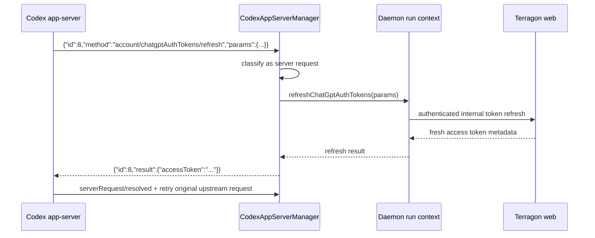

# fix: Handle Codex app-server server requests

## Summary

Terragon should stop treating Codex app-server as a one-way event stream and handle JSON-RPC server requests explicitly. The first shipped slice is the protocol seam that blocks documented external ChatGPT token refreshes: recognize `method + id` messages, respond deterministically, enable the required experimental app-server capability, and harden adjacent meta-event parsing so app-server drift is observable instead of silent.

## Problem Frame

Codex credentials can expire during long-running Terragon runs because Terragon currently writes a non-refreshable ChatGPT-shaped `auth.json` into sandboxes. OpenAI's app-server docs describe a host-owned external-token mode, `chatgptAuthTokens`, where app-server asks the host to refresh via `account/chatgptAuthTokens/refresh`. Terragon cannot use that flow today because `packages/daemon/src/codex-app-server.ts` ignores legitimate JSON-RPC requests that contain both `method` and `id`.

This plan implements the protocol foundation and a token-refresh handler shape without broadening into all app-server improvements from the research note.

## Requirements

**JSON-RPC request handling**

- R1. App-server messages with `id`, `method`, and `params` are classified as server-initiated requests, not dropped.
- R2. Every server request receives exactly one JSON-RPC response: either a supported result or a structured JSON-RPC error for unsupported methods.
- R3. Unsupported server requests are logged with method and request id so protocol drift is visible during sandbox debugging.

**External ChatGPT token refresh**

- R4. `account/chatgptAuthTokens/refresh` is recognized as a supported server request and routed through a daemon-provided refresh seam.
- R5. Refresh failures return structured JSON-RPC errors without leaking token material.
- R6. The implementation is ready for the later `account/login/start` external-token login path, but does not replace all credential file setup in this slice.

**Capability negotiation and protocol hardening**

- R7. `initialize` advertises `capabilities.experimentalApi = true` because `chatgptAuthTokens` and related server-request APIs are experimental.
- R8. Initialize metadata uses a stable Terragon client name and a real daemon/package version instead of a static `"1.0"` where feasible.
- R9. Meta-event parsing accepts current documented field names and existing legacy names for model reroutes, MCP startup status, and config warnings.
- R10. Global meta events such as rate limits, config warnings, and deprecations are not discarded solely because they lack the active thread id.

## Scope Boundaries

In scope:

- JSON-RPC request dispatch and response writing inside `packages/daemon/src/codex-app-server.ts`.
- A narrow `account/chatgptAuthTokens/refresh` handler seam that can call Terragon credential refresh plumbing when run context provides it.
- Tests for request dispatch, unsupported request errors, refresh success/failure responses, initialize capabilities, and meta-event field-name compatibility.
- Thread-filter ordering fixes needed so global meta events survive.

Deferred to follow-up work:

- Full `account/login/start` migration from sandbox `auth.json` to `chatgptAuthTokens` for all user OAuth runs.
- DB-level refresh-token rotation locking in `packages/shared/src/model/agent-provider-credentials.ts`.
- Generated app-server schema CI checks.
- Warm per-sandbox app-server process lifecycle changes.
- UI for command/file approval requests, dynamic tools, and user input requests.

## Key Technical Decisions

- **Respond before expanding behavior:** The core bug is that Terragon drops server requests. The first invariant is that every request is either handled or explicitly rejected; this prevents hidden waits and makes later approval/auth handlers incremental.
- **Keep parser work fixture-first:** Prior protocol planning in `docs/chat-ui-protocol-gaps-plan.md` treats upstream protocol fixtures as the guardrail. New server-request and meta-event behavior should land with captured or synthetic JSON-RPC fixtures so future Codex protocol drift is visible.
- **Use a handler registry:** Server-request handling should be table-driven or map-based, mirroring existing registry-style chat-layer invariants and keeping new app-server methods from becoming a long conditional chain.
- **Keep token refresh behind a seam:** The app-server manager should not know DB credential details. It should invoke an injected refresh function or daemon callback so tests can prove protocol behavior without reaching into app credentials.
- **Enable experimental API deliberately:** `chatgptAuthTokens` is documented but experimental. The initialize payload should opt in explicitly and keep unknown methods forward-compatible through structured errors.
- **Normalize protocol drift centrally:** Meta-event field-name compatibility belongs in extraction helpers, not scattered throughout daemon notification handling.

## High-Level Technical Design

## Implementation Units

### U1. Classify and respond to app-server server requests

**Goal:** Add first-class server-request handling for JSON-RPC envelopes with both `method` and `id`.

**Requirements:** R1, R2, R3.

**Dependencies:** None.

**Files:**

- `packages/daemon/src/codex-app-server.ts`
- `packages/daemon/src/codex-app-server.test.ts`

**Approach:** Split incoming message classification into response, request, and notification branches. Add a private server-request dispatcher that receives `{ id, method, params }` and writes JSON-RPC responses through the existing transport. Unknown methods should return `-32601` or an equivalent structured unsupported-method error and log at warn/debug level with no sensitive params.

**Execution note:** Start with failing parser/transport tests proving that a `method + id` message currently does not disappear.

**Patterns to follow:** Existing response correlation and transport write paths in `packages/daemon/src/codex-app-server.ts`; existing harness tests under `describe("CodexAppServerManager")`.

**Test scenarios:**

- A server request with `id`, `method`, and `params` reaches the dispatcher.
- An unsupported server request writes one JSON-RPC error response with the same id.
- A response envelope with `id + result` still resolves the original pending client request.
- A notification with `method` and no `id` still dispatches through `onNotification`.
- Malformed JSON and non-object payload behavior remains unchanged.

**Verification:** Request, response, and notification envelopes are mutually exclusive branches in tests, and unsupported requests no longer vanish silently.

### U2. Add the external ChatGPT token refresh handler seam

**Goal:** Support `account/chatgptAuthTokens/refresh` as a server-request method and route it through an injected daemon refresh callback.

**Requirements:** R4, R5, R6.

**Dependencies:** U1.

**Files:**

- `packages/daemon/src/codex-app-server.ts`
- `packages/daemon/src/codex-app-server.test.ts`
- `packages/daemon/src/daemon.ts`

**Approach:** Extend `CodexAppServerManagerOptions` with an optional refresh handler. The handler returns the app-server result shape for external-token refresh: fresh `accessToken`, stable `chatgptAccountId`, and optional `chatgptPlanType`. When no handler exists, return a structured unavailable error. In `daemon.ts`, pass a run-context-aware handler stub or existing credential helper only where the run has enough credential context; keep the full internal web endpoint migration deferred if current run inputs do not expose the required credential id safely.

**Execution note:** Avoid token logging; tests should use fake opaque token strings and assert they do not appear in warning metadata.

**Patterns to follow:** Existing dependency injection for `spawnProcess`, `createWebSocket`, and timeouts in `CodexAppServerManagerOptions`.

**Test scenarios:**

- Refresh request succeeds when the injected handler returns a token payload.
- Refresh request returns a structured JSON-RPC error when the handler throws.
- Refresh request returns a structured JSON-RPC error when no handler is configured.
- Request params preserve `reason` and previous account metadata when passed to the handler.
- Logs include method/request id but not access tokens.

**Verification:** The app-server manager can satisfy the documented refresh request without knowing DB credential internals.

### U3. Advertise app-server experimental capabilities during initialize

**Goal:** Make initialize opt into experimental app-server APIs required by the refresh flow and use accurate client metadata.

**Requirements:** R7, R8.

**Dependencies:** None.

**Files:**

- `packages/daemon/src/codex-app-server.ts`
- `packages/daemon/src/codex-app-server.test.ts`
- `packages/daemon/package.json`

**Approach:** Update the initialize payload to include `capabilities.experimentalApi = true`. Use package metadata or an existing build/version constant for `clientInfo.version`; if no safe runtime source exists, centralize the version string in one local constant and document the follow-up to wire build metadata.

**Patterns to follow:** Existing `ensureReady()` handshake test and package-level constants.

**Test scenarios:**

- The initialize request includes `clientInfo.name = "terragon-daemon"`.
- The initialize request includes `capabilities.experimentalApi = true`.
- The initialize request includes a non-empty version string.
- The `initialized` notification is still sent after a successful initialize response.

**Verification:** Handshake tests assert the exact capability opt-in that downstream refresh behavior depends on.

### U4. Normalize app-server meta events and preserve global events

**Goal:** Accept current and legacy app-server meta-event shapes, and avoid dropping global meta events before extraction.

**Requirements:** R9, R10.

**Dependencies:** None.

**Files:**

- `packages/daemon/src/codex-app-server.ts`
- `packages/daemon/src/codex-app-server.test.ts`
- `packages/daemon/src/daemon.ts`
- `packages/daemon/src/daemon.test.ts`
- `packages/shared/src/runtime/thread-meta-event.ts`

**Approach:** Update `extractMetaEvent()` to accept both `fromModel`/`toModel` and `originalModel`/`reroutedModel`, both `name` and `serverName` for MCP startup, and documented warning shapes. In daemon notification handling, extract global meta events before rejecting notifications for thread mismatch, while still attaching emitted meta events to the active Terragon run context.

**Patterns to follow:** Existing `extractMetaEvent()` fixture tests and `enqueueMetaEvent()` path in daemon notification handling.

**Test scenarios:**

- `model/rerouted` with `fromModel` and `toModel` produces the expected meta event.
- Legacy `originalModel` and `reroutedModel` still works.
- MCP startup status with `name` and status `failed` maps to Terragon error state.
- Global `account/rateLimits/updated` without thread id is enqueued for the active run.
- A non-meta notification from a different thread is still filtered out.

**Verification:** Protocol drift fixtures pass without weakening thread isolation for content events.

## Acceptance Examples

- AE1. Given app-server sends `account/chatgptAuthTokens/refresh` with id `8`, when the injected refresh handler returns a fresh token, then Terragon writes a JSON-RPC response with id `8` and a result payload containing the fresh token fields.
- AE2. Given app-server sends an unknown request method with id `9`, when Terragon receives it, then Terragon writes a structured unsupported-method error response with id `9` and logs the unsupported method.
- AE3. Given app-server sends `account/rateLimits/updated` without a thread id, when a Codex run is active, then Terragon still emits a meta event for that active run.

## Risks & Dependencies

- `chatgptAuthTokens` is experimental in the official Codex app-server docs. The implementation should be tolerant of unknown methods and field-name drift.
- The full credential-expiry fix depends on a later `account/login/start` migration and refresh-token rotation locking. This slice makes that migration possible but does not claim to complete the entire auth lifecycle.
- If current daemon run input lacks a safe credential identifier, U2 should land the handler seam and tests, then leave the web-token endpoint wiring as deferred work rather than guessing from sandbox state.

## Sources & Research

- `.claude/plans/codex-app-server-usage-research.md`
- `.claude/plans/codex-credentials-expiry-plan.md`
- `packages/daemon/src/codex-app-server.ts`
- `packages/daemon/src/daemon.ts`
- `apps/www/src/agent/msg/codexCredentials.ts`
- `docs/chat-ui-protocol-gaps-plan.md`
- OpenAI Codex app-server docs: `https://developers.openai.com/codex/app-server`
- OpenAI feature maturity docs: `https://developers.openai.com/codex/feature-maturity`
