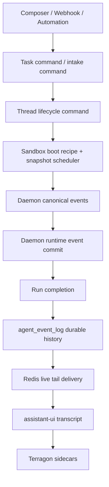
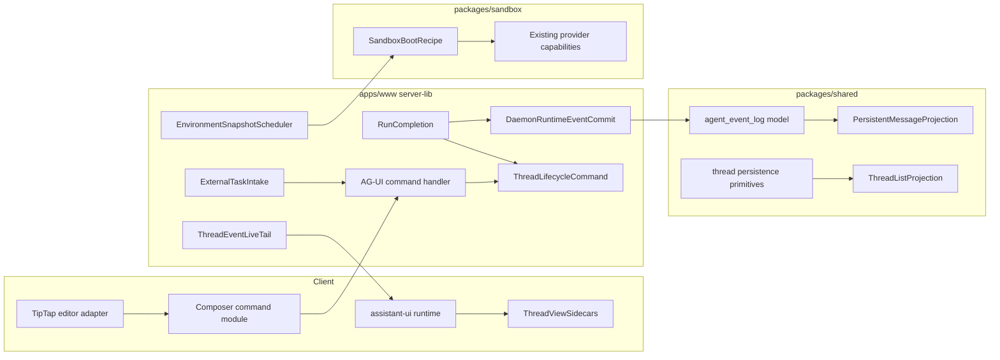
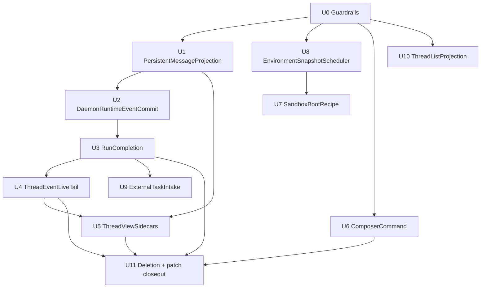

# refactor: Architecture Deepening Program

## Summary

Terragon is mid-migration from a duplicated chat/runtime architecture to a native assistant-ui/AG-UI spine. The deletion-first slice removed obvious dead code and added first seams, but several high-risk paths still have shallow boundaries: routes own policy, hooks know protocol taxonomy, reducers still defend against transcript duplication, and external workflows each reimplement create-or-follow-up routing.

This plan deepens the ten cleanup areas identified by sub agent exploration into implementation units. The goal is not to add a generic framework. The goal is to make ownership obvious:



The durable truth remains `agent_event_log`. Redis is delivery only. Assistant-ui remains the transcript owner. Terragon sidecars live beside the transcript, not underneath it.

## Problem Frame

The current over-engineering is not mostly "too many files." It is the worse kind: duplicated ownership hidden behind shallow helper seams.

- `apps/www/src/app/api/daemon-event/route.ts` still knows commit ordering, terminal state, legacy side effects, checkpointing, queue draining, replay summaries, and response shaping.
- `apps/www/src/app/api/ag-ui/[threadId]/route.ts` still owns live-tail timing, durable catch-up, stream cursor capture, no-run discovery, and terminal fallback.
- `apps/www/src/components/chat/thread-view-model/*` still lets sidecar code reason about AG-UI transcript event families.
- Persistent projection is scattered across shared models, AG-UI side-effect code, UI hydration, and thread-page projection.
- Sandbox boot and snapshot refresh have split policy across app orchestration, provider setup, environment actions, webhooks, and cron.
- External workflow adapters each decide create vs follow-up, idempotency, owner attribution, and source metadata.
- Thread list projection is duplicated between server rows, React Query cache patches, TanStack DB collections, and optimistic mutations.
- TipTap editor code still owns too much submit routing even though `composer-submit-routing.ts` has the right emerging seam.

The simplification direction is therefore "deepen real boundaries, then delete duplicate branches." Deletion before characterization risks message duplication, stale terminal state, missed queued follow-ups, or stale sandbox base branches.

## Requirements

- **R1. Transcript ownership:** assistant-ui runtime/native thread rendering remains final. `thread-view-model` owns lifecycle, meta, artifacts, queued state, diagnostics, and product sidecars only.
- **R2. Durable history:** `agent_event_log` must reconstruct transcript history without depending on Redis. `MESSAGES_SNAPSHOT` remains compatibility input, not the long-term transcript source.
- **R3. Rich parts survive:** Terragon text, reasoning, tool, terminal, diff, plan, delegation, image/audio/resource-link, and custom data-part semantics must survive projection cleanup.
- **R4. Terminal ordering:** terminal run handling must preserve CAS, legacy side-effect ordering, delta END synthesis, terminal canonical events, checkpoint/queue side effects, and idempotent duplicate terminal behavior.
- **R5. Thin routes:** AG-UI and daemon routes should keep auth, request parsing, HTTP response construction, and small adapter calls. Policy belongs in modules.
- **R6. Command strictness:** AG-UI POST must reject leaked draft/schedule state with `400`, reject malformed non-empty command bodies, validate authenticated thread write access, and validate run ownership. The client fallback remains the owner for draft and scheduled submits.
- **R7. Lifecycle command:** thread lifecycle transitions should flow through the app-level lifecycle command seam; shared thread persistence primitives remain low-level.
- **R8. Sandbox boot policy:** app code resolves environment facts and feature policy; sandbox/provider code executes an explicit boot recipe. Snapshot boot must refresh baked repos or mark degraded state visibly without serializing decrypted secrets into recipes, logs, or snapshots.
- **R9. Snapshot scheduler:** boot misses, manual builds, environment config changes, verified base-branch pushes, cron refresh, and orphan reaping should share one scheduler policy.
- **R10. External intake:** GitHub, Linear, Slack, automations, and scheduled tasks should normalize into typed create/follow-up task intents before calling `newThreadInternal` or `queueFollowUpInternal`. Stop flows use lifecycle commands. Snapshot refresh webhooks and cron routes use the snapshot scheduler directly.
- **R11. List projection:** thread list construction, patching, filtering, sorting, and optimistic mutation behavior should share one projection policy.
- **R12. Test-first simplification:** every deletion or branch collapse must follow characterization tests for replay, terminal, queue, boot, workflow idempotency, and list freshness.

## Scope Boundaries

In scope:

- Deepen the ten identified seams into named modules and adapters.
- Move policy out of large routes/hooks into explicit module interfaces.
- Add characterization tests before deleting reducer, replay, routing, or projection branches.
- Use the existing Daytona snapshot pipeline only.
- Preserve current assistant-ui/AG-UI package versions.

Out of scope:

- TipTap replacement.
- Streamdown replacement.
- assistant-ui, `@assistant-ui/react-ag-ui`, `@ag-ui/client`, or `@ag-ui/core` upgrades.
- Non-Daytona snapshot parity.
- Environment setup UI redesign.
- Broad feature-flag cleanup.
- A generic event bus or workflow engine.
- Moving snapshots out of JSONB in the first tranche.

## Key Technical Decisions

### D1. Deepen ownership modules, not adapters

Each module must own policy that would otherwise leak to two or more callers. A module that only forwards arguments is a bad abstraction and should be deleted or folded back into the caller.

### D2. Durable runtime spine comes before sidecar deletion

Reducer and sidecar cleanup depends on stable durable message identity. The first implementation phase should lock projection, daemon commit, and run completion before deleting transcript fallback branches.

### D3. Shared modules stay pure

`packages/shared/src/model/*` can own pure projection, list policy, and persistence primitives. It must not import React, Redis, route helpers, `@/lib/db`, logging adapters, or UI tool-card projection.

### D4. App modules own product routing

Webhook intake, run completion, lifecycle commands, AG-UI live tail, and snapshot scheduling stay in `apps/www/src/server-lib/*` because they depend on app auth, command, notification, Redis, and provider integration concerns.

### D5. Sandbox boot has two layers

App code builds resolved boot facts from DB/environment/user policy. The sandbox package turns those facts into an explicit boot recipe over existing provider capabilities and executes finite sandbox-specific steps. Daytona snapshot behavior stays Daytona-only. Provider code executes steps; it does not decide product policy.

### D6. Characterization gates deletion

Deletion is allowed only after tests prove stable message identity, replay cursor behavior, terminal ordering, duplicate submission handling, sidecar non-transcript mutation, workflow idempotency, and snapshot refresh behavior.

### D7. Security boundaries stay outside deep modules

Routes and provider adapters verify identity, authorization, signatures, replay windows, size limits, and ownership before handing typed inputs to deep modules. Deep modules may require pre-validated identities in their inputs, but they do not become hidden auth bypasses.

## High-Level Technical Design

### Module Map



### Target Route Shape

```text
POST /api/daemon-event
  -> auth + run-context fence adapter
  -> DaemonRuntimeEventCommit.commitBeforeLegacy()
  -> legacy projection adapter where still needed
  -> RunCompletion.completeRun() for terminal events
     -> DaemonRuntimeEventCommit.commitAfterLegacy()
     -> idempotent post-run work
  -> HTTP ack

GET /api/ag-ui/[threadId]
  -> auth + initial replay planner
  -> AgUiSseSession
  -> ThreadEventLiveTail.tailThreadEvents()

POST /api/ag-ui/[threadId]
  -> auth + thread write access + body validation
  -> ag-ui-command-handler
  -> follow-up-command
  -> followUpInternal()
```

### Sequencing



The durable runtime lane is intentionally first because it guards deletion of transcript fallback paths. The snapshot scheduler contract lands before sandbox degraded-boot wiring so boot can request rebuilds through the shared policy. External intake should wait for run completion and lifecycle semantics to be explicit. U11 is chat/runtime closeout only; snapshot, intake, and list closeouts happen inside U8, U9, and U10.

## Implementation Units

### U0. Guardrails And Characterization Baseline

**Goal:** Add and stabilize characterization tests that make behavior safe to move.

**Files:**

- `apps/www/src/app/api/ag-ui/[threadId]/route.test.ts`
- `apps/www/src/app/api/daemon-event/route.test.ts`
- `apps/www/src/components/chat/thread-view-model/reducer.test.ts`
- `apps/www/src/components/chat/use-product-sidecars.test.tsx`
- `apps/www/src/components/promptbox/composer-submit-routing.test.ts`
- `apps/www/src/server-lib/ag-ui/ag-ui-command-handler.test.ts`
- `apps/www/src/server-lib/follow-up-command.test.ts`
- `apps/www/test/integration/ag-ui-replayer.test.ts`
- `packages/architecture-lint`

**Work:**

- Lock assistant-ui as transcript owner with tests for idle append, active queue, resume, cancel, duplicate `clientSubmissionId`, invalid model, empty/invalid AG-UI body, draft/schedule rejection, and run ownership validation.
- Lock AG-UI POST authorization with tests for cross-user, read-only/shared, archived, mismatched thread-chat, and mismatched run requests.
- Prove `use-product-sidecars.ts` cannot mutate text, tool, or reasoning transcript state.
- Add fixtures for reconnect, sliced replay, optimistic user dedupe, orphan tool-call prevention, historical rendering, and rich Terragon part survival.
- Keep `packages/architecture-lint` allowlists strict; do not weaken them to make refactors pass.

**Test scenarios:**

- Invalid AG-UI command body returns `400` instead of opening a stream.
- Draft and scheduled payloads are rejected server-side and routed through client fallback.
- Resume does not enqueue a follow-up.
- Duplicate `clientSubmissionId` is idempotent.
- Product sidecar event streams leave transcript rows unchanged.
- `clientSubmissionId` dedupe is scoped by user, thread, and chat.

**Depends on:** none.

### U1. PersistentMessageProjection Module

**Goal:** Create one pure projection seam for durable transcript/history conversion.

**Files:**

- `packages/shared/src/model/persistent-message-projection.ts`
- `packages/shared/src/model/persistent-message-projection.test.ts`
- `packages/shared/src/model/agent-event-log.ts`
- `apps/www/src/server-lib/ag-ui-side-effect-messages.ts`
- `apps/www/src/server-lib/ag-ui/thread-history-projector.ts`
- `apps/www/src/components/chat/db-messages-to-ag-ui.ts`
- `packages/shared/src/model/thread-page.test.ts`

**Interface direction:**

```ts
type ProjectionResult<T> = {
  value: T;
  quarantine: ProjectionQuarantineEntry[];
};
```

The module owns pure directional conversions between DB messages, canonical AG-UI events, durable history items, projection cursor data, and quarantine entries. It should expose named APIs for each real shared conversion, such as event-log-to-replay, DB-message-to-history, canonical-event-to-row, and quarantine classification, rather than a generic facade. It returns data; it does not read the DB, publish Redis events, log, or render UI.

**Work:**

- Move pure projection helpers out of `agent-event-log.ts`, `ag-ui-side-effect-messages.ts`, and `db-messages-to-ag-ui.ts`.
- Make skip vs quarantine explicit for unknown, unsupported, malformed, and recognized no-op events.
- Treat quarantine summaries as sensitive transcript-adjacent data and redact credentials, tokens, and raw provider secrets from persisted quarantine/error metadata.
- Preserve `threadChatMessageSeq`, AG-UI `projectionIndex`, context reset behavior, snapshot dedupe, unresolved tool result synthesis, and custom `terragon.data-part` history.
- Keep `toUIMessages.ts` as an app/UI adapter.

**Test scenarios:**

- Canonical assistant/tool events project to stable DB messages.
- `MESSAGES_SNAPSHOT` projects to replay messages without duplicating native rows.
- Compact result resets prior history.
- Malformed AG-UI history item returns quarantine.
- Malformed AG-UI history item returns redacted quarantine.
- Unknown provider event produces no projection and no false transcript row.
- DB rich text and attachments hydrate to AG-UI messages with metadata.
- Unresolved tool calls synthesize failed tool result on terminal event.
- Nested tool calls attach to the assistant parent.
- `lastSeqOffset`, `lastSeq`, and `projectionIndex` remain stable across empty runs and terminal events.

**Depends on:** U0.

### U2. DaemonRuntimeEventCommit Module

**Goal:** Extract durable AG-UI/event-log commit planning and ordering from the daemon route.

**Files:**

- `apps/www/src/server-lib/daemon-event/event-commit.ts`
- `apps/www/src/server-lib/daemon-event/event-commit.test.ts`
- `apps/www/src/app/api/daemon-event/route.ts`
- `apps/www/src/server-lib/ag-ui-publisher.ts`
- `apps/www/src/server-lib/ag-ui-publisher.test.ts`
- `packages/shared/src/model/agent-event-log.ts`
- `packages/shared/src/model/agent-event-log.test.ts`

**Interface direction:**

- `prepareDaemonRuntimeEventCommit(input)`
- `commitDaemonRuntimeEventsBeforeLegacy(input)`
- `commitDaemonRuntimeTerminalEventsAfterLegacy(input)`
- optionally `backfillRuntimeEventReplaySeq(input)` if replay-seq assignment becomes route noise

Inputs include `db`, `runId`, `threadId`, `threadChatId`, `messages`, canonical events, deltas, envelope v2, and persistence capability. Outputs return inserted event ids, inserted/deduplicated counts, persisted event summaries, and whether persistable rows existed.

**Ordering rules:**

1. Auth, run-context validation, run-scoped daemon credential validation, monotonic sequence/replay rejection, schema validation, and payload size checks happen before commit.
2. Terminal run-context CAS happens before terminal durable append.
3. Non-terminal canonical, delta, and rich-part rows commit before legacy handling.
4. Legacy `handleDaemonEvent` runs before terminal rows so side-effect `MESSAGES_SNAPSHOT` rows keep lower `seq`.
5. Delta END rows come before terminal canonical rows in the terminal batch.
6. DB commit happens before Redis publish.
7. `threadChatMessageSeq` allocation stays below `persistAgUiEvents`.
8. Meta events remain ephemeral and outside this durable commit module.

**Test scenarios:**

- Canonical assistant-message is dropped when deltas exist.
- Canonical, delta, and rich parts merge into one pre-legacy commit.
- Inserted event ids are returned without re-running mappers.
- Persistence unavailable fails closed only when rows exist.
- Terminal commit emits delta END before `RUN_FINISHED` or `RUN_ERROR`.
- Duplicate rows preserve inserted/deduplicated counts.
- Route tests still cover auth/context rejection before commit and terminal CAS rejection before terminal append.
- Invalid daemon tokens, stale sequences, mismatched run/thread/sandbox claims, and oversized payloads cannot publish Redis or append durable rows.

**Depends on:** U1.

### U3. RunCompletion Module

**Goal:** Make terminal run finalization a single idempotent module instead of route-level orchestration.

**Files:**

- `apps/www/src/server-lib/daemon-event/run-completion.ts`
- `apps/www/src/server-lib/daemon-event/run-completion.test.ts`
- `apps/www/src/app/api/daemon-event/route.ts`
- `apps/www/src/server-lib/daemon-event/router.ts`
- `apps/www/src/server-lib/daemon-event/lifecycle-manager.ts`
- `apps/www/src/server-lib/thread-lifecycle-command.ts`
- `apps/www/src/server-lib/checkpoint-thread.ts`
- `apps/www/src/server-lib/process-follow-up-queue.ts`
- `packages/shared/src/model/agent-run-context.ts`
- `packages/shared/src/model/agent-run-context.test.ts`

**Interface direction:**

```ts
completeRun(input, adapters): Promise<RunCompletionResult>
```

The module receives a terminal signal, run identity, projection result, replay-row ordering facts, lifecycle policy, and side-effect adapters. It does not own daemon auth, launch, dispatch, replay, or HTTP responses.

**Work:**

- Separate `agent_run_context.status` from `thread_chat.status` transitions.
- Route completion through `thread-lifecycle-command.ts`.
- Extract terminal status to thread event mapping, checkpoint decision, error metadata, and ack shape.
- Make queued follow-up processing, checkpointing, sandbox active-run cleanup, and Linear completion side effects idempotent post-run work.
- Preserve duplicate same-terminal ack behavior and reject conflicting terminal winners.
- Preserve prompt-too-long metadata and disabled-checkpoint semantics.

**Criticality matrix:**

- Ack-critical: terminal run-context CAS, legacy projection where still needed for side-effect snapshot ordering, terminal event-log rows, thread status transition, and idempotency winner recording.
- Durable but failure-isolated: checkpoint start/completion, queued follow-up launch, sandbox active-run cleanup, Linear activity/completion links, and retry job scheduling.
- Best-effort only: non-critical notifications and diagnostics that can be dropped without changing durable run state.

Failures in durable post-run work must not corrupt the terminal winner. They should be recorded for retry or surfaced as bounded diagnostics rather than causing duplicate terminal projection.

**Test scenarios:**

- Canonical-only terminal completes a run.
- Mixed assistant/result terminal completes with correct side effects.
- Duplicate terminal after projection failure can retry safely.
- Stale run and stale sequence reject before terminal projection.
- Failed run checkpoint behavior remains unchanged.
- Checkpoint disabled skips checkpoint but still runs queued follow-up and external completion side effects.
- Queued follow-up after terminal starts the next run exactly once.
- Terminal event-log rows remain after side-effect snapshot rows.
- Failure in checkpoint, Linear activity, or queued follow-up launch is isolated from ack-critical terminal persistence and is retryable/idempotent.

**Depends on:** U2.

### U4. ThreadEventLiveTail Module

**Goal:** Move Redis XREAD, adaptive polling, durable catch-up, empty-thread discovery, and terminal fallback out of the AG-UI route.

**Files:**

- `apps/www/src/server-lib/ag-ui/thread-event-live-tail.ts`
- `apps/www/src/server-lib/ag-ui/thread-event-live-tail.test.ts`
- `apps/www/src/app/api/ag-ui/[threadId]/route.ts`
- `apps/www/src/server-lib/ag-ui/ag-ui-sse-writer.ts`
- `apps/www/src/server-lib/ag-ui/ag-ui-sse-writer.test.ts`
- `apps/www/src/server-lib/ag-ui/ag-ui-sse-session.ts`
- `apps/www/src/server-lib/ag-ui/ag-ui-replay-planner.ts`
- `apps/www/src/server-lib/ag-ui/terminal-event-synthesizer.ts`

**Interface direction:**

```ts
type LiveTailTarget =
  | { type: "await-first-run" }
  | { type: "run"; runId: string; userId: string };

async function tailThreadEvents(params): Promise<void>;
```

The module owns when to read Redis, when to durable catch up, and when to discover/fallback terminal state. `AgUiSseSession` remains the SSE/dedupe/close adapter. Replay planner continues to decide what replay entries mean.

**Work:**

- Move XREAD constants, timeout detection, stream cursor capture, and polling progression into live-tail locality.
- Keep `Last-Event-ID` precedence and cursor-before-replay invariants route-tested.
- Reuse existing terminal synthesizer; do not duplicate terminal mapping.
- Replace route-local live-tail calls in both no-run and active-run paths.

**Test scenarios:**

- Adaptive blockMS progression and local Redis pinning.
- Replay cursor filters live entries, including projection indexes.
- Replay/live overlap dedupes through `AgUiSseSession`.
- Idle durable catch-up emits new durable rows and keeps tailing.
- Durable terminal fallback replays END rows before terminal close.
- XREAD errors back off while durable terminal fallback still works.
- Empty-thread latest-run discovery after connect.
- Redis terminal marker closes the stream.

**Depends on:** U3.

### U5. ThreadViewSidecars Module

**Goal:** Make product sidecars a semantic sidecar module that cannot mutate transcript state.

**Files:**

- `apps/www/src/components/chat/thread-view-model/sidecars.ts`
- `apps/www/src/components/chat/thread-view-model/sidecars.test.ts`
- `apps/www/src/components/chat/thread-view-model/types.ts`
- `apps/www/src/components/chat/thread-view-model/reducer.ts`
- `apps/www/src/components/chat/use-ag-ui-messages.ts`
- `apps/www/src/components/chat/use-product-sidecars.ts`
- `apps/www/src/components/chat/chat-ui.tsx`
- `apps/www/src/components/chat/ag-ui-messages-reducer.ts`
- `apps/www/src/components/chat/ag-ui-messages-reducer.test.ts`

**Interface direction:**

- `classify(rawEvent)` returns `drop`, `lifecycle`, `runtimeState`, `runtimeActivity`, `meta`, `artifactReference`, `lifecycleMessage`, or `diagnostic`.
- `toThreadViewEvent(classified)` returns a sidecar-safe event.
- `effectsFor(rawEvent, classified)` returns trace receipt and query invalidation effects.
- `useThreadViewSidecars(...)` is the React adapter.

**Work:**

- Extract product event classification from `use-product-sidecars.ts` and `createThreadViewSidecarEventProjector`.
- Split naming between full AG-UI replay adapters and product sidecar adapters.
- Harden the reducer so product sidecars dispatch a sidecar-safe path that cannot fold transcript events even if a transcript event slips through.
- Decide and encode `MESSAGES_SNAPSHOT` treatment: treated as transcript compatibility input by default; lifecycle notices flow only through explicit sidecar mapping.
- Only after fixtures pass, remove transcript branches from `thread-view-model` and delete `ag-ui-messages-reducer.ts` paths that assistant-ui/runtime now owns.

**Test scenarios:**

- Sidecar classifier drops text, reasoning, thinking, tool calls/results/chunks, and `terragon.data-part` transcript families.
- Sidecar classifier allows lifecycle, native runtime state/activity, artifact references, status, and meta events.
- Trace receipt fires for accepted and dropped events.
- Status and terminal invalidation fire before projection filtering.
- Artifact references update descriptors without transcript rows.
- Duplicate/replayed sidecar events preserve dedupe behavior.
- Malformed native runtime events quarantine instead of disappearing.

**Depends on:** U1, U4.

### U6. ComposerCommand Module

**Goal:** Keep TipTap as the editor leaf while evolving the existing `routeComposerSubmit` seam into the command routing boundary.

**Files:**

- `apps/www/src/components/promptbox/composer-submit-routing.ts`
- `apps/www/src/components/promptbox/composer-submit-routing.test.ts`
- `apps/www/src/components/promptbox/use-promptbox.tsx`
- `apps/www/src/components/promptbox/use-promptbox.test.tsx`
- `apps/www/src/components/promptbox/send-button.tsx`
- `apps/www/src/components/chat/chat-prompt-box.tsx`
- `apps/www/src/server-lib/ag-ui/ag-ui-command-handler.ts`
- `apps/www/src/server-lib/follow-up-command.ts`
- `apps/www/src/server-lib/ag-ui/follow-up-submission-guard.ts`

**Interface direction:**

- Keep the existing `routeComposerSubmit` function and `ComposerSubmitRouteOutcome` shape as the starting point.
- `ComposerSubmitIntent`
- `ComposerSubmitCommand`, evolved from the current type rather than duplicated.
- `ComposerSubmitAdapters`
- `ComposerSubmitOutcome`

`usePromptBox` remains the editor adapter. It builds `DBUserMessage`, handles validation, submit locks, clear/restore, attachments, local draft state, creates one stable `clientSubmissionId` per submit attempt, and calls the command module. It does not choose runtime vs queue vs fallback itself.

**Routing rules:**

- `saveAsDraft` or `scheduleAt` uses fallback, even when runtime exists.
- Active + queue enabled + queue adapter queues the whole `DBUserMessage`.
- Idle + runtime + supported content uses `runtime.append`.
- Unsupported content uses fallback for the whole message.
- No runtime uses fallback.
- Empty runtime content no-ops.
- `clientSubmissionId` is part of the submit intent and is retained through append retry, queue fallback, editor restore, and double-click paths.

**Test scenarios:**

- Draft and schedule fallback never reach AG-UI append.
- Active unsupported content queues the whole message.
- Deterministic `clientSubmissionId` dedupes repeated submit.
- The same `clientSubmissionId` survives retry, fallback, and double-click handling for one submit attempt.
- Empty content no-ops.
- Runtime append carries permission mode.
- Failed runtime append restores editor content and files.
- `send-button.tsx` stops depending on `TSubmitForm`.

**Depends on:** U0.

### U7. SandboxBootRecipe Module

**Goal:** Make the existing sandbox boot plan explicit, especially the Daytona snapshot path, without moving app-owned environment resolution into provider code.

**Files:**

- `apps/www/src/agent/sandbox.ts`
- `packages/sandbox/src/boot-plan.ts`
- `packages/sandbox/src/boot-recipe.ts`
- `packages/sandbox/src/boot-recipe.test.ts`
- `packages/sandbox/src/setup.ts`
- `packages/sandbox/src/setup.test.ts`
- `packages/sandbox/src/sandbox.ts`
- `packages/sandbox/src/providers/daytona-provider.ts`
- `packages/sandbox/src/providers/daytona-provider.test.ts`

**Interface direction:**

```ts
type SandboxBootRecipe = {
  provider: SandboxProvider;
  mode: "create" | "resume";
  steps: SandboxBootStep[];
};
```

The first tranche should evolve the existing `boot-plan.ts` seam rather than invent a parallel workflow engine. App policy produces resolved facts. The sandbox package compiles those facts into finite ordered steps and executes them. Docker and E2B behavior should stay unchanged unless the current code already has provider-specific branches that need a typed capability hook.

**Work:**

- Split `CreateSandboxOptions` into provisioning, repo setup, daemon install, feature, and callback groups.
- Preserve app-side `getReadySnapshot`, env decryption, setup script lookup, and repo environment lookup.
- Keep Daytona snapshot boot steps Daytona-only. Use provider capability hooks only where they replace existing conditional logic; do not add non-Daytona snapshot parity.
- Make create/resume ordering explicit:
  - base profile
  - provider one-time prep
  - clone repo or refresh baked snapshot repo
  - git identity
  - branch action
  - git clean
  - daemon install/probe with setup script mode
- Encode setup script modes: `skip`, `foreground`, `background`.
- If baked snapshot refresh fails, return a degraded boot fact such as `snapshotRefreshFailed` to app orchestration. The app layer schedules exactly one rebuild through `EnvironmentSnapshotScheduler` and records a durable warning unless implementation discovers this must be fail-fast.
- Decrypted env values and provider/user tokens must never be serialized into boot recipes, Daytona snapshots, durable warnings, provider status, setup logs, or cache artifacts. Inject secrets at runtime and redact setup output/provider errors.

**Test scenarios:**

- Clone boot and snapshot boot produce different recipe steps.
- Fast resume does not run one-time clone/setup steps.
- Background setup creates dependency barrier before dispatch.
- Daytona snapshot boot owns volume profile, snapshot repo refresh, and retry policy.
- Docker/E2B behavior is unchanged except for typed no-op capability assertions where needed.
- Recipe execution honors order and status emission without introducing a generic workflow engine.
- Degraded snapshot refresh emits one warning and one scheduler rebuild request.
- Boot recipes, warnings, provider status, and setup logs do not contain decrypted env values or tokens.

**Depends on:** U8.

### U8. EnvironmentSnapshotScheduler Module

**Goal:** Centralize snapshot build scheduling policy without replacing the existing Daytona snapshot pipeline.

**Files:**

- `apps/www/src/server-lib/environment-snapshot-scheduler.ts`
- `apps/www/src/server-lib/environment-snapshot-scheduler.test.ts`
- `apps/www/src/server-lib/environment-snapshot-build.ts`
- `apps/www/src/server-lib/environment-snapshot-trigger.ts`
- `packages/sandbox/src/snapshot-builder.ts`
- `apps/www/src/server-actions/environment-snapshot.ts`
- `apps/www/src/server-actions/create-environment.ts`
- `apps/www/src/server-actions/environment-variables.ts`
- `apps/www/src/server-actions/environment-setup-script.ts`
- `apps/www/src/server-actions/mcp-config.ts`
- `apps/www/src/app/api/webhooks/github/handle-snapshot-refresh.ts`
- `apps/www/src/app/api/webhooks/github/handle-snapshot-refresh.test.ts`
- `apps/www/src/app/api/internal/cron/refresh-snapshots/route.ts`
- `apps/www/src/app/api/internal/cron/refresh-snapshots/route.test.ts`
- `packages/shared/src/model/environments.ts`
- `packages/shared/src/model/environments.test.ts`

**Interface direction:**

- `scheduleEnvironmentSnapshotBuild({ db, userId, environmentId, reason, size })`
- `scheduleRepositorySnapshotRefresh({ db, verifiedRepository, defaultBranch, reason })`
- `runEnvironmentSnapshotMaintenance({ db, now })`

Reasons include `manual`, `environment-created`, `environment-config-changed`, `boot-miss`, `github-base-push`, and `cron-stale-refresh`.

The scheduler accepts verified repository references from authenticated adapters, not raw webhook `repoFullName` strings as authority.

**Policy:**

- `manual`: requested size, force.
- `environment-created`: small, no force.
- `environment-config-changed`: mark existing snapshots stale, eagerly rebuild small, leave large demand-driven.
- `boot-miss`: thread sandbox size, no force.
- `github-base-push`: refresh existing Daytona sizes after verified GitHub webhook handling and installation/repo binding, force.
- `cron-stale-refresh`: refresh ready Daytona snapshots older than the policy age, force.

**Work:**

- Keep `environment-snapshot-build.ts` as build lifecycle owner.
- Land the scheduler contract before U7 so degraded boot can request rebuilds through this policy; migrate GitHub webhook and cron adapters after the contract is in place.
- Move refresh age and orphan minimum age from the cron route into the scheduler.
- Add small shared selectors only if they reduce caller knowledge.
- Snapshot builds should call the existing builder path that owns pruning `.next`, `.turbo`, browser binaries, and large transient caches.
- Add pruning after install/setup and before `daytona.snapshot.create` in the existing snapshot builder path, with a size/log assertion because Daytona resources are capped in this path.
- Keep missing user tokens as quiet no-ops where current behavior already does that.
- Add JSONB-safe build attempt identity (`buildId`, `reason`, `requestedAt`) and compare-before-ready/failed writes so overlapping triggers cannot let stale background completion overwrite newer snapshot state.
- Require internal cron authentication, per-repo/build concurrency controls, and rate limits for push storms.

**Test scenarios:**

- Manual uses requested size and force.
- Create/config uses small.
- Boot miss uses passed sandbox size and does not force.
- Push refresh schedules each existing Daytona size once.
- Cron ignores fresh, failed, and building snapshots.
- Orphan reaper skips referenced and too-new names.
- Superseded Daytona snapshots are deleted/reaped through existing lifecycle.
- Boot-miss vs push-refresh and config-change vs stale background completion cannot overwrite newer build state.
- Spoofed repo/default branch, unauthorized installation, duplicate push storms, and unauthenticated cron do not schedule builds.
- Snapshot builder prunes `.next`, `.turbo`, browser binaries, and large transient caches before snapshot create, and logs/asserts final size budget.

**Depends on:** U0.

### U9. ExternalTaskIntake Module

**Goal:** Normalize external workflow entry points before they call thread creation or follow-up dispatch.

**Files:**

- `apps/www/src/server-lib/external-task-intake/types.ts`
- `apps/www/src/server-lib/external-task-intake/route-external-task-intake.ts`
- `apps/www/src/server-lib/external-task-intake/idempotency.ts`
- `apps/www/src/server-lib/new-thread-shared.ts`
- `apps/www/src/server-lib/follow-up.ts`
- `apps/www/src/server-lib/process-follow-up-queue.ts`
- `apps/www/src/server-lib/automations.ts`
- `apps/www/src/server-lib/scheduled-thread.ts`
- `apps/www/src/server-actions/scheduled-thread.ts`
- `apps/www/src/app/api/internal/cron/automations/route.ts`
- `apps/www/src/app/api/internal/cron/scheduled-tasks/route.ts`
- `apps/www/src/app/api/internal/cron/scheduled-tasks/route.test.ts`
- `apps/www/src/app/api/internal/process-scheduled-task/[userId]/[threadId]/[threadChatId]/route.ts`
- `apps/www/src/app/api/webhooks/linear/thread-creation.ts`
- `apps/www/src/app/api/webhooks/linear/handlers.ts`
- `apps/www/src/app/api/webhooks/linear/handlers.test.ts`
- `apps/www/src/app/api/webhooks/github/route-feedback.ts`
- `apps/www/src/app/api/webhooks/github/route-feedback.test.ts`
- `apps/www/src/app/api/webhooks/github/handle-app-mention.ts`
- `apps/www/src/app/api/webhooks/github/handle-app-mention.test.ts`
- `apps/www/src/app/api/webhooks/slack/handlers.ts`
- `apps/www/src/app/api/webhooks/slack/handlers.test.ts`
- `packages/shared/src/db/types.ts`
- `packages/shared/src/model/threads.ts`
- `packages/shared/src/model/thread.test.ts`
- `packages/shared/src/model/linear.ts`

**Interface direction:**

`ExternalTaskIntakeRequest` should contain provider or internal workflow source, owner user id and owner reason, external actor when present, target key, `DBUserMessage`, route policy, idempotency keys, source type, and source metadata. Raw provider payloads stay in provider adapters.

Provider adapters must verify signatures and replay windows before intake, map external actor/install/workspace/repo/channel to an authorized Terragon owner before setting `ownerUserId`, scope idempotency by provider plus delivery plus target, and reject or ack-drop spoofed payloads.

**Work:**

- Migrate Linear first; it already has a partial thread-creation seam.
- Migrate GitHub feedback next; preserve `githubWebhookDeliveries` and `githubFeedbackDeliveries`.
- Migrate GitHub app mention fanout while preserving batching through `maybeBatchThreads`.
- Harden Slack after adding durable thread keys such as `teamId`, `channel`, and `threadTs`; route repeated Slack mentions in a thread as follow-ups.
- Add optional-for-legacy `teamId` to Slack source metadata and a shared lookup such as `getThreadBySlackThreadKey` before enabling Slack create-or-follow-up routing.
- Model automations, scheduled tasks, and server-action task creation through the same `createThread` or `dispatchFollowUp` intent family.
- Keep Linear Stop outside intake; it is lifecycle control through `ThreadLifecycleCommand`.
- Keep snapshot refresh webhooks outside intake; they call `EnvironmentSnapshotScheduler` directly.

**Test scenarios:**

- Linear `created` emits one create intent with existing delivery idempotency.
- Linear `prompted` emits one follow-up intent and preserves `agentSessionId`.
- GitHub feedback does not double-route a direct mention as both feedback and mention.
- GitHub app mention fanout creates one logical intake request per recipient/cause.
- Slack repeated mention in the same durable thread key routes as follow-up after hardening.
- Slack nil `teamId`, empty `threadTs`, legacy metadata, and duplicate mention cases are handled explicitly.
- Automation cron emits one create/follow-up intent with existing automation attribution.
- Scheduled task cron/process routes emit follow-up or dispatch intents without bypassing queue/lifecycle policy.
- Invalid signature, stale timestamp, spoofed actor, wrong repo/channel/team, and idempotency collision cases do not create or enqueue tasks.
- Existing owner attribution, delivery markers, batching, and user attribution are unchanged.

**Depends on:** U3.

### U10. ThreadListProjection Module

**Goal:** Collapse thread-list construction, patching, filtering, sorting, and optimistic mutation behavior behind one pure projection policy.

**Files:**

- `packages/shared/src/model/thread-list-projection.ts`
- `packages/shared/src/model/thread-list-projection.test.ts`
- `packages/shared/src/model/threads.ts`
- `packages/shared/src/model/thread.test.ts`
- `apps/www/src/queries/thread-patch-cache.ts`
- `apps/www/src/queries/thread-patch-cache.test.ts`
- `apps/www/src/queries/thread-queries.ts`
- `apps/www/src/collections/thread-info-collection.ts`
- `apps/www/src/collections/thread-info-collection.test.ts`
- `apps/www/src/queries/thread-mutations.ts`
- `apps/www/src/hooks/use-thread-info-list.ts`
- `apps/www/src/components/thread-list/use-thread-list.ts`

**Interface direction:**

- `buildThreadListProjectionFromPatch({ patch, fallbackThread, now })`
- `applyThreadListProjectionPatch(thread, patch)`
- `matchesThreadListProjectionFilter(thread, filter)`
- `parseThreadListProjectionFilter(value: unknown)`
- `compareThreadListProjection(a, b)`
- `getThreadListEffectiveUpdatedAt(...)`

Use `ThreadInfo` as the projection type for now. A new name can be a type alias; avoid widening the model.

**Work:**

- Move fallback/default behavior out of React Query patch code.
- Replace untyped filter handling with `unknown` plus typed parsing.
- Move or re-export the current `ThreadListFilters` type, parser, and matcher out of `thread-queries.ts` through the shared projection policy.
- Make `updatedAt` monotonic across existing thread, shell patch, and chat patch.
- Canonical order is `updatedAt desc, id desc`; UI anti-jump grouping remains app display logic.
- Add freshness guards so collection seeding cannot overwrite newer realtime patches.

**Test scenarios:**

- Shell-only insert produces a list row.
- Chat-only status/error update patches the existing row.
- `updatedAt` remains monotonic.
- Delete/refetch classification is stable.
- Invalid source metadata quarantines or falls back consistently.
- Tie-break ordering uses id.
- Filtered automation and archived lists have the same freshness contract as the main list.

**Depends on:** U0.

### U11. Runtime Deletion, Patch, And Invariant Closeout

**Goal:** Delete duplicate chat/runtime branches only after the replacement module interfaces are proven.

**Files:**

- `apps/www/src/components/chat/ag-ui-messages-reducer.ts`
- `apps/www/src/components/chat/thread-view-model/reducer.ts`
- `apps/www/src/app/api/ag-ui/[threadId]/route.ts`
- `apps/www/src/app/api/daemon-event/route.ts`
- `patches/@assistant-ui__react-ag-ui@0.0.26.patch`
- `docs/plans/phase-6-reducer-audit.md`
- `docs/plans/2026-05-24-004-patch-inventory.md`
- `AGENTS.md`

**Work:**

- Delete reducer branches proven dead by U1/U5 fixtures.
- Keep rich Terragon part handling in explicit adapters.
- Classify every `@assistant-ui/react-ag-ui` patch hunk as delete, upstream candidate, or temporary. Temporary hunks require tests proving why repo code cannot own them yet.
- Thin AG-UI and daemon route tests once equivalent module tests exist, but keep route tests for auth, request contracts, and critical ordering invariants.
- Update architecture invariants only after implementation behavior matches the new architecture.
- Maintain a deletion ledger for every removed branch or patch hunk: branch/hunk, replacement owner, required characterization test, remaining route-level invariant, and rollback condition.
- Split reducer deletion, route thinning, and patch closeout into separate PRs if their ledgers have different proof gates.
- Snapshot, intake, and list projection closeouts happen inside U8, U9, and U10; they do not block chat/runtime deletion.

**Test scenarios:**

- Stable message identity across replay, resume, active-to-idle, and historical rendering.
- No duplicate assistant messages.
- No orphan tool calls.
- Optimistic user dedupe remains stable.
- Sliced replay behaves the same as full replay.
- Product sidecars remain non-transcript.
- Patch hunks with temporary status have local tests.

**Depends on:** U3, U4, U5, U6.

## System-Wide Impact

- **Chat/runtime:** assistant-ui becomes the only transcript interpreter. Terragon keeps durable history, rich projection, lifecycle, and sidecar adapters.
- **Daemon/event log:** terminal and non-terminal commit behavior becomes testable outside the daemon route.
- **Thread lifecycle:** transition semantics become reusable by follow-up, queue processing, stop, retry, archive, checkpoint, cron/reaper, and terminal handling.
- **Sandbox:** boot becomes explicit recipe execution for current provider behavior; app orchestration stops encoding Daytona snapshot command order.
- **Snapshots:** all refresh/reap decisions use one reason-to-policy matrix.
- **External workflows:** provider and internal adapters parse/verify/enrich; shared intake routes create/follow-up intents. Snapshot webhook/cron adapters route to the scheduler instead.
- **Thread list:** realtime patches, optimistic mutations, server rows, and filters share one projection contract.

## Security And Data Handling

- `agent_event_log`, durable history projections, and quarantine entries are sensitive transcript data. Reads must keep thread-level authorization, deletion/retention must follow thread/user deletion behavior, and persisted error/quarantine summaries must redact credentials, tokens, and raw provider secrets.
- AG-UI POST must validate authenticated thread write access before command handling: `threadId` and `threadChatId` ownership, permission mode eligibility, read-only/shared visibility, archived state, run ownership, and `clientSubmissionId` scope.
- Daemon-event handling must preserve run-scoped daemon credential validation, expiry/replay protection, sandbox/run/thread claim matching, schema validation, and payload size limits before any Redis publish or durable append.
- Webhook adapters must verify provider signatures and replay windows before building intake or scheduler requests. They must map external actor/install/workspace/repo/channel to an authorized Terragon owner or verified repository binding.
- Snapshot and boot paths must never bake decrypted env values, user tokens, provider tokens, or auth files into Daytona snapshots. Setup logs, provider errors, durable warnings, and snapshot build metadata must be redacted.
- Snapshot refresh scheduling must use verified GitHub installation/repository bindings, authenticated cron routes, per-repo/build concurrency limits, and rate limits for duplicate push storms.

## Risks And Mitigations

- **Terminal ordering drift:** Keep explicit tests around CAS, legacy side-effect snapshots, delta END, terminal canonical rows, checkpoint, queue draining, and publish order.
- **Message duplication:** Do not remove reducer dedupe or legacy projection paths until U1/U5 fixtures prove stable ids across replay modes.
- **Cursor drift:** Keep route-level coverage for `Last-Event-ID`, `fromSeq`, projection indexes, and cursor-before-replay.
- **Silent data loss:** Make projection skip vs quarantine explicit. Recognized no-op events are not quarantine; malformed recognized data is.
- **Over-centralization:** Shared projection must stay pure. Live tail must not absorb replay planner semantics. Run completion must not absorb launch or auth.
- **Snapshot staleness:** Refresh baked repos on boot, schedule forced rebuilds on failure, and surface degraded state instead of silently running against stale base code.
- **Webhook regressions:** Preserve existing delivery markers, owner attribution, batching, provider acknowledgements, Linear activities, and Slack replies.
- **List flicker/regression:** Separate canonical list projection from UI grouping/anti-jump behavior.
- **Secret persistence:** Treat snapshot artifacts, setup logs, provider status, event-log metadata, and quarantine entries as possible leak points; add redaction and artifact-scan gates before marking snapshots ready.

## Verification Strategy

Run targeted gates as each unit lands:

- Runtime/submission: `composer-submit-routing`, `use-promptbox`, `follow-up-command`, `ag-ui-command-handler`, cancel route, AG-UI route, replay cursor tests.
- Projection: `persistent-message-projection`, `thread-history-projector`, `db-messages-to-ag-ui`, native thread, sidecar, reducer, and integration replay fixtures.
- Daemon/lifecycle: `daemon-event/route`, `event-commit`, `run-completion`, `agent-run-context`, `process-follow-up-queue`, stalled-task/reaper tests where applicable.
- Sandbox/snapshot: `packages/sandbox` boot recipe/setup/provider tests, Daytona smoke when provider proof is needed, environment snapshot scheduler/build/trigger/webhook/cron tests.
- Workflow/list: GitHub, Linear, Slack, automation/server-action contract tests; thread list projection, patch cache, collection, mutation tests.
- Security: AG-UI write authorization, daemon credential/replay rejection, webhook signature/replay windows, snapshot token redaction, event-log authorization/deletion, cron auth, and scheduler abuse-control tests.

Final gates before broad repo checks:

```bash
pnpm architecture-lint
pnpm -C apps/www lint
pnpm tsc-check
pnpm -C apps/www test
pnpm -C packages/shared test
pnpm -C packages/sandbox test
```

Run broader checks only after targeted suites are clean; parallel shared/www failures should be rerun sequentially before calling them regressions.

## Assumptions

- Terminal finalization should process queued follow-ups and external completion side effects even when checkpointing is skipped.
- `agent_event_log` should become sufficient to reconstruct full transcript history without relying on `MESSAGES_SNAPSHOT`.
- Snapshot refresh failure should continue degraded with durable warning plus forced rebuild scheduling unless implementation finds a safety reason to fail before agent start.
- Malformed non-empty AG-UI POST bodies should return `400`; foreign or invalid `runId` should return `403` or `404` according to existing auth semantics.
- First tranche keeps snapshot state in JSONB. A table migration is deferred until observability or concurrency demands it.

## Sources And Research

- Current request and sub agent research lanes for:
  - Thread View Sidecars Module
  - AG-UI Live Tail Module
  - Daemon Runtime Event Commit Module
  - Run Completion Module
  - Sandbox Boot Recipe Module
  - Environment Snapshot Scheduler Module
  - External Task Intake Module
  - Thread List Projection Module
  - Persistent Message Projection Module
  - TipTap Composer Command Module
- `docs/plans/2026-04-27-refactor-chat-layer-consolidated-plan.md`
- `docs/plans/2026-04-30-runtime-owns-writes-adr.md`
- `docs/plans/2026-05-24-002-assistant-ui-ag-ui-architecture-shaping.md`
- `docs/plans/2026-05-24-004-assistant-ui-ag-ui-simplification-plan.md`
- `docs/plans/2026-05-24-004-patch-inventory.md`
- `docs/plans/2026-05-25-path-to-fully-native-agui-assistant-ui.md`
- `docs/plans/2026-05-29-bake-repos-into-environment-snapshots.md`
- `docs/plans/phase-6-reducer-audit.md`
