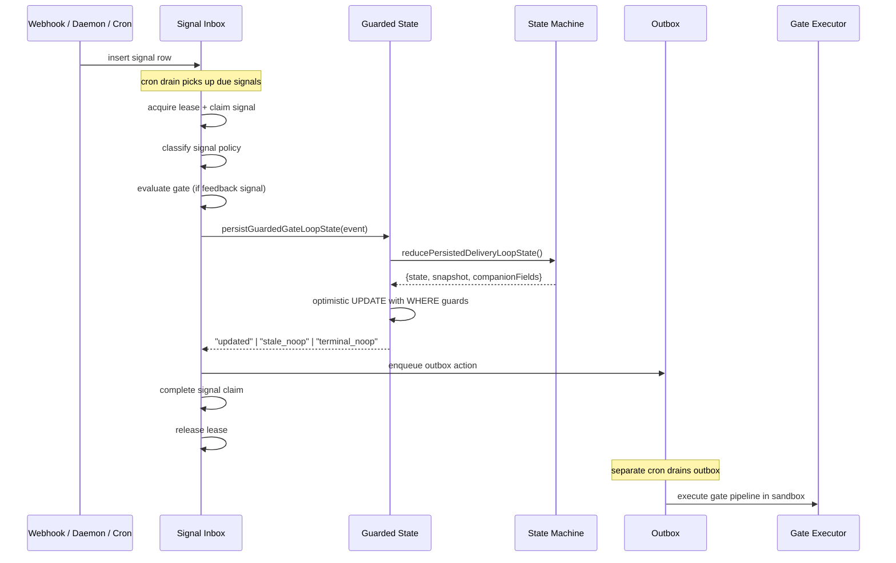
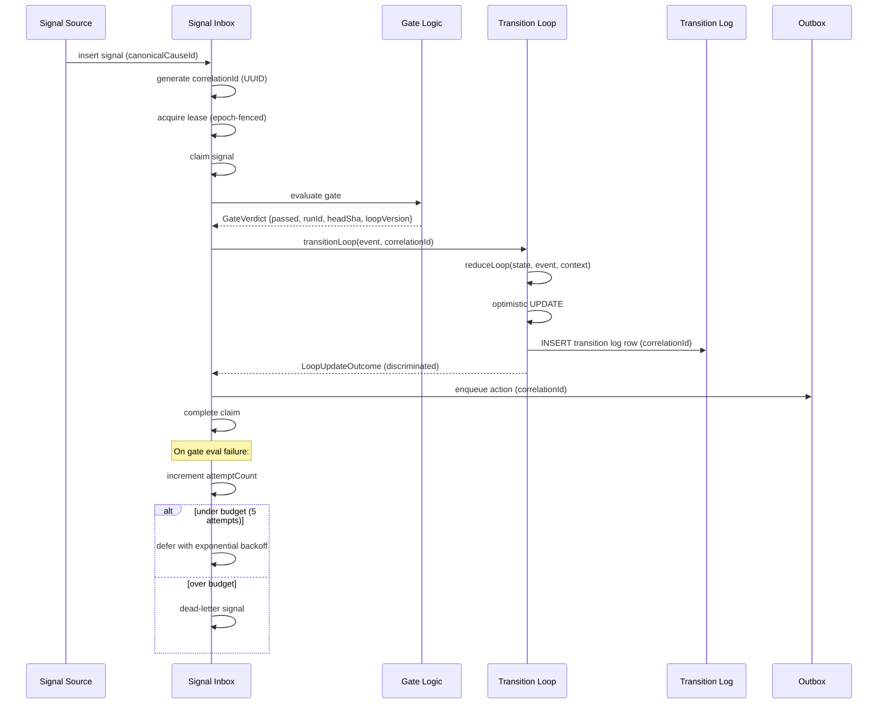

# Delivery Loop v2 Architecture

## 1. Overview

The **Delivery Loop** is Terragon's autonomous software delivery pipeline. It drives a coding agent through a repeatable cycle: plan code, implement it, run quality gates (review, CI, UI smoke), open a PR, and babysit it to merge. Each loop is a long-lived state machine persisted in PostgreSQL, advanced by **signals** (GitHub webhooks, daemon events, cron polls) processed through a claim-based inbox.

### Why Redesign

The current system works but has accumulated significant accidental complexity across three prior decomposition phases. The v2 overhaul targets three pillars:

| Pillar             | Problem Today                                            | Goal                                                                          |
| ------------------ | -------------------------------------------------------- | ----------------------------------------------------------------------------- |
| **Reliability**    | Silent signal loss, no retry budget, split-brain leases  | DLQ, idempotent gates, epoch-fenced leases                                    |
| **Observability**  | No audit trail, no correlation, undiscriminated failures | Append-only transition log, end-to-end correlation IDs, typed failure reasons |
| **Simplification** | Two event systems, dual naming, 12 snapshot factories    | One event type, one naming convention, flat snapshot                          |

---

## 2. Current Architecture

### 2.1 State Machine

The loop progresses through 12 states. Terminal states accept no further transitions (except idempotent `mark_done` on `done`).

```
                         +----------+
                         | planning |
                         +----+-----+
                              |  plan_completed
                              v
                       +--------------+
              +------->| implementing |<-----------+
              |        +------+-------+            |
              |               | impl_completed     |
              |               v                    |
              |        +--------------+            |
              |  rev   | review_gate  |            |
              | blocked+------+-------+            |
              |               | review_passed      |
              |               v                    |
              |        +-----------+               |
              |  ci    |  ci_gate  |               |
              | blocked+-----+-----+               |
              |              | ci_passed           |
              |              v                     |
              |        +-----------+               |
              |  ui    |  ui_gate  |   babysit     |
              | blocked+-----+-----+   blocked     |
              |              |                     |
              |   +----------+----------+          |
              |   | (has PR)            | (no PR)  |
              |   v                     v          |
              | +-------------+  +----------------+|
              | | babysitting |  | awaiting_pr_link|
              | +------+------+  +-------+--------+|
              |        |                 | pr_linked|
              |        |                 +----->----+
              |        | babysit_passed            |
              |        v                           |
              |     +------+                       |
              |     | done |                       |
              |     +------+                       |
              |                                    |
              +--- (any blocked gate) -------------+

    Global transitions from any active state:
      manual_stop        --> stopped
      pr_closed_unmerged --> terminated_pr_closed
      pr_merged          --> terminated_pr_merged
      exhausted_retries  --> blocked

    From blocked:
      blocked_resume --> (return to blockedFrom state)
      mark_done      --> done
```

### 2.2 Module Dependency Graph

```
apps/www/src/server-lib/delivery-loop/
  signal-inbox.ts          -- orchestrator: claim signals, evaluate gates, route feedback
  signal-inbox-helpers.ts  -- guardrail runtime, feedback message building
  gate-executor.ts         -- sandbox gate pipeline (review, CI, UI smoke)
  babysit-recheck.ts       -- cron-triggered CI/babysit polling

packages/shared/src/model/delivery-loop/
  types.ts                 -- DeliveryLoopSnapshot (12-variant union), companion fields
  state-machine.ts         -- reduceDeliveryLoopSnapshot, DeliveryLoopTransitionEvent (20 events)
  state-constants.ts       -- SdlcLoopTransitionEvent (30+ events), guardrails, failure categories
  legacy-transitions.ts    -- resolveSdlcLoopNextState (legacy reducer), canonical cause builder
  guarded-state.ts         -- persistGuardedGateLoopState (optimistic locking UPDATE)
  index.ts                 -- barrel with 30+ alias re-exports
  lease.ts                 -- acquire/release loop lease
  outbox.ts                -- transactional outbox (enqueue, claim, complete)
  dispatch-intent.ts       -- durable dispatch records
  enrollment.ts            -- loop creation and PR linking
  artifacts.ts             -- phase artifacts (plan, review, babysit)
  ci-gate-persistence.ts   -- CI gate run records
  review-gate-persistence.ts    -- review gate run records
  review-thread-gate-persistence.ts -- review thread gate run records
  video-capture.ts         -- UI gate video capture
  webhook-delivery.ts      -- GitHub webhook claim deduplication
  parity-metrics.ts        -- SLO parity tracking

packages/shared/src/model/
  signal-inbox-core.ts     -- signal claim/release, policy classification, gate eval dispatch
```

### 2.3 Data Flow (Current)



---

## 3. Problems

### 3.1 Two Coexisting Event Systems

`SdlcLoopTransitionEvent` (30+ events in `state-constants.ts`) and `DeliveryLoopTransitionEvent` (20 events in `state-machine.ts`) coexist with two different mapping functions that disagree:

```typescript
// state-machine.ts:73 - mapping function #1
mapSdlcTransitionEventToDeliveryLoopTransition(event, options?)

// guarded-state.ts:114 - mapping function #2 (different logic!)
mapSdlcTransitionEventToCanonicalWriteTransition({event, currentState, hasPrLink})
```

The second mapper has state-dependent logic (e.g., `ci_gate_blocked` in `babysitting` maps to `babysit_blocked`). The first mapper doesn't. Adding a new gate requires touching both.

### 3.2 Undiscriminated Stale Noop

`persistGuardedGateLoopState` returns `"stale_noop"` for 7 distinct failure conditions:

```typescript
// guarded-state.ts - all of these return the same string:
if (!loop) return "stale_noop"; // loop deleted
if (!DELIVERY_LOOP_CANONICAL_STATE_SET.has(loop.state))
  // legacy state
  return "stale_noop";
if (!canonicalTransitionEvent) return "stale_noop"; // unmappable event
if (!nextState) return "stale_noop"; // invalid transition
if (loop.loopVersion > normalizedLoopVersion)
  // version conflict
  return "stale_noop";
if (loop.currentHeadSha !== headSha) return "stale_noop"; // SHA conflict
if (!updated) return "stale_noop"; // WHERE guard miss
```

Callers cannot distinguish recoverable (version conflict, retry) from non-recoverable (loop deleted, stop).

### 3.3 Silent Signal Loss

Gate evaluation errors are caught and swallowed. The signal is still marked processed:

```typescript
// signal-inbox.ts:1126-1147
try {
  gateEvaluationOutcome = await evaluateAndPersistGate({...});
} catch (error) {
  console.error("[sdlc-loop] enrolled-loop gate evaluation failed", {...});
  // swallowed -- processing continues, signal marked done
}
```

### 3.4 No Audit Trail

State transitions mutate the `sdlc_loop` row in place. There is no history. You cannot answer "what sequence of events led this loop to `blocked`?" without grepping server logs.

### 3.5 Snapshot Complexity

12 factory functions (`createPlanningSnapshot`, `createImplementingSnapshot`, ...) plus `buildDeliveryLoopSnapshot` and `buildDeliveryLoopCompanionFields` that round-trip between the 12-variant discriminated union and a flat `DeliveryLoopCompanionFields` record. The type safety is illusory -- callers always extract the same flat fields.

### 3.6 Naming Duplication

The barrel (`index.ts`) has 30+ alias re-exports mapping `Sdlc*` to `DeliveryLoop*`:

```typescript
export const isDeliveryLoopTerminalState = isSdlcLoopTerminalState;
export const transitionDeliveryLoopState = transitionSdlcLoopState;
// ... 28 more
```

### 3.7 Split-Brain Leases

Lease refresh (`acquireSdlcLoopLease`) does not verify epoch. After lease theft, the original holder can re-acquire because it matches `leaseOwner`:

```typescript
// lease.ts:67-70 - no epoch check in WHERE clause
or(
  eq(schema.sdlcLoopLease.leaseOwner, leaseOwner), // original owner matches
  isNull(schema.sdlcLoopLease.leaseExpiresAt),
  lte(schema.sdlcLoopLease.leaseExpiresAt, now),
);
```

### 3.8 Scattered State Transitions

Gate persistence modules (`ci-gate-persistence.ts`, `review-gate-persistence.ts`) call `persistGuardedGateLoopState` internally, mixing gate-data persistence with state machine advancement. There is no single entry point for state transitions.

---

## 4. Proposed Architecture

### 4.1 Unified Event Model

Replace both event types with a single `LoopEvent` (17 events, down from 50+):

```typescript
type LoopEvent =
  | "plan_completed"
  | "implementation_completed"
  | "review_gate_passed"
  | "review_gate_blocked"
  | "ci_gate_passed"
  | "ci_gate_blocked"
  | "ui_gate_passed"
  | "ui_gate_blocked"
  | "pr_linked"
  | "babysit_passed"
  | "babysit_blocked"
  | "blocked_resume"
  | "manual_stop"
  | "mark_done"
  | "exhausted_retries"
  | "pr_closed_unmerged"
  | "pr_merged";
```

Key collapses:

- `ui_gate_passed_with_pr` / `ui_gate_passed_without_pr` --> `ui_gate_passed` (PR check moves to reducer context)
- All sub-gate events (`deep_review_gate_passed`, `carmack_review_gate_blocked`, etc.) removed -- tracked in gate run records
- `implementation_progress`, `video_capture_started` removed -- they were noops
- `plan_gate_blocked`, `implementation_gate_blocked` absorbed into dispatch retry

The state machine reducer gains a context parameter:

```typescript
function reduceLoop(params: {
  state: LoopState;
  event: LoopEvent;
  context: { hasPrLink: boolean; blockedFrom?: LoopResumableState };
}): { state: LoopState } | null;
```

### 4.2 New Module Boundaries

```
packages/shared/src/model/delivery-loop/
  types.ts                 -- LoopSnapshot (flat record), LoopEvent, LoopState
  state-machine.ts         -- reduceLoop() (~50 lines)
  guarded-state.ts         -- transitionLoop() (single entry point)
  transition-log.ts        -- append-only audit log
  lease.ts                 -- acquire/release/refresh with epoch fencing
  outbox.ts                -- transactional outbox (unchanged API)
  dispatch-intent.ts       -- durable dispatch records
  enrollment.ts            -- loop creation and PR linking
  artifacts.ts             -- phase artifacts
  ci-gate-persistence.ts   -- returns GateVerdict (no state transition)
  review-gate-persistence.ts   -- returns GateVerdict
  review-thread-gate-persistence.ts -- returns GateVerdict
  observability.ts         -- alerting predicates, replay builder
  index.ts                 -- clean barrel (~15 lines of export *)

  DELETED: legacy-transitions.ts
  DELETED: video-capture.ts (absorbed into ui gate)
  DELETED: parity-metrics.ts (replaced by transition log queries)

packages/shared/src/model/
  signal-inbox-core.ts     -- adds DLQ columns, dead-letter/defer functions

apps/www/src/server-lib/delivery-loop/
  signal-inbox.ts          -- orchestrator with correlation IDs, auto-refresh heartbeat
  gate-executor.ts         -- unchanged
```

### 4.3 Data Flow with Correlation IDs



### 4.4 GateVerdict Pattern

Gate persistence modules return a verdict. They do NOT touch loop state:

```typescript
type GateVerdict = {
  passed: boolean;
  event: LoopEvent; // e.g. "review_gate_passed" or "review_gate_blocked"
  runId: string;
  headSha: string;
  loopVersion: number;
};

// Gate modules become pure persistence:
async function persistCiGateEvaluation(args): Promise<GateVerdict>;
async function persistReviewGateResult(args): Promise<GateVerdict>;

// Single state transition entry point:
async function transitionLoop(params: {
  db: DB;
  loopId: string;
  event: LoopEvent;
  headSha?: string;
  loopVersion?: number;
  correlationId: string;
}): Promise<LoopUpdateOutcome>;
```

### 4.5 Reliability Primitives

#### Dead Letter Queue

New columns on `sdlc_loop_signal_inbox`:

| Column                     | Type      | Purpose                                 |
| -------------------------- | --------- | --------------------------------------- |
| `processing_attempt_count` | integer   | Tracks retry count                      |
| `last_processing_error`    | text      | Last error message                      |
| `dead_lettered_at`         | timestamp | When signal was dead-lettered           |
| `dead_letter_reason`       | text      | Why (max_attempts, unrecoverable, etc.) |

Processing outcome:

```typescript
type SignalProcessingOutcome =
  | { status: "completed"; signalId: string }
  | { status: "deferred"; signalId: string; retryAfter: Date }
  | { status: "dead_lettered"; signalId: string; reason: string };
```

#### Idempotent Gates

New `idempotency_key` column (unique index) on CI/review gate run tables. Key = `{loopId}:{headSha}:{signalId}:{gateType}`. Before inserting a new run, check for existing evaluation with the same key. If found, return cached result.

#### Epoch-Fenced Lease Refresh

```typescript
async function refreshSdlcLoopLease(params: {
  db: DB;
  loopId: string;
  leaseOwner: string;
  leaseEpoch: number; // MUST match current epoch
  leaseTtlMs: number;
}): Promise<SdlcLoopLeaseToken | null>;
// WHERE clause includes eq(leaseEpoch, params.leaseEpoch)
// If epoch changed -> return null -> processing aborts
```

#### Auto-Refreshing Heartbeat

Replace caller-driven `refreshIfDue()` (sprinkled through pipeline) with a background `setInterval` that refreshes both lease and signal claim every 8s. Expose `isHealthy()` predicate. Processing checks health before critical operations.

---

## 5. Type System Design

### 5.1 LoopState (unchanged)

```typescript
type LoopState =
  | "planning"
  | "implementing"
  | "review_gate"
  | "ci_gate"
  | "ui_gate"
  | "awaiting_pr_link"
  | "babysitting"
  | "blocked"
  | "done"
  | "stopped"
  | "terminated_pr_closed"
  | "terminated_pr_merged";
```

### 5.2 LoopEvent (new, replaces both event types)

```typescript
type LoopEvent =
  | "plan_completed"
  | "implementation_completed"
  | "review_gate_passed"
  | "review_gate_blocked"
  | "ci_gate_passed"
  | "ci_gate_blocked"
  | "ui_gate_passed"
  | "ui_gate_blocked"
  | "pr_linked"
  | "babysit_passed"
  | "babysit_blocked"
  | "blocked_resume"
  | "manual_stop"
  | "mark_done"
  | "exhausted_retries"
  | "pr_closed_unmerged"
  | "pr_merged";
```

**Rationale**: 17 events vs 50+. Each event maps to exactly one semantic action. Sub-gate granularity (deep review vs carmack review) is tracked in gate run records, not in the state machine.

### 5.3 LoopSnapshot (new, flat record)

```typescript
type LoopSnapshot = {
  state: LoopState;
  selectedAgent: LoopSelectedAgent | null;
  dispatchStatus: LoopDispatchStatus | null;
  dispatchAttemptCount: number;
  activeRunId: string | null;
  activeGateRunId: string | null;
  lastFailureCategory: string | null;
  blockedFrom: LoopResumableState | null;
  blockedReason: LoopBlockedReasonCategory | null;
  nextPhaseTarget: LoopDispatchablePhase | null;
};
```

**Rationale**: The 12-variant discriminated union and its 12 factory functions provide illusory type safety. Every consumer extracts the same flat fields. One factory: `createSnapshot(state, fields?)`.

### 5.4 LoopUpdateOutcome (new, discriminated)

```typescript
type LoopUpdateOutcome =
  | "updated"
  | "terminal_noop"
  | { staleReason: StaleNoopReason };

type StaleNoopReason =
  | "loop_not_found"
  | "state_not_canonical"
  | "transition_unmapped"
  | "transition_invalid"
  | "version_conflict"
  | "headsha_conflict"
  | "where_guard_miss"
  | "wrong_state_for_event";
```

**Rationale**: Callers can now distinguish recoverable failures (version_conflict -> retry) from non-recoverable (loop_not_found -> stop).

### 5.5 GateVerdict (new)

```typescript
type GateVerdict = {
  passed: boolean;
  event: LoopEvent;
  runId: string;
  headSha: string;
  loopVersion: number;
};
```

**Rationale**: Separates gate-data persistence from state machine advancement. Gate modules become pure data writers.

---

## 6. Database Changes

### 6.1 New Table: `sdlc_loop_transition_log`

Append-only audit trail. One row per state transition attempt (including rejected ones).

| Column                       | Type               | Notes                                              |
| ---------------------------- | ------------------ | -------------------------------------------------- |
| `id`                         | text PK            | CUID                                               |
| `loop_id`                    | text NOT NULL      | FK to sdlc_loop                                    |
| `seq`                        | integer NOT NULL   | Monotonic per loop                                 |
| `correlation_id`             | text NOT NULL      | Threads full pipeline                              |
| `previous_state`             | text NOT NULL      | State before transition                            |
| `next_state`                 | text               | NULL if rejected                                   |
| `transition_event`           | text NOT NULL      | The LoopEvent                                      |
| `outcome`                    | text NOT NULL      | "updated" or staleReason                           |
| `loop_version_before`        | integer NOT NULL   |                                                    |
| `loop_version_after`         | integer            | NULL if rejected                                   |
| `head_sha_after`             | text               |                                                    |
| `fix_attempt_count_after`    | integer            |                                                    |
| `trigger_source`             | text NOT NULL      | signal_inbox, gate_executor, intervention, webhook |
| `signal_id`                  | text               | FK to signal_inbox, nullable                       |
| `previous_phase_duration_ms` | integer            | Time in previous phase                             |
| `transitioned_at`            | timestamp NOT NULL | DEFAULT now()                                      |

**Indexes**: `(loop_id, seq)` unique, `(loop_id, transitioned_at)`, `(correlation_id)`.

### 6.2 New Columns on Existing Tables

#### `sdlc_loop_signal_inbox` (DLQ support)

| Column                     | Type      | Default |
| -------------------------- | --------- | ------- |
| `processing_attempt_count` | integer   | 0       |
| `last_processing_error`    | text      | NULL    |
| `dead_lettered_at`         | timestamp | NULL    |
| `dead_letter_reason`       | text      | NULL    |

#### `sdlc_loop_outbox` (correlation)

| Column           | Type |
| ---------------- | ---- |
| `correlation_id` | text |

#### `delivery_loop_dispatch_intent` (correlation)

| Column           | Type |
| ---------------- | ---- |
| `correlation_id` | text |

#### CI/Review gate run tables (idempotency)

| Column            | Type | Notes        |
| ----------------- | ---- | ------------ |
| `idempotency_key` | text | UNIQUE index |

### 6.3 Migration Strategy

All changes are **additive** (new table, new nullable columns, new indexes). No column renames or drops in the initial migration. This means:

1. Deploy migration (add table + columns)
2. Deploy code that writes to new columns
3. Backfill existing rows where needed (transition log starts empty -- that's fine)
4. After code is stable: drop deprecated columns in a follow-up migration

---

## 7. State Transition Table

Complete table of `(current_state, event) -> next_state`. NULL means the transition is invalid (rejected).

| Current State            | plan_completed | impl_completed | review_gate_passed | review_gate_blocked | ci_gate_passed | ci_gate_blocked | ui_gate_passed | ui_gate_blocked | pr_linked   | babysit_passed | babysit_blocked | blocked_resume | manual_stop | mark_done | exhausted_retries | pr_closed_unmerged   | pr_merged            |
| ------------------------ | -------------- | -------------- | ------------------ | ------------------- | -------------- | --------------- | -------------- | --------------- | ----------- | -------------- | --------------- | -------------- | ----------- | --------- | ----------------- | -------------------- | -------------------- |
| **planning**             | implementing   | -              | -                  | -                   | -              | -               | -              | -               | -           | -              | -               | -              | stopped     | -         | blocked           | terminated_pr_closed | terminated_pr_merged |
| **implementing**         | -              | review_gate    | -                  | -                   | -              | -               | -              | -               | -           | -              | -               | -              | stopped     | -         | blocked           | terminated_pr_closed | terminated_pr_merged |
| **review_gate**          | -              | -              | ci_gate            | implementing        | -              | -               | -              | -               | -           | -              | -               | -              | stopped     | -         | blocked           | terminated_pr_closed | terminated_pr_merged |
| **ci_gate**              | -              | -              | -                  | -                   | ui_gate        | implementing    | -              | -               | -           | -              | -               | -              | stopped     | -         | blocked           | terminated_pr_closed | terminated_pr_merged |
| **ui_gate**              | -              | -              | -                  | -                   | -              | -               | babysitting\*  | implementing    | -           | -              | -               | -              | stopped     | -         | blocked           | terminated_pr_closed | terminated_pr_merged |
| **awaiting_pr_link**     | -              | -              | -                  | -                   | -              | -               | -              | -               | babysitting | -              | -               | -              | stopped     | done      | blocked           | terminated_pr_closed | terminated_pr_merged |
| **babysitting**          | -              | -              | -                  | -                   | -              | -               | -              | -               | -           | done           | implementing    | -              | stopped     | done      | blocked           | terminated_pr_closed | terminated_pr_merged |
| **blocked**              | -              | -              | -                  | -                   | -              | -               | -              | -               | -           | -              | -               | (blockedFrom)  | stopped     | done      | -                 | terminated_pr_closed | terminated_pr_merged |
| **done**                 | -              | -              | -                  | -                   | -              | -               | -              | -               | -           | -              | -               | -              | -           | done      | -                 | -                    | -                    |
| **stopped**              | -              | -              | -                  | -                   | -              | -               | -              | -               | -           | -              | -               | -              | -           | -         | -                 | -                    | -                    |
| **terminated_pr_closed** | -              | -              | -                  | -                   | -              | -               | -              | -               | -           | -              | -               | -              | -           | -         | -                 | -                    | -                    |
| **terminated_pr_merged** | -              | -              | -                  | -                   | -              | -               | -              | -               | -           | -              | -               | -              | -           | -         | -                 | -                    | -                    |

\* `ui_gate_passed`: goes to `babysitting` if PR exists, `awaiting_pr_link` if not. Determined by `context.hasPrLink`.

---

## 8. Observability

### 8.1 Transition Log Queries

**"What happened to loop X?"**

```sql
SELECT seq, previous_state, next_state, transition_event, outcome,
       trigger_source, previous_phase_duration_ms, transitioned_at
FROM sdlc_loop_transition_log
WHERE loop_id = $1
ORDER BY seq;
```

**"How long did loop X spend in each phase?"**

```sql
SELECT next_state AS phase,
       SUM(previous_phase_duration_ms) AS total_ms,
       COUNT(*) AS transitions_in
FROM sdlc_loop_transition_log
WHERE loop_id = $1 AND outcome = 'updated'
GROUP BY next_state;
```

**"Trace a signal end-to-end"**

```sql
SELECT tl.*, si.cause_type, ob.action_type, di.target_phase
FROM sdlc_loop_transition_log tl
LEFT JOIN sdlc_loop_signal_inbox si ON si.id = tl.signal_id
LEFT JOIN sdlc_loop_outbox ob ON ob.correlation_id = tl.correlation_id
LEFT JOIN delivery_loop_dispatch_intent di ON di.correlation_id = tl.correlation_id
WHERE tl.correlation_id = $1
ORDER BY tl.transitioned_at;
```

**"Find stuck loops"**

```sql
SELECT l.id, l.state, l.phase_entered_at,
       EXTRACT(EPOCH FROM (NOW() - l.phase_entered_at)) / 60 AS minutes_in_phase
FROM sdlc_loop l
WHERE l.state NOT IN ('done', 'stopped', 'terminated_pr_closed', 'terminated_pr_merged')
  AND l.phase_entered_at < NOW() - INTERVAL '30 minutes'
ORDER BY l.phase_entered_at;
```

**"Find dead-lettered signals"**

```sql
SELECT id, loop_id, cause_type, dead_letter_reason,
       processing_attempt_count, last_processing_error, dead_lettered_at
FROM sdlc_loop_signal_inbox
WHERE dead_lettered_at IS NOT NULL
ORDER BY dead_lettered_at DESC
LIMIT 50;
```

**"Stale noop breakdown"**

```sql
SELECT outcome, COUNT(*) AS count
FROM sdlc_loop_transition_log
WHERE loop_id = $1 AND outcome != 'updated'
GROUP BY outcome
ORDER BY count DESC;
```

### 8.2 Alerting Predicates

Pure function `evaluateDeliveryLoopAlerts()` checks:

| Alert                  | Condition                       | SLO                                   |
| ---------------------- | ------------------------------- | ------------------------------------- |
| `stuck_in_phase`       | Loop in same phase > threshold  | 30 min (implementing), 10 min (gates) |
| `excessive_fix_cycles` | fixAttemptCount approaching max | > 80% of maxFixAttempts               |
| `signal_backlog`       | Unprocessed signals piling up   | > 10 per loop                         |
| `dead_letter_spike`    | DLQ growth rate                 | > 5 in 1 hour                         |

### 8.3 Debug Replay

`buildDeliveryLoopReplay(db, loopId)` queries transition log, signal inbox, outbox, and dispatch intents. Returns a unified chronological event stream:

```typescript
type ReplayEntry =
  | { kind: "signal"; timestamp: Date; causeType: string; signalId: string }
  | {
      kind: "transition";
      timestamp: Date;
      from: string;
      to: string;
      event: string;
      outcome: string;
    }
  | { kind: "outbox"; timestamp: Date; actionType: string; status: string }
  | { kind: "dispatch"; timestamp: Date; targetPhase: string; status: string };
```

---

## 9. Migration Plan

### Phase 1: Foundation (no breaking changes)

1. **1a. Discriminated stale noop** -- Change `persistGuardedGateLoopState` return type. Update ~6 callers.
2. **1b. Transition log** -- Add table, insert log rows in the same transaction as state UPDATE.
3. **1c. Correlation IDs** -- Generate UUID per signal processing attempt, thread through all layers.

All three are independent and can be done in parallel. No breaking changes; existing tests continue to pass.

### Phase 2: Reliability (no breaking changes)

4. **2a. Dead letter queue** -- Add columns, replace silent catch with retry/DLQ logic.
5. **2b. Idempotent gates** -- Add idempotency_key, check-before-insert.
6. **2c. Epoch-fenced lease refresh** -- Add `refreshSdlcLoopLease` with epoch guard.
7. **2d. Auto-refreshing heartbeat** -- Replace caller-driven refresh with background interval.

All four are independent. Can be interleaved with Phase 1.

### Phase 3: Simplification (breaking changes, deploy atomically)

8. **3b. Kill naming duplication** -- Rename `Sdlc*` to `DeliveryLoop*` at source. Delete 30+ aliases. Mechanical find-and-replace across ~25 files.
9. **3a. Unified events** -- Delete `SdlcLoopTransitionEvent`, `legacy-transitions.ts`. One `LoopEvent` type. Rewrite reducer to ~50 lines.
10. **3c. Flatten snapshot** -- Replace 12-variant union with flat `LoopSnapshot`. Delete 12 factories.
11. **3d. GateVerdict pattern** -- Gate modules return verdict, single `transitionLoop` entry point.

Order within Phase 3: do **3b first** (naming), then 3a/3c/3d (can be parallel after naming is unified).

### Phase 4: Observability (builds on Phase 1)

12. **4a. Signal processing telemetry** -- New table, instrument signal processing with span builder.
13. **4b. Alerting predicates** -- Pure functions, run in cron.
14. **4c. Debug replay** -- Query builder, expose via admin UI.

### Rollback Strategy

- Phases 1-2: All additive. Rollback = deploy previous code; new columns/tables are inert.
- Phase 3: Breaking changes. Rollback = revert the atomic commit. No data migration needed (states and events in DB are unchanged; only TypeScript types change).
- Phase 4: All additive. Same as Phases 1-2.

### Zero-Downtime Deployment

The only risky phase is Phase 3 (breaking type changes). Strategy:

1. Land Phase 3 as a single PR
2. All tests pass before merge (TypeScript compiler catches mismatches)
3. Deploy is atomic (single Vercel deployment)
4. No DB migration in Phase 3 (type changes are code-only)

---

## 10. Open Questions

| #   | Question                                                                                                                                                | Status                                                 |
| --- | ------------------------------------------------------------------------------------------------------------------------------------------------------- | ------------------------------------------------------ |
| 1   | Should `plan_gate_blocked` / `implementation_gate_blocked` become explicit events in `LoopEvent`, or are they fully absorbed into dispatch retry logic? | Leaning toward absorbed                                |
| 2   | Should the transition log live in the same DB or a separate analytics store?                                                                            | Same DB for now; can replicate later                   |
| 3   | What's the right DLQ retry budget? 5 attempts with exponential backoff?                                                                                 | Proposed 5, needs production validation                |
| 4   | Should `blocked_resume` restore to the exact `blockedFrom` state, or always restart from `implementing`?                                                | Current: exact restore. Keep this.                     |
| 5   | Do we need per-phase fix attempt budgets (Phase 5c), or is the flat counter sufficient?                                                                 | Flat counter for now; revisit after observability data |
| 6   | Should the outbox use typed payloads (Phase 5a) in v2, or defer?                                                                                        | Defer to Phase 5                                       |
| 7   | How should the admin UI surface the transition log and DLQ?                                                                                             | TBD -- build replay endpoint first, then UI            |
| 8   | Should `legacy-transitions.ts` utilities (`buildSdlcCanonicalCause`, `getGithubWebhookClaimHttpStatus`) move to `webhook-delivery.ts` or a new module?  | Move to webhook-delivery.ts                            |
